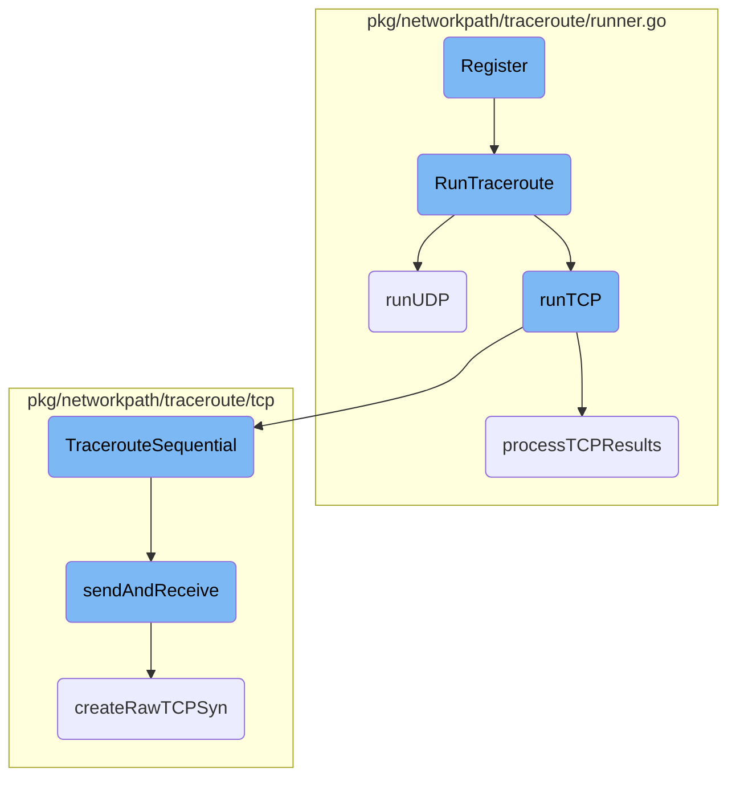
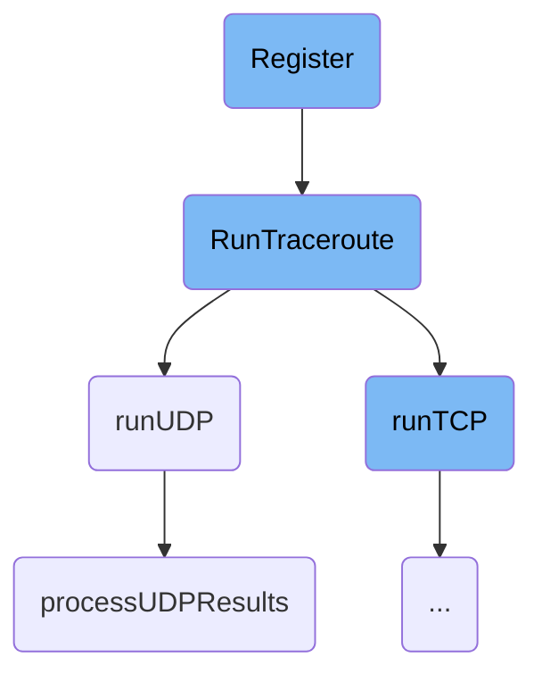
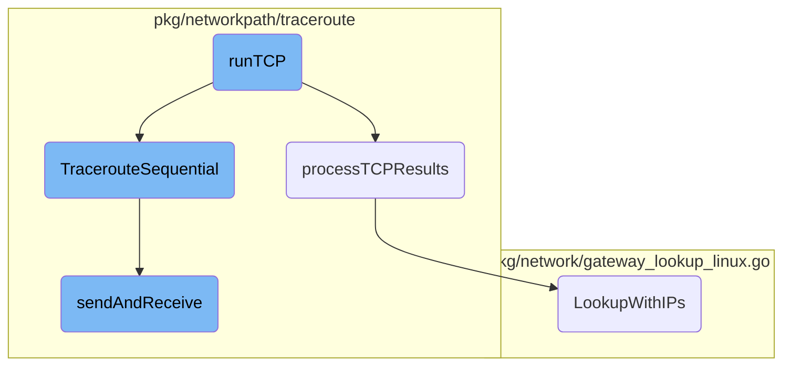

This document explains the process of registering and executing a traceroute operation. It covers the setup of an HTTP handler, the execution of the traceroute, and the processing of the results.

The flow starts with setting up an HTTP handler that listens for traceroute requests. When a request is received, it parses the parameters and runs the traceroute operation. The traceroute can be executed using either TCP or UDP protocols. After the traceroute is completed, the results are processed and returned in a structured format.

Here is a high level diagram of the flow, showing only the most important functions:



# Flow drill down

First, we'll zoom into this section of the flow:



<SwmSnippet path="/cmd/system-probe/modules/traceroute.go" line="57">

---

## Register

The <SwmToken path="cmd/system-probe/modules/traceroute.go" pos="57:9:9" line-data="func (t *traceroute) Register(httpMux *module.Router) error {">`Register`</SwmToken> function sets up an HTTP handler for the traceroute module. It handles incoming requests, parses parameters, and invokes the <SwmToken path="cmd/system-probe/modules/traceroute.go" pos="73:12:12" line-data="		path, err := t.runner.RunTraceroute(context.Background(), cfg)">`RunTraceroute`</SwmToken> method. This function is crucial as it acts as the entry point for traceroute requests, ensuring they are correctly processed and logged.

```go
func (t *traceroute) Register(httpMux *module.Router) error {
	var runCounter = atomic.NewUint64(0)

	// TODO: what other config should be passed as part of this request?
	httpMux.HandleFunc("/traceroute/{host}", func(w http.ResponseWriter, req *http.Request) {
		start := time.Now()
		id := getClientID(req)
		cfg, err := parseParams(req)
		log.Debugf("Module Received params: %+v", cfg)
		if err != nil {
			log.Errorf("invalid params for host: %s: %s", cfg.DestHostname, err)
			w.WriteHeader(http.StatusBadRequest)
			return
		}

		// Run traceroute
		path, err := t.runner.RunTraceroute(context.Background(), cfg)
		if err != nil {
			log.Errorf("unable to run traceroute for host: %s: %s", cfg.DestHostname, err.Error())
			w.WriteHeader(http.StatusInternalServerError)
			return
```

---

</SwmSnippet>

<SwmSnippet path="/pkg/networkpath/traceroute/runner.go" line="95">

---

## <SwmToken path="pkg/networkpath/traceroute/runner.go" pos="95:2:2" line-data="// RunTraceroute wraps the implementation of traceroute">`RunTraceroute`</SwmToken>

The <SwmToken path="pkg/networkpath/traceroute/runner.go" pos="95:2:2" line-data="// RunTraceroute wraps the implementation of traceroute">`RunTraceroute`</SwmToken> function is responsible for executing the traceroute operation. It resolves the destination hostname to an IP address, determines the protocol (TCP or UDP), and calls the appropriate function (<SwmToken path="pkg/networkpath/traceroute/runner.go" pos="143:10:10" line-data="		pathResult, err = r.runTCP(cfg, hname, dest, maxTTL, timeout)">`runTCP`</SwmToken> or <SwmToken path="pkg/networkpath/traceroute/runner.go" pos="164:9:9" line-data="func (r *Runner) runUDP(cfg Config, hname string, dest net.IP, maxTTL uint8, timeout time.Duration) (payload.NetworkPath, error) {">`runUDP`</SwmToken>). This function is essential for performing the actual network path tracing based on the provided configuration.

```go
// RunTraceroute wraps the implementation of traceroute
// so it can be called from the different OS implementations
//
// This code is experimental and will be replaced with a more
// complete implementation.
func (r *Runner) RunTraceroute(ctx context.Context, cfg Config) (payload.NetworkPath, error) {
	defer tracerouteRunnerTelemetry.runs.Inc()
	dests, err := net.DefaultResolver.LookupIP(ctx, "ip4", cfg.DestHostname)
	if err != nil || len(dests) == 0 {
		tracerouteRunnerTelemetry.failedRuns.Inc()
		return payload.NetworkPath{}, fmt.Errorf("cannot resolve %s: %v", cfg.DestHostname, err)
	}

	//TODO: should we get smarter about IP address resolution?
	// if it's a hostname, perhaps we could run multiple traces
	// for each of the different IPs it resolves to up to a threshold?
	// use first resolved IP for now
	dest := dests[0]

	maxTTL := cfg.MaxTTL
	if maxTTL == 0 {
```

---

</SwmSnippet>

<SwmSnippet path="/pkg/networkpath/traceroute/runner.go" line="164">

---

### <SwmToken path="pkg/networkpath/traceroute/runner.go" pos="164:9:9" line-data="func (r *Runner) runUDP(cfg Config, hname string, dest net.IP, maxTTL uint8, timeout time.Duration) (payload.NetworkPath, error) {">`runUDP`</SwmToken>

The <SwmToken path="pkg/networkpath/traceroute/runner.go" pos="164:9:9" line-data="func (r *Runner) runUDP(cfg Config, hname string, dest net.IP, maxTTL uint8, timeout time.Duration) (payload.NetworkPath, error) {">`runUDP`</SwmToken> function performs a UDP-based traceroute. It configures the UDP probe, executes the traceroute, and processes the results using <SwmToken path="pkg/networkpath/traceroute/runner.go" pos="285:9:9" line-data="func (r *Runner) processUDPResults(res *results.Results, hname string, destinationHost string, destinationPort uint16, destinationIP net.IP) (payload.NetworkPath, error) {">`processUDPResults`</SwmToken>. This function is vital for handling UDP traceroute requests and gathering the necessary network path data.

```go
func (r *Runner) runUDP(cfg Config, hname string, dest net.IP, maxTTL uint8, timeout time.Duration) (payload.NetworkPath, error) {
	destPort, srcPort, useSourcePort := getPorts(cfg.DestPort)

	dt := &probev4.UDPv4{
		Target:     dest,
		SrcPort:    srcPort,
		DstPort:    destPort,
		UseSrcPort: useSourcePort,
		NumPaths:   uint16(DefaultNumPaths),
		MinTTL:     uint8(DefaultMinTTL), // TODO: what's a good value?
		MaxTTL:     maxTTL,
		Delay:      time.Duration(DefaultDelay) * time.Millisecond, // TODO: what's a good value?
		Timeout:    timeout,                                        // TODO: what's a good value?
		BrokenNAT:  false,
	}

	log.Debugf("Traceroute UDPv4 probe config: %+v", dt)
	results, err := dt.Traceroute()
	if err != nil {
		return payload.NetworkPath{}, fmt.Errorf("traceroute run failed: %s", err.Error())
	}
```

---

</SwmSnippet>

<SwmSnippet path="/pkg/networkpath/traceroute/runner.go" line="285">

---

### <SwmToken path="pkg/networkpath/traceroute/runner.go" pos="285:9:9" line-data="func (r *Runner) processUDPResults(res *results.Results, hname string, destinationHost string, destinationPort uint16, destinationIP net.IP) (payload.NetworkPath, error) {">`processUDPResults`</SwmToken>

The <SwmToken path="pkg/networkpath/traceroute/runner.go" pos="285:9:9" line-data="func (r *Runner) processUDPResults(res *results.Results, hname string, destinationHost string, destinationPort uint16, destinationIP net.IP) (payload.NetworkPath, error) {">`processUDPResults`</SwmToken> function processes the results of a UDP traceroute. It constructs the network path, including hops and their respective details, and returns the final <SwmToken path="pkg/networkpath/traceroute/runner.go" pos="285:44:44" line-data="func (r *Runner) processUDPResults(res *results.Results, hname string, destinationHost string, destinationPort uint16, destinationIP net.IP) (payload.NetworkPath, error) {">`NetworkPath`</SwmToken> payload. This function is crucial for interpreting the raw traceroute data and converting it into a structured format.

```go
func (r *Runner) processUDPResults(res *results.Results, hname string, destinationHost string, destinationPort uint16, destinationIP net.IP) (payload.NetworkPath, error) {
	type node struct {
		node  string
		probe *results.Probe
	}

	pathID := uuid.New().String()

	traceroutePath := payload.NetworkPath{
		PathID:    pathID,
		Protocol:  payload.ProtocolUDP,
		Timestamp: time.Now().UnixMilli(),
		Source: payload.NetworkPathSource{
			Hostname:  hname,
			NetworkID: r.networkID,
		},
		Destination: payload.NetworkPathDestination{
			Hostname:  getDestinationHostname(destinationHost),
			Port:      destinationPort,
			IPAddress: destinationIP.String(),
		},
```

---

</SwmSnippet>

Now, lets zoom into this section of the flow:



<SwmSnippet path="/pkg/networkpath/traceroute/runner.go" line="227">

---

## Handling TCP Traceroute Results

The function <SwmToken path="pkg/networkpath/traceroute/runner.go" pos="227:9:9" line-data="func (r *Runner) processTCPResults(res *tcp.Results, hname string, destinationHost string, destinationPort uint16, destinationIP net.IP) (payload.NetworkPath, error) {">`processTCPResults`</SwmToken> is responsible for processing the results of a TCP traceroute. It creates a <SwmToken path="pkg/networkpath/traceroute/runner.go" pos="227:44:44" line-data="func (r *Runner) processTCPResults(res *tcp.Results, hname string, destinationHost string, destinationPort uint16, destinationIP net.IP) (payload.NetworkPath, error) {">`NetworkPath`</SwmToken> object, which includes details about the source and destination, such as hostname, network ID, and IP address. The function iterates over the hops in the traceroute results, extracting information like TTL, IP address, hostname, and round-trip time (RTT) for each hop. This processed data is then returned as a <SwmToken path="pkg/networkpath/traceroute/runner.go" pos="227:44:44" line-data="func (r *Runner) processTCPResults(res *tcp.Results, hname string, destinationHost string, destinationPort uint16, destinationIP net.IP) (payload.NetworkPath, error) {">`NetworkPath`</SwmToken> object.

```go
func (r *Runner) processTCPResults(res *tcp.Results, hname string, destinationHost string, destinationPort uint16, destinationIP net.IP) (payload.NetworkPath, error) {
	pathID := uuid.New().String()
	traceroutePath := payload.NetworkPath{
		PathID:    pathID,
		Protocol:  payload.ProtocolTCP,
		Timestamp: time.Now().UnixMilli(),
		Source: payload.NetworkPathSource{
			Hostname:  hname,
			NetworkID: r.networkID,
		},
		Destination: payload.NetworkPathDestination{
			Hostname:  getDestinationHostname(destinationHost),
			Port:      destinationPort,
			IPAddress: destinationIP.String(),
		},
	}

	// get hardware interface info
	//
	// TODO: using a gateway lookup may be a more performant
	// solution for getting the local addr to use
```

---

</SwmSnippet>

<SwmSnippet path="/pkg/networkpath/traceroute/tcp/tcpv4.go" line="57">

---

## Sequential Traceroute Execution

The function <SwmToken path="pkg/networkpath/traceroute/tcp/tcpv4.go" pos="57:2:2" line-data="// TracerouteSequential runs a traceroute sequentially where a packet is">`TracerouteSequential`</SwmToken> executes a TCP traceroute sequentially. It sends a packet and waits for a response before sending the next packet. The function sets up raw ICMP and TCP listeners to catch responses. It then iterates over the TTL values, sending packets and collecting hop information until the destination is reached or the maximum TTL is exceeded. The collected hops are returned as part of the <SwmToken path="pkg/networkpath/traceroute/tcp/tcpv4.go" pos="59:15:15" line-data="func (t *TCPv4) TracerouteSequential() (*Results, error) {">`Results`</SwmToken> object.

```go
// TracerouteSequential runs a traceroute sequentially where a packet is
// sent and we wait for a response before sending the next packet
func (t *TCPv4) TracerouteSequential() (*Results, error) {
	// Get local address for the interface that connects to this
	// host and store in in the probe
	//
	// TODO: do this once for the probe and hang on to the
	// listener until we decide to close the probe
	addr, err := localAddrForHost(t.Target, t.DestPort)
	if err != nil {
		return nil, fmt.Errorf("failed to get local address for target: %w", err)
	}
	t.srcIP = addr.IP
	t.srcPort = addr.AddrPort().Port()

	// So far I haven't had success trying to simply create a socket
	// using syscalls directly, but in theory doing so would allow us
	// to avoid creating two listeners since we could see all IP traffic
	// this way
	//
	// Create a raw ICMP listener to catch ICMP responses
```

---

</SwmSnippet>

<SwmSnippet path="/pkg/networkpath/traceroute/tcp/tcpv4.go" line="136">

---

### Sending and Receiving Packets

The function <SwmToken path="pkg/networkpath/traceroute/tcp/tcpv4.go" pos="136:9:9" line-data="func (t *TCPv4) sendAndReceive(rawIcmpConn *ipv4.RawConn, rawTCPConn *ipv4.RawConn, ttl int, seqNum uint32, timeout time.Duration) (*Hop, error) {">`sendAndReceive`</SwmToken> is called within <SwmToken path="pkg/networkpath/traceroute/tcp/tcpv4.go" pos="57:2:2" line-data="// TracerouteSequential runs a traceroute sequentially where a packet is">`TracerouteSequential`</SwmToken> to handle the actual sending of TCP SYN packets and listening for responses. It creates a raw TCP packet with the specified TTL and sends it. The function then listens for ICMP and TCP responses, calculates the round-trip time (RTT), and returns a <SwmToken path="pkg/networkpath/traceroute/tcp/tcpv4.go" pos="136:46:46" line-data="func (t *TCPv4) sendAndReceive(rawIcmpConn *ipv4.RawConn, rawTCPConn *ipv4.RawConn, ttl int, seqNum uint32, timeout time.Duration) (*Hop, error) {">`Hop`</SwmToken> object containing the hop's IP address, port, ICMP type, RTT, and whether it is the destination.

```go
func (t *TCPv4) sendAndReceive(rawIcmpConn *ipv4.RawConn, rawTCPConn *ipv4.RawConn, ttl int, seqNum uint32, timeout time.Duration) (*Hop, error) {
	tcpHeader, tcpPacket, err := createRawTCPSyn(t.srcIP, t.srcPort, t.Target, t.DestPort, seqNum, ttl)
	if err != nil {
		log.Errorf("failed to create TCP packet with TTL: %d, error: %s", ttl, err.Error())
		return nil, err
	}

	err = sendPacket(rawTCPConn, tcpHeader, tcpPacket)
	if err != nil {
		log.Errorf("failed to send TCP SYN: %s", err.Error())
		return nil, err
	}

	start := time.Now() // TODO: is this the best place to start?
	hopIP, hopPort, icmpType, end, err := listenPackets(rawIcmpConn, rawTCPConn, timeout, t.srcIP, t.srcPort, t.Target, t.DestPort, seqNum)
	if err != nil {
		log.Errorf("failed to listen for packets: %s", err.Error())
		return nil, err
	}
	log.Debugf("Finished loop for TTL %d", ttl)

```

---

</SwmSnippet>

<SwmSnippet path="/pkg/network/gateway_lookup_linux.go" line="124">

---

## Gateway Lookup with <SwmToken path="pkg/networkpath/traceroute/runner.go" pos="110:13:13" line-data="	// for each of the different IPs it resolves to up to a threshold?">`IPs`</SwmToken>

The function <SwmToken path="pkg/network/gateway_lookup_linux.go" pos="124:2:2" line-data="// LookupWithIPs performs a gateway lookup given the">`LookupWithIPs`</SwmToken> performs a gateway lookup given the source, destination, and namespace. It retrieves the route from the cache and, if necessary, performs a subnet lookup to get additional information about the gateway. The function returns a <SwmToken path="pkg/network/gateway_lookup_linux.go" pos="126:31:31" line-data="func (g *gatewayLookup) LookupWithIPs(source util.Address, dest util.Address, netns uint32) *Via {">`Via`</SwmToken> object containing the subnet information if the lookup is successful.

```go
// LookupWithIPs performs a gateway lookup given the
// source, destination, and namespace
func (g *gatewayLookup) LookupWithIPs(source util.Address, dest util.Address, netns uint32) *Via {
	r, ok := g.routeCache.Get(source, dest, netns)
	if !ok {
		return nil
	}

	// if there is no gateway, we don't need to add subnet info
	// for gateway resolution in the backend
	if r.Gateway.IsZero() || r.Gateway.IsUnspecified() {
		return nil
	}

	gatewayLookupTelemetry.subnetCacheLookups.Inc()
	v, ok := g.subnetCache.Get(r.IfIndex)
	if !ok {
		gatewayLookupTelemetry.subnetCacheMisses.Inc()

		var s Subnet
		var err error
```

---

</SwmSnippet>

The repository contains the source code for the Datadog Agent versions 6 and 7. The Datadog Agent collects metrics, logs, and traces from various sources and sends them to the Datadog platform for monitoring and analysis. The README provides detailed instructions on building, testing, and running the agent, setting up a development environment, contributing to the project, and the licensing terms.

&nbsp;

*This is an auto-generated document by Swimm AI 🌊 and has not yet been verified by a human*

<SwmMeta version="3.0.0" repo-id="Z2l0aHViJTNBJTNBZGF0YWRvZy1hZ2VudCUzQSUzQVN3aW1tLURlbW8=" repo-name="datadog-agent"><sup>Powered by [Swimm](/)</sup></SwmMeta>
