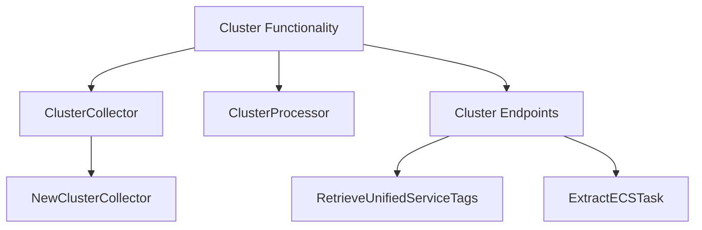

# Cluster Functionality Overview

Cluster functionality involves collecting and processing data from Kubernetes clusters. This is achieved through various components such as the <SwmToken path="pkg/collector/corechecks/cluster/orchestrator/collectors/k8s/cluster.go" pos="29:2:2" line-data="// ClusterCollector is a collector for Kubernetes clusters.">`ClusterCollector`</SwmToken> and <SwmToken path="pkg/collector/corechecks/cluster/orchestrator/collectors/k8s/cluster.go" pos="34:6:6" line-data="	processor *k8sProcessors.ClusterProcessor">`ClusterProcessor`</SwmToken>, which work together to gather and process metadata.

# <SwmToken path="pkg/collector/corechecks/cluster/orchestrator/collectors/k8s/cluster.go" pos="29:2:2" line-data="// ClusterCollector is a collector for Kubernetes clusters.">`ClusterCollector`</SwmToken>

The <SwmToken path="pkg/collector/corechecks/cluster/orchestrator/collectors/k8s/cluster.go" pos="29:2:2" line-data="// ClusterCollector is a collector for Kubernetes clusters.">`ClusterCollector`</SwmToken> is a key component that gathers information from Kubernetes clusters using informers and listers. It is responsible for collecting metadata and processing it through the <SwmToken path="pkg/collector/corechecks/cluster/orchestrator/collectors/k8s/cluster.go" pos="34:6:6" line-data="	processor *k8sProcessors.ClusterProcessor">`ClusterProcessor`</SwmToken>.

<SwmSnippet path="/pkg/collector/corechecks/cluster/orchestrator/collectors/k8s/cluster.go" line="29">

---

The <SwmToken path="pkg/collector/corechecks/cluster/orchestrator/collectors/k8s/cluster.go" pos="29:2:2" line-data="// ClusterCollector is a collector for Kubernetes clusters.">`ClusterCollector`</SwmToken> struct defines the necessary fields for collecting data from Kubernetes clusters, including informers, listers, metadata, and the processor.

```go
// ClusterCollector is a collector for Kubernetes clusters.
type ClusterCollector struct {
	informer  corev1Informers.NodeInformer
	lister    corev1Listers.NodeLister
	metadata  *collectors.CollectorMetadata
	processor *k8sProcessors.ClusterProcessor
}
```

---

</SwmSnippet>

# <SwmToken path="pkg/collector/corechecks/cluster/orchestrator/collectors/k8s/cluster.go" pos="37:2:2" line-data="// NewClusterCollector creates a new collector for the Kubernetes Cluster">`NewClusterCollector`</SwmToken>

The <SwmToken path="pkg/collector/corechecks/cluster/orchestrator/collectors/k8s/cluster.go" pos="37:2:2" line-data="// NewClusterCollector creates a new collector for the Kubernetes Cluster">`NewClusterCollector`</SwmToken> function creates a new instance of <SwmToken path="pkg/collector/corechecks/cluster/orchestrator/collectors/k8s/cluster.go" pos="29:2:2" line-data="// ClusterCollector is a collector for Kubernetes clusters.">`ClusterCollector`</SwmToken>, setting up the necessary metadata and processor.

<SwmSnippet path="/pkg/collector/corechecks/cluster/orchestrator/collectors/k8s/cluster.go" line="37">

---

The <SwmToken path="pkg/collector/corechecks/cluster/orchestrator/collectors/k8s/cluster.go" pos="37:2:2" line-data="// NewClusterCollector creates a new collector for the Kubernetes Cluster">`NewClusterCollector`</SwmToken> function initializes a new <SwmToken path="pkg/collector/corechecks/cluster/orchestrator/collectors/k8s/cluster.go" pos="39:7:7" line-data="func NewClusterCollector() *ClusterCollector {">`ClusterCollector`</SwmToken> with default metadata and a new <SwmToken path="pkg/collector/corechecks/cluster/orchestrator/collectors/k8s/cluster.go" pos="34:6:6" line-data="	processor *k8sProcessors.ClusterProcessor">`ClusterProcessor`</SwmToken>.

```go
// NewClusterCollector creates a new collector for the Kubernetes Cluster
// resource.
func NewClusterCollector() *ClusterCollector {
	return &ClusterCollector{
		metadata: &collectors.CollectorMetadata{
			IsDefaultVersion:          true,
			IsStable:                  true,
			IsMetadataProducer:        true,
			IsManifestProducer:        true,
			SupportsManifestBuffering: true,
			Name:                      "clusters",
			NodeType:                  orchestrator.K8sCluster,
		},
		processor: k8sProcessors.NewClusterProcessor(),
	}
}
```

---

</SwmSnippet>

# <SwmToken path="pkg/collector/corechecks/cluster/orchestrator/collectors/k8s/cluster.go" pos="34:6:6" line-data="	processor *k8sProcessors.ClusterProcessor">`ClusterProcessor`</SwmToken>

The <SwmToken path="pkg/collector/corechecks/cluster/orchestrator/collectors/k8s/cluster.go" pos="34:6:6" line-data="	processor *k8sProcessors.ClusterProcessor">`ClusterProcessor`</SwmToken> processes the collected data from Kubernetes clusters, aggregating information from various resources. It is a custom processor that aggregates data from the Kubernetes Node resource and API Server information.

<SwmSnippet path="/pkg/collector/corechecks/cluster/orchestrator/processors/k8s/cluster.go" line="28">

---

The <SwmToken path="pkg/collector/corechecks/cluster/orchestrator/processors/k8s/cluster.go" pos="28:2:2" line-data="// ClusterProcessor is a processor for Kubernetes clusters. There is no">`ClusterProcessor`</SwmToken> struct defines the necessary fields for processing data from Kubernetes clusters, including handlers for node resources.

```go
// ClusterProcessor is a processor for Kubernetes clusters. There is no
// concept of cluster per se in Kubernetes. The model is created by aggregating
// data from the Kubernetes Node resource and pulling API Server information.
// This is why that processor is custom and not following the generic logic like
// other resources.
type ClusterProcessor struct {
	processors.Processor
	nodeHandlers processors.Handlers
}
```

---

</SwmSnippet>

# Cluster Endpoints

Cluster endpoints provide various functionalities such as retrieving unified service tags and extracting ECS task information.

## <SwmToken path="pkg/collector/corechecks/cluster/orchestrator/transformers/ust.go" pos="32:2:2" line-data="// RetrieveUnifiedServiceTags for cluster level resources">`RetrieveUnifiedServiceTags`</SwmToken>

The <SwmToken path="pkg/collector/corechecks/cluster/orchestrator/transformers/ust.go" pos="32:2:2" line-data="// RetrieveUnifiedServiceTags for cluster level resources">`RetrieveUnifiedServiceTags`</SwmToken> function is used to retrieve unified service tags for cluster-level resources. It processes labels to generate tags, handling the <SwmToken path="pkg/collector/corechecks/cluster/orchestrator/transformers/ust.go" pos="33:5:5" line-data="// the `env` is handled special because it being a host level tag.">`env`</SwmToken> tag specially as it is a host-level tag.

<SwmSnippet path="/pkg/collector/corechecks/cluster/orchestrator/transformers/ust.go" line="32">

---

The <SwmToken path="pkg/collector/corechecks/cluster/orchestrator/transformers/ust.go" pos="32:2:2" line-data="// RetrieveUnifiedServiceTags for cluster level resources">`RetrieveUnifiedServiceTags`</SwmToken> function processes labels to generate tags for cluster-level resources, with special handling for the <SwmToken path="pkg/collector/corechecks/cluster/orchestrator/transformers/ust.go" pos="33:5:5" line-data="// the `env` is handled special because it being a host level tag.">`env`</SwmToken> tag.

```go
// RetrieveUnifiedServiceTags for cluster level resources
// the `env` is handled special because it being a host level tag.
func RetrieveUnifiedServiceTags(labels map[string]string) []string {
	var tags []string

	if tagValue, found := labels[kubernetes.EnvTagLabelKey]; found {
		tags = append(tags, fmt.Sprintf("%s:%s", labelToTagKeys[kubernetes.EnvTagLabelKey], tagValue))
	} else {
		if envTag := config.Datadog().GetString("env"); envTag != "" {
			tags = append(tags, fmt.Sprintf("%s:%s", tagKeyEnv, envTag))
		}
	}

	for _, labelKey := range ustLabelsWithoutFallback {
		if tagValue, found := labels[labelKey]; found {
			tags = append(tags, fmt.Sprintf("%s:%s", labelToTagKeys[labelKey], tagValue))
		}
	}
	return tags
}
```

---

</SwmSnippet>

## <SwmToken path="pkg/collector/corechecks/cluster/orchestrator/transformers/ecs/task.go" pos="36:2:2" line-data="// ExtractECSTask returns the protobuf model corresponding to an ECS Task resource.">`ExtractECSTask`</SwmToken>

The <SwmToken path="pkg/collector/corechecks/cluster/orchestrator/transformers/ecs/task.go" pos="36:2:2" line-data="// ExtractECSTask returns the protobuf model corresponding to an ECS Task resource.">`ExtractECSTask`</SwmToken> function returns the protobuf model corresponding to an ECS Task resource. It extracts various attributes from the ECS task and its containers, including tags and resource versions.

<SwmSnippet path="/pkg/collector/corechecks/cluster/orchestrator/transformers/ecs/task.go" line="36">

---

The <SwmToken path="pkg/collector/corechecks/cluster/orchestrator/transformers/ecs/task.go" pos="36:2:2" line-data="// ExtractECSTask returns the protobuf model corresponding to an ECS Task resource.">`ExtractECSTask`</SwmToken> function extracts attributes from an ECS task and its containers, returning the corresponding protobuf model.

```go
// ExtractECSTask returns the protobuf model corresponding to an ECS Task resource.
func ExtractECSTask(task TaskWithContainers) *model.ECSTask {
	if task.Task == nil {
		return nil
	}
	taskModel := &model.ECSTask{
		Arn:                     task.Task.EntityID.ID,
		LaunchType:              string(task.Task.LaunchType),
		DesiredStatus:           task.Task.DesiredStatus,
		KnownStatus:             task.Task.KnownStatus,
		Family:                  task.Task.Family,
		Version:                 task.Task.Version,
		AvailabilityZone:        task.Task.AvailabilityZone,
		Limits:                  task.Task.Limits,
		EphemeralStorageMetrics: task.Task.EphemeralStorageMetrics,
		ServiceName:             task.Task.ServiceName,
		VpcId:                   task.Task.VPCID,
		PullStartedAt:           extractTimestampPtr(task.Task.PullStartedAt),
		PullStoppedAt:           extractTimestampPtr(task.Task.PullStoppedAt),
		ExecutionStoppedAt:      extractTimestampPtr(task.Task.ExecutionStoppedAt),
		Containers:              extractECSContainer(task.Containers),
```

---

</SwmSnippet>

&nbsp;

*This is an auto-generated document by Swimm AI 🌊 and has not yet been verified by a human*

<SwmMeta version="3.0.0" repo-id="Z2l0aHViJTNBJTNBZGF0YWRvZy1hZ2VudCUzQSUzQVN3aW1tLURlbW8=" repo-name="datadog-agent"><sup>Powered by [Swimm](/)</sup></SwmMeta>
