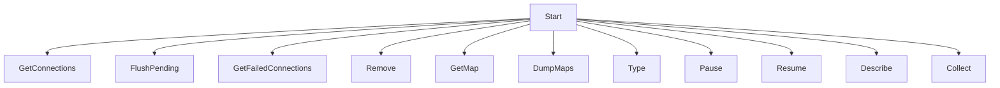

<SwmSnippet path="/pkg/network/tracer/connection/tracer.go" line="66">

---

The <SwmToken path="pkg/network/tracer/connection/tracer.go" pos="66:2:2" line-data="// Tracer is the common interface implemented by all connection tracers.">`Tracer`</SwmToken> interface provides a comprehensive set of methods for managing network connections. These methods include starting and stopping data collection, retrieving active and failed connections, and interacting with underlying maps.

```go
// Tracer is the common interface implemented by all connection tracers.
type Tracer interface {
	// Start begins collecting network connection data.
	Start(func([]network.ConnectionStats)) error
	// Stop halts all network data collection.
	Stop()
	// GetConnections returns the list of currently active connections, using the buffer provided.
	// The optional filter function is used to prevent unwanted connections from being returned and consuming resources.
	GetConnections(buffer *network.ConnectionBuffer, filter func(*network.ConnectionStats) bool) error
	// FlushPending forces any closed connections waiting for batching to be processed immediately.
	FlushPending()
	// GetFailedConnections returns the underlying map used to store failed connections
	GetFailedConnections() *failure.FailedConns
	// Remove deletes the connection from tracking state.
	// It does not prevent the connection from re-appearing later, if additional traffic occurs.
	Remove(conn *network.ConnectionStats) error
	// GetMap returns the underlying named map. This is useful if any maps are shared with other eBPF components.
	// An individual tracer implementation may choose which maps to expose via this function.
	GetMap(string) *ebpf.Map
	// DumpMaps (for debugging purpose) returns all maps content by default or selected maps from maps parameter.
	DumpMaps(w io.Writer, maps ...string) error
```

---

</SwmSnippet>

# Enabling Probes

The <SwmToken path="pkg/network/tracer/connection/kprobe/config.go" pos="23:2:2" line-data="// enabledProbes returns a map of probes that are enabled per config settings.">`enabledProbes`</SwmToken> function configures probes based on the provided configuration, enabling the collection of network connection data for TCP and UDP connections.

<SwmSnippet path="/pkg/network/tracer/connection/kprobe/config.go" line="23">

---

The <SwmToken path="pkg/network/tracer/connection/kprobe/config.go" pos="23:2:2" line-data="// enabledProbes returns a map of probes that are enabled per config settings.">`enabledProbes`</SwmToken> function returns a map of probes that are enabled per config settings. This map does not include the probes used exclusively in the offset guessing process.

```go
// enabledProbes returns a map of probes that are enabled per config settings.
// This map does not include the probes used exclusively in the offset guessing process.
func enabledProbes(c *config.Config, runtimeTracer, coreTracer bool) (map[probes.ProbeFuncName]struct{}, error) {
	enabled := make(map[probes.ProbeFuncName]struct{}, 0)

	kv410 := kernel.VersionCode(4, 1, 0)
	kv470 := kernel.VersionCode(4, 7, 0)
	kv4180 := kernel.VersionCode(4, 18, 0)
	kv5180 := kernel.VersionCode(5, 18, 0)
	kv5190 := kernel.VersionCode(5, 19, 0)
	kv650 := kernel.VersionCode(6, 5, 0)
	kv, err := kernel.HostVersion()
	if err != nil {
		return nil, err
	}

	if c.CollectTCPv4Conns || c.CollectTCPv6Conns {
		if ClassificationSupported(c) {
			enableProbe(enabled, probes.ProtocolClassifierEntrySocketFilter)
			enableProbe(enabled, probes.ProtocolClassifierQueuesSocketFilter)
			enableProbe(enabled, probes.ProtocolClassifierDBsSocketFilter)
```

---

</SwmSnippet>

# Advanced UDP Handling

The <SwmToken path="pkg/network/tracer/connection/kprobe/config.go" pos="142:2:2" line-data="func enableAdvancedUDP(enabled map[probes.ProbeFuncName]struct{}) error {">`enableAdvancedUDP`</SwmToken> function verifies kernel functions and enables advanced UDP handling probes, ensuring comprehensive data collection for UDP connections.

<SwmSnippet path="/pkg/network/tracer/connection/kprobe/config.go" line="142">

---

The <SwmToken path="pkg/network/tracer/connection/kprobe/config.go" pos="142:2:2" line-data="func enableAdvancedUDP(enabled map[probes.ProbeFuncName]struct{}) error {">`enableAdvancedUDP`</SwmToken> function checks for the presence of specific kernel functions and enables the corresponding probes for advanced UDP handling.

```go
func enableAdvancedUDP(enabled map[probes.ProbeFuncName]struct{}) error {
	missing, err := ebpf.VerifyKernelFuncs("skb_consume_udp", "__skb_free_datagram_locked", "skb_free_datagram_locked")
	if err != nil {
		return fmt.Errorf("error verifying kernel function presence: %s", err)
	}

	if _, miss := missing["skb_consume_udp"]; !miss {
		enableProbe(enabled, probes.SKBConsumeUDP)
	} else if _, miss := missing["__skb_free_datagram_locked"]; !miss {
		enableProbe(enabled, probes.UnderscoredSKBFreeDatagramLocked)
	} else if _, miss := missing["skb_free_datagram_locked"]; !miss {
		enableProbe(enabled, probes.SKBFreeDatagramLocked)
	} else {
		return fmt.Errorf("missing desired UDP receive kernel functions")
	}
	return nil
}
```

---

</SwmSnippet>

# Connection Endpoints

Connection Endpoints provide methods to manage and analyze network traffic by retrieving active connections and removing tracked connections.

## <SwmToken path="pkg/network/tracer/connection/tracer.go" pos="72:3:3" line-data="	// GetConnections returns the list of currently active connections, using the buffer provided.">`GetConnections`</SwmToken>

The <SwmToken path="pkg/network/tracer/connection/tracer.go" pos="72:3:3" line-data="	// GetConnections returns the list of currently active connections, using the buffer provided.">`GetConnections`</SwmToken> method returns a list of currently active connections. It allows for optional filtering to exclude unwanted connections, making it useful for managing and analyzing network traffic.

<SwmSnippet path="/pkg/network/tracer/connection/tracer.go" line="410">

---

The <SwmToken path="pkg/network/tracer/connection/tracer.go" pos="410:9:9" line-data="func (t *tracer) GetConnections(buffer *network.ConnectionBuffer, filter func(*network.ConnectionStats) bool) error {">`GetConnections`</SwmToken> method iterates through all <SwmToken path="pkg/network/tracer/connection/tracer.go" pos="411:9:11" line-data="	// Iterate through all key-value pairs in map">`key-value`</SwmToken> pairs in the map, using a buffer and optional filter function to return the list of currently active connections.

```go
func (t *tracer) GetConnections(buffer *network.ConnectionBuffer, filter func(*network.ConnectionStats) bool) error {
	// Iterate through all key-value pairs in map
	key, stats := &netebpf.ConnTuple{}, &netebpf.ConnStats{}
	seen := make(map[netebpf.ConnTuple]struct{})
	// connsByTuple is used to detect whether we are iterating over
	// a connection we have previously seen. This can happen when
	// ebpf maps are being iterated over and deleted at the same time.
	// The iteration can reset when that happens.
	// See https://justin.azoff.dev/blog/bpf_map_get_next_key-pitfalls/
	connsByTuple := make(map[netebpf.ConnTuple]uint32)

	// Cached objects
	conn := new(network.ConnectionStats)
	tcp := new(netebpf.TCPStats)

	var tcp4, tcp6, udp4, udp6 float64
	entries := t.conns.Iterate()
	for entries.Next(key, stats) {
		if cookie, exists := connsByTuple[*key]; exists && cookie == stats.Cookie {
			// already seen the connection in current batch processing,
			// due to race between the iterator and bpf_map_delete
```

---

</SwmSnippet>

## Remove

The <SwmToken path="pkg/network/tracer/connection/tracer.go" pos="79:3:3" line-data="	// Remove deletes the connection from tracking state.">`Remove`</SwmToken> method deletes a connection from the tracking state. This method does not prevent the connection from reappearing if additional traffic occurs, but it helps in managing the state of tracked connections.

<SwmSnippet path="/pkg/network/tracer/connection/tracer.go" line="507">

---

The <SwmToken path="pkg/network/tracer/connection/tracer.go" pos="507:9:9" line-data="func (t *tracer) Remove(conn *network.ConnectionStats) error {">`Remove`</SwmToken> method deletes a connection from the tracking state and handles the removal of associated telemetry data.

```go
func (t *tracer) Remove(conn *network.ConnectionStats) error {
	util.ConnStatsToTuple(conn, t.removeTuple)

	err := t.conns.Delete(t.removeTuple)
	if err != nil {
		// If this entry no longer exists in the eBPF map it means `tcp_close` has executed
		// during this function call. In that case state.StoreClosedConnection() was already called for this connection,
		// and we can't delete the corresponding client state, or we'll likely over-report the metric values.
		// By skipping to the next iteration and not calling state.RemoveConnections() we'll let
		// this connection expire "naturally" when either next connection check runs or the client itself expires.
		return err
	}

	removeConnectionFromTelemetry(conn)

	if conn.Type == network.TCP {
		// We can ignore the error for this map since it will not always contain the entry
		_ = t.tcpStats.Delete(t.removeTuple)
		// We remove the PID from the tuple as it is not used in the retransmits map
		pid := t.removeTuple.Pid
		t.removeTuple.Pid = 0
```

---

</SwmSnippet>

&nbsp;

*This is an auto-generated document by Swimm AI 🌊 and has not yet been verified by a human*

<SwmMeta version="3.0.0" repo-id="Z2l0aHViJTNBJTNBZGF0YWRvZy1hZ2VudCUzQSUzQVN3aW1tLURlbW8=" repo-name="datadog-agent"><sup>Powered by [Swimm](/)</sup></SwmMeta>
