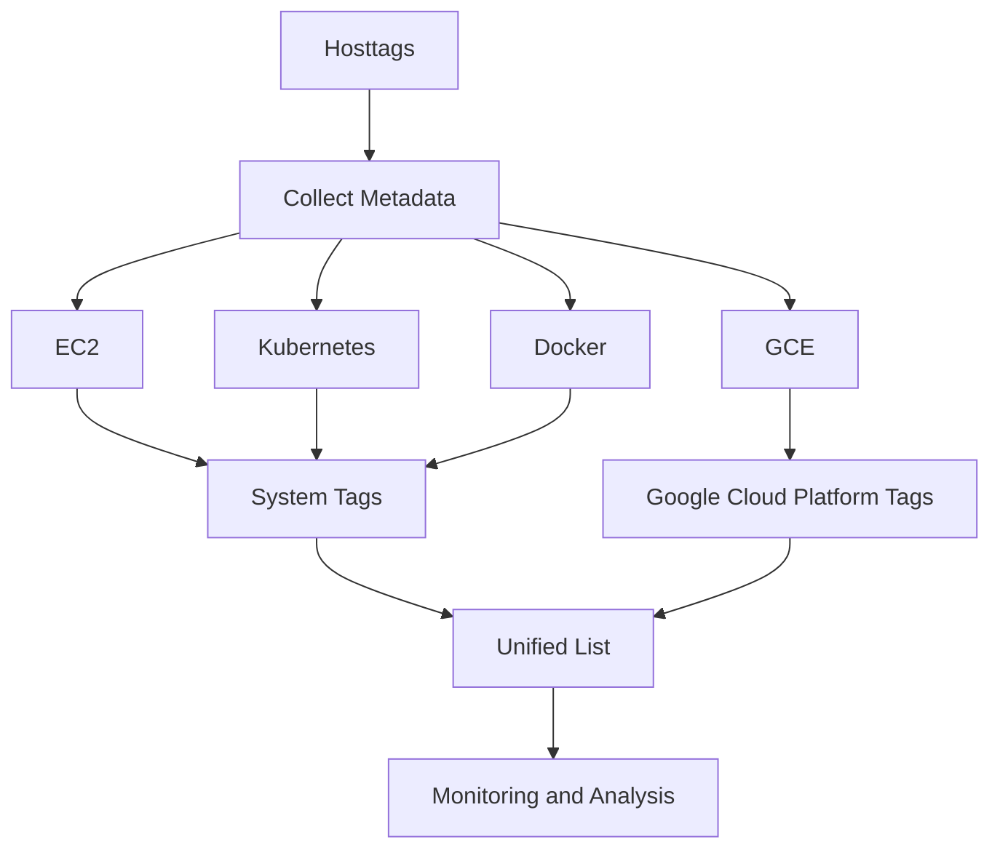

# Understanding Host Tags

Host tags are metadata tags associated with a host in the Datadog Agent. These tags help in categorizing and filtering hosts based on various attributes. Host tags are used to collect and organize metadata from different sources such as <SwmToken path="comp/metadata/host/hostimpl/hosttags/tags.go" pos="21:16:16" line-data="	&quot;github.com/DataDog/datadog-agent/pkg/util/ec2&quot;">`ec2`</SwmToken>, GCE, Kubernetes, and Docker. This metadata is then used for monitoring and analysis purposes.

The <SwmToken path="comp/metadata/host/hostimpl/hosttags/tags.go" pos="35:2:2" line-data="// Tags contains the detected host tags">`Tags`</SwmToken> struct in the hosttags package contains the detected host tags, including system tags and Google Cloud Platform tags.

<SwmSnippet path="/comp/metadata/host/hostimpl/hosttags/tags.go" line="35">

---

The <SwmToken path="comp/metadata/host/hostimpl/hosttags/tags.go" pos="35:2:2" line-data="// Tags contains the detected host tags">`Tags`</SwmToken> struct contains the detected host tags, including system tags and Google Cloud Platform tags.

```go
// Tags contains the detected host tags
type Tags struct {
	System              []string `json:"system"`
	GoogleCloudPlatform []string `json:"google cloud platform,omitempty"`
}
```

---

</SwmSnippet>

The function <SwmToken path="comp/metadata/host/hostimpl/hosttags/tags.go" pos="97:2:2" line-data="// Get the host tags, optionally looking in the cache">`Get`</SwmToken> retrieves the host tags, optionally using a cache for performance. It collects tags from various providers and combines them into a unified list.

<SwmSnippet path="/comp/metadata/host/hostimpl/hosttags/tags.go" line="97">

---

The <SwmToken path="comp/metadata/host/hostimpl/hosttags/tags.go" pos="97:2:2" line-data="// Get the host tags, optionally looking in the cache">`Get`</SwmToken> function retrieves the host tags, optionally using a cache for performance. It collects tags from various providers and combines them into a unified list.

```go
// Get the host tags, optionally looking in the cache
// There are two levels of caching:
// - First one controlled by `cached` boolean, used for performances (cache all tags)
// - Second one per provider, to avoid missing host tags for 30 minutes when a component fails (for instance, Cluster Agent).
// This second layer is always on.
func Get(ctx context.Context, cached bool, conf config.Reader) *Tags {
	if cached {
		if x, found := cache.Cache.Get(tagsCacheKey); found {
			tags := x.(*Tags)
			return tags
		}
	}

	splits := conf.GetStringMapString("tag_value_split_separator")
	appendToHostTags := func(old, new []string) []string {
		return appendAndSplitTags(old, new, splits)
	}

	configTags := configUtils.GetConfiguredTags(conf, false)
	hostTags := make([]string, 0, len(configTags))
	hostTags = appendToHostTags(hostTags, configTags)
```

---

</SwmSnippet>

The <SwmToken path="comp/metadata/host/hostimpl/hosttags/tags.go" pos="70:2:2" line-data="func appendAndSplitTags(target []string, tags []string, splits map[string]string) []string {">`appendAndSplitTags`</SwmToken> function is used to append tags to a target list and split tag values based on specified separators.

<SwmSnippet path="/comp/metadata/host/hostimpl/hosttags/tags.go" line="69">

---

The <SwmToken path="comp/metadata/host/hostimpl/hosttags/tags.go" pos="70:2:2" line-data="func appendAndSplitTags(target []string, tags []string, splits map[string]string) []string {">`appendAndSplitTags`</SwmToken> function is used to append tags to a target list and split tag values based on specified separators.

```go
// this is a "low-tech" version of tagger/utils/taglist.go but host tags are handled separately here for now
func appendAndSplitTags(target []string, tags []string, splits map[string]string) []string {
	if len(splits) == 0 {
		return append(target, tags...)
	}

	for _, tag := range tags {
		tagParts := strings.SplitN(tag, ":", 2)
		if len(tagParts) != 2 {
			target = append(target, tag)
			continue
		}
		name := tagParts[0]
		value := tagParts[1]

		sep, ok := splits[name]
		if !ok {
			target = append(target, tag)
			continue
		}
```

---

</SwmSnippet>

Host tags play a crucial role in the Datadog Agent's ability to provide detailed and organized monitoring data, enabling users to filter and analyze their infrastructure effectively.

&nbsp;

*This is an auto-generated document by Swimm AI 🌊 and has not yet been verified by a human*

<SwmMeta version="3.0.0" repo-id="Z2l0aHViJTNBJTNBZGF0YWRvZy1hZ2VudCUzQSUzQVN3aW1tLURlbW8=" repo-name="datadog-agent"><sup>Powered by [Swimm](/)</sup></SwmMeta>
