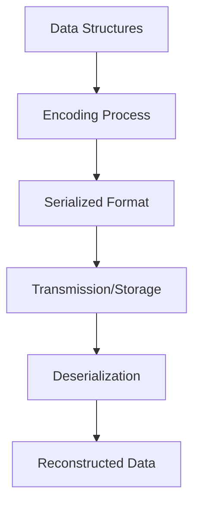

# Understanding Network Data Encoding

Encoding in the Network package refers to the process of converting data structures or objects into a specific format that can be efficiently transmitted over a network or stored. The encoding process involves transforming data into a format that can be easily serialized and deserialized, ensuring that the data remains consistent and can be accurately reconstructed at the receiving end.

## Purpose of Encoding

In the Network package, encoding is used to handle various types of network data, such as HTTP and DNS statistics, by converting them into formats like JSON or Protobuf. This ensures that the data is in a standardized format that can be easily processed by other components or systems.

## HTTP and <SwmToken path="pkg/network/encoding/marshal/usm_http2.go" pos="31:7:7" line-data="		byConnection: GroupByConnection(&quot;http2&quot;, http2Payloads, func(key http.Key) types.ConnectionKey {">`http2`</SwmToken> Encoders

The <SwmToken path="pkg/network/encoding/marshal/usm_http.go" pos="20:2:2" line-data="type httpEncoder struct {">`httpEncoder`</SwmToken> and <SwmToken path="pkg/network/encoding/marshal/usm_http2.go" pos="25:19:19" line-data="func newHTTP2Encoder(http2Payloads map[http.Key]*http.RequestStats) *http2Encoder {">`http2Encoder`</SwmToken> classes are examples of components that perform encoding for HTTP and <SwmToken path="pkg/network/encoding/marshal/usm_http2.go" pos="31:7:7" line-data="		byConnection: GroupByConnection(&quot;http2&quot;, http2Payloads, func(key http.Key) types.ConnectionKey {">`http2`</SwmToken> data, respectively. They aggregate and encode data related to network connections and their associated statistics.

<SwmSnippet path="/pkg/network/encoding/marshal/usm_http.go" line="20">

---

The <SwmToken path="pkg/network/encoding/marshal/usm_http.go" pos="20:2:2" line-data="type httpEncoder struct {">`httpEncoder`</SwmToken> class aggregates and encodes HTTP request statistics. It uses the <SwmToken path="pkg/network/encoding/marshal/usm_http.go" pos="21:1:1" line-data="	httpAggregationsBuilder *model.HTTPAggregationsBuilder">`httpAggregationsBuilder`</SwmToken> to build the aggregations and the <SwmToken path="pkg/network/encoding/marshal/usm_http.go" pos="22:1:1" line-data="	byConnection            *USMConnectionIndex[http.Key, *http.RequestStats]">`byConnection`</SwmToken> index to group the data by connection.

```go
type httpEncoder struct {
	httpAggregationsBuilder *model.HTTPAggregationsBuilder
	byConnection            *USMConnectionIndex[http.Key, *http.RequestStats]
}

func newHTTPEncoder(httpPayloads map[http.Key]*http.RequestStats) *httpEncoder {
	if len(httpPayloads) == 0 {
		return nil
	}

	return &httpEncoder{
		httpAggregationsBuilder: model.NewHTTPAggregationsBuilder(nil),
		byConnection: GroupByConnection("http", httpPayloads, func(key http.Key) types.ConnectionKey {
			return key.ConnectionKey
		}),
	}
```

---

</SwmSnippet>

## Encoding Data

The <SwmToken path="pkg/network/encoding/marshal/usm_http.go" pos="59:9:9" line-data="func (e *httpEncoder) encodeData(connectionData *USMConnectionData[http.Key, *http.RequestStats], w io.Writer) (uint64, map[string]struct{}) {">`encodeData`</SwmToken> method in these encoders is responsible for iterating over the collected data, converting it into the desired format, and writing it to an output buffer.

<SwmSnippet path="/pkg/network/encoding/marshal/usm_http.go" line="59">

---

The <SwmToken path="pkg/network/encoding/marshal/usm_http.go" pos="59:9:9" line-data="func (e *httpEncoder) encodeData(connectionData *USMConnectionData[http.Key, *http.RequestStats], w io.Writer) (uint64, map[string]struct{}) {">`encodeData`</SwmToken> method in the <SwmToken path="pkg/network/encoding/marshal/usm_http.go" pos="59:6:6" line-data="func (e *httpEncoder) encodeData(connectionData *USMConnectionData[http.Key, *http.RequestStats], w io.Writer) (uint64, map[string]struct{}) {">`httpEncoder`</SwmToken> class iterates over the collected data, converts it into the desired format, and writes it to an output buffer. This ensures that the data is serialized correctly for transmission or storage.

```go
func (e *httpEncoder) encodeData(connectionData *USMConnectionData[http.Key, *http.RequestStats], w io.Writer) (uint64, map[string]struct{}) {
	var staticTags uint64
	dynamicTags := make(map[string]struct{})
	e.httpAggregationsBuilder.Reset(w)

	for _, kvPair := range connectionData.Data {
		e.httpAggregationsBuilder.AddEndpointAggregations(func(httpStatsBuilder *model.HTTPStatsBuilder) {
			key := kvPair.Key
			stats := kvPair.Value

			httpStatsBuilder.SetPath(key.Path.Content.Get())
			httpStatsBuilder.SetFullPath(key.Path.FullPath)
			httpStatsBuilder.SetMethod(uint64(model.HTTPMethod(key.Method)))

			for code, stats := range stats.Data {
				httpStatsBuilder.AddStatsByStatusCode(func(w *model.HTTPStats_StatsByStatusCodeEntryBuilder) {
					w.SetKey(int32(code))
					w.SetValue(func(w *model.HTTPStats_DataBuilder) {
						w.SetCount(uint32(stats.Count))
						if latencies := stats.Latencies; latencies != nil {
```

---

</SwmSnippet>

## Usage of Encoded Data

This encoded data can then be transmitted over the network or stored for later analysis, ensuring that the data is in a standardized format that can be easily processed by other components or systems.

<SwmSnippet path="/pkg/network/encoding/encoding_test.go" line="53">

---

The <SwmToken path="pkg/network/encoding/encoding_test.go" pos="53:2:2" line-data="func getBlobWriter(t *testing.T, assert *assert.Assertions, in *network.Connections, marshalerType string) *bytes.Buffer {">`getBlobWriter`</SwmToken> function demonstrates how encoded data can be written to a buffer for transmission or storage. It uses a marshaler to serialize the data and writes it to a <SwmToken path="pkg/network/encoding/encoding_test.go" pos="53:34:36" line-data="func getBlobWriter(t *testing.T, assert *assert.Assertions, in *network.Connections, marshalerType string) *bytes.Buffer {">`bytes.Buffer`</SwmToken>.

```go
func getBlobWriter(t *testing.T, assert *assert.Assertions, in *network.Connections, marshalerType string) *bytes.Buffer {
	marshaler := marshal.GetMarshaler(marshalerType)
	assert.Equal(marshalerType, marshaler.ContentType())
	blobWriter := bytes.NewBuffer(nil)
	connectionsModeler := marshal.NewConnectionsModeler(in)
	defer connectionsModeler.Close()
	err := marshaler.Marshal(in, blobWriter, connectionsModeler)
	require.NoError(t, err)

	return blobWriter
```

---

</SwmSnippet>

## Main Functions

There are several main functions in this folder. Some of them are <SwmToken path="pkg/network/encoding/marshal/usm_postgres.go" pos="25:2:2" line-data="func newPostgresEncoder(postgresPayloads map[postgres.Key]*postgres.RequestStat) *postgresEncoder {">`newPostgresEncoder`</SwmToken>, <SwmToken path="pkg/network/encoding/marshal/usm_http.go" pos="32:4:4" line-data="		byConnection: GroupByConnection(&quot;http&quot;, httpPayloads, func(key http.Key) types.ConnectionKey {">`GroupByConnection`</SwmToken>, <SwmToken path="pkg/network/encoding/marshal/usm_http.go" pos="25:2:2" line-data="func newHTTPEncoder(httpPayloads map[http.Key]*http.RequestStats) *httpEncoder {">`newHTTPEncoder`</SwmToken>, and <SwmToken path="pkg/network/encoding/marshal/usm_http2.go" pos="25:2:2" line-data="func newHTTP2Encoder(http2Payloads map[http.Key]*http.RequestStats) *http2Encoder {">`newHTTP2Encoder`</SwmToken>. We will dive a little into <SwmToken path="pkg/network/encoding/marshal/usm_postgres.go" pos="25:2:2" line-data="func newPostgresEncoder(postgresPayloads map[postgres.Key]*postgres.RequestStat) *postgresEncoder {">`newPostgresEncoder`</SwmToken> and <SwmToken path="pkg/network/encoding/marshal/usm_http.go" pos="32:4:4" line-data="		byConnection: GroupByConnection(&quot;http&quot;, httpPayloads, func(key http.Key) types.ConnectionKey {">`GroupByConnection`</SwmToken>.

### <SwmToken path="pkg/network/encoding/marshal/usm_postgres.go" pos="25:2:2" line-data="func newPostgresEncoder(postgresPayloads map[postgres.Key]*postgres.RequestStat) *postgresEncoder {">`newPostgresEncoder`</SwmToken>

The <SwmToken path="pkg/network/encoding/marshal/usm_postgres.go" pos="25:2:2" line-data="func newPostgresEncoder(postgresPayloads map[postgres.Key]*postgres.RequestStat) *postgresEncoder {">`newPostgresEncoder`</SwmToken> function initializes a new instance of <SwmToken path="pkg/network/encoding/marshal/usm_postgres.go" pos="25:19:19" line-data="func newPostgresEncoder(postgresPayloads map[postgres.Key]*postgres.RequestStat) *postgresEncoder {">`postgresEncoder`</SwmToken> which is responsible for encoding PostgreSQL request statistics. It takes a map of PostgreSQL payloads and returns a <SwmToken path="pkg/network/encoding/marshal/usm_postgres.go" pos="25:19:19" line-data="func newPostgresEncoder(postgresPayloads map[postgres.Key]*postgres.RequestStat) *postgresEncoder {">`postgresEncoder`</SwmToken> object that aggregates these payloads by connection.

<SwmSnippet path="/pkg/network/encoding/marshal/usm_postgres.go" line="25">

---

The <SwmToken path="pkg/network/encoding/marshal/usm_postgres.go" pos="25:2:2" line-data="func newPostgresEncoder(postgresPayloads map[postgres.Key]*postgres.RequestStat) *postgresEncoder {">`newPostgresEncoder`</SwmToken> function initializes a new instance of <SwmToken path="pkg/network/encoding/marshal/usm_postgres.go" pos="25:19:19" line-data="func newPostgresEncoder(postgresPayloads map[postgres.Key]*postgres.RequestStat) *postgresEncoder {">`postgresEncoder`</SwmToken> which aggregates PostgreSQL request statistics by connection.

```go
func newPostgresEncoder(postgresPayloads map[postgres.Key]*postgres.RequestStat) *postgresEncoder {
	if len(postgresPayloads) == 0 {
		return nil
	}

	return &postgresEncoder{
		postgresAggregationsBuilder: model.NewDatabaseAggregationsBuilder(nil),
		byConnection: GroupByConnection("postgres", postgresPayloads, func(key postgres.Key) types.ConnectionKey {
			return key.ConnectionKey
		}),
	}
```

---

</SwmSnippet>

### <SwmToken path="pkg/network/encoding/marshal/usm_http.go" pos="32:4:4" line-data="		byConnection: GroupByConnection(&quot;http&quot;, httpPayloads, func(key http.Key) types.ConnectionKey {">`GroupByConnection`</SwmToken>

The <SwmToken path="pkg/network/encoding/marshal/usm_http.go" pos="32:4:4" line-data="		byConnection: GroupByConnection(&quot;http&quot;, httpPayloads, func(key http.Key) types.ConnectionKey {">`GroupByConnection`</SwmToken> function generates a <SwmToken path="pkg/network/encoding/marshal/usm_http.go" pos="22:4:4" line-data="	byConnection            *USMConnectionIndex[http.Key, *http.RequestStats]">`USMConnectionIndex`</SwmToken> from a generic map data structure. It groups data by connection using a provided key generation function, which translates keys to <SwmToken path="pkg/network/encoding/marshal/usm_http.go" pos="32:23:25" line-data="		byConnection: GroupByConnection(&quot;http&quot;, httpPayloads, func(key http.Key) types.ConnectionKey {">`types.ConnectionKey`</SwmToken>.

<SwmSnippet path="/pkg/network/encoding/marshal/usm.go" line="50">

---

The <SwmToken path="pkg/network/encoding/marshal/usm.go" pos="50:2:2" line-data="// GroupByConnection generates a `USMConnectionIndex` from a generic `map[K]V` data structure.">`GroupByConnection`</SwmToken> function groups data by connection using a provided key generation function, which translates keys to <SwmToken path="pkg/network/encoding/marshal/usm.go" pos="52:15:17" line-data="// essentially translates `K` to a `types.ConnectionKey` and a `protocol` name.">`types.ConnectionKey`</SwmToken>.

```go
// GroupByConnection generates a `USMConnectionIndex` from a generic `map[K]V` data structure.
// In addition to the `data` argument the caller must provide a `keyGen` function that
// essentially translates `K` to a `types.ConnectionKey` and a `protocol` name.
func GroupByConnection[K comparable, V any](protocol string, data map[K]V, keyGen func(K) types.ConnectionKey) *USMConnectionIndex[K, V] {
	byConnection := &USMConnectionIndex[K, V]{
		protocol: protocol,
		lookupFn: USMLookup[K, V],

		// Experimental: Connection Rollups
		enableConnectionRollup: config.SystemProbe.GetBool("service_monitoring_config.enable_connection_rollup"),
	}

	// The map intended to calculate how many entries we actually need in byConnection.data, and for each entry
	// how many elements it has in it.
	entriesSizeMap := make(map[types.ConnectionKey]int)

	// In the first pass we instantiate the map and calculate the number of
	// USM aggregation objects per connection
	for key := range data {
		entriesSizeMap[keyGen(key)]++
	}
```

---

</SwmSnippet>

<SwmSnippet path="/pkg/network/encoding/marshal/usm_http.go" line="25">

---

The <SwmToken path="pkg/network/encoding/marshal/usm_http.go" pos="25:2:2" line-data="func newHTTPEncoder(httpPayloads map[http.Key]*http.RequestStats) *httpEncoder {">`newHTTPEncoder`</SwmToken> function initializes a new instance of <SwmToken path="pkg/network/encoding/marshal/usm_http.go" pos="25:19:19" line-data="func newHTTPEncoder(httpPayloads map[http.Key]*http.RequestStats) *httpEncoder {">`httpEncoder`</SwmToken> which aggregates HTTP request statistics by connection.

```go
func newHTTPEncoder(httpPayloads map[http.Key]*http.RequestStats) *httpEncoder {
	if len(httpPayloads) == 0 {
		return nil
	}

	return &httpEncoder{
		httpAggregationsBuilder: model.NewHTTPAggregationsBuilder(nil),
		byConnection: GroupByConnection("http", httpPayloads, func(key http.Key) types.ConnectionKey {
			return key.ConnectionKey
		}),
	}
```

---

</SwmSnippet>

### <SwmToken path="pkg/network/encoding/marshal/usm_http2.go" pos="25:2:2" line-data="func newHTTP2Encoder(http2Payloads map[http.Key]*http.RequestStats) *http2Encoder {">`newHTTP2Encoder`</SwmToken>

The <SwmToken path="pkg/network/encoding/marshal/usm_http2.go" pos="25:2:2" line-data="func newHTTP2Encoder(http2Payloads map[http.Key]*http.RequestStats) *http2Encoder {">`newHTTP2Encoder`</SwmToken> function initializes a new instance of <SwmToken path="pkg/network/encoding/marshal/usm_http2.go" pos="25:19:19" line-data="func newHTTP2Encoder(http2Payloads map[http.Key]*http.RequestStats) *http2Encoder {">`http2Encoder`</SwmToken> which is responsible for encoding <SwmToken path="pkg/network/encoding/marshal/usm_http2.go" pos="31:7:7" line-data="		byConnection: GroupByConnection(&quot;http2&quot;, http2Payloads, func(key http.Key) types.ConnectionKey {">`http2`</SwmToken> request statistics. It takes a map of <SwmToken path="pkg/network/encoding/marshal/usm_http2.go" pos="31:7:7" line-data="		byConnection: GroupByConnection(&quot;http2&quot;, http2Payloads, func(key http.Key) types.ConnectionKey {">`http2`</SwmToken> payloads and returns an <SwmToken path="pkg/network/encoding/marshal/usm_http2.go" pos="25:19:19" line-data="func newHTTP2Encoder(http2Payloads map[http.Key]*http.RequestStats) *http2Encoder {">`http2Encoder`</SwmToken> object that aggregates these payloads by connection.

<SwmSnippet path="/pkg/network/encoding/marshal/usm_http2.go" line="25">

---

The <SwmToken path="pkg/network/encoding/marshal/usm_http2.go" pos="25:2:2" line-data="func newHTTP2Encoder(http2Payloads map[http.Key]*http.RequestStats) *http2Encoder {">`newHTTP2Encoder`</SwmToken> function initializes a new instance of <SwmToken path="pkg/network/encoding/marshal/usm_http2.go" pos="25:19:19" line-data="func newHTTP2Encoder(http2Payloads map[http.Key]*http.RequestStats) *http2Encoder {">`http2Encoder`</SwmToken> which aggregates <SwmToken path="pkg/network/encoding/marshal/usm_http2.go" pos="31:7:7" line-data="		byConnection: GroupByConnection(&quot;http2&quot;, http2Payloads, func(key http.Key) types.ConnectionKey {">`http2`</SwmToken> request statistics by connection.

```go
func newHTTP2Encoder(http2Payloads map[http.Key]*http.RequestStats) *http2Encoder {
	if len(http2Payloads) == 0 {
		return nil
	}

	return &http2Encoder{
		byConnection: GroupByConnection("http2", http2Payloads, func(key http.Key) types.ConnectionKey {
			return key.ConnectionKey
		}),
		http2AggregationsBuilder: model.NewHTTP2AggregationsBuilder(nil),
	}
```

---

</SwmSnippet>

## Endpoints of Encoding

Endpoints of Encoding

### <SwmToken path="pkg/network/encoding/encoding_test.go" pos="57:7:7" line-data="	connectionsModeler := marshal.NewConnectionsModeler(in)">`NewConnectionsModeler`</SwmToken>

The <SwmToken path="pkg/network/encoding/encoding_test.go" pos="57:7:7" line-data="	connectionsModeler := marshal.NewConnectionsModeler(in)">`NewConnectionsModeler`</SwmToken> function initializes the connection modeler with various encoders and a DNS formatter for existing connections. It groups traffic encoders by USM logic and includes formatted connection telemetry related to all batches. This function also stores the current agent configuration applicable to all instances related to the entire set of connections.

<SwmSnippet path="/pkg/network/encoding/marshal/modeler.go" line="35">

---

The <SwmToken path="pkg/network/encoding/marshal/modeler.go" pos="35:2:2" line-data="// NewConnectionsModeler initializes the connection modeler with encoders, dns formatter for">`NewConnectionsModeler`</SwmToken> function initializes the connection modeler with various encoders and a DNS formatter for existing connections.

```go
// NewConnectionsModeler initializes the connection modeler with encoders, dns formatter for
// the existing connections. The ConnectionsModeler holds the traffic encoders grouped by USM logic.
// It also includes formatted connection telemetry related to all batches, not specific batches.
// Furthermore, it stores the current agent configuration which applies to all instances related to the entire set of connections,
// rather than just individual batches.
func NewConnectionsModeler(conns *network.Connections) *ConnectionsModeler {
	ipc := make(ipCache, len(conns.Conns)/2)
	return &ConnectionsModeler{
		httpEncoder:     newHTTPEncoder(conns.HTTP),
		http2Encoder:    newHTTP2Encoder(conns.HTTP2),
		kafkaEncoder:    newKafkaEncoder(conns.Kafka),
		postgresEncoder: newPostgresEncoder(conns.Postgres),
		redisEncoder:    newRedisEncoder(conns.Redis),
		ipc:             ipc,
		dnsFormatter:    newDNSFormatter(conns, ipc),
		routeIndex:      make(map[string]RouteIdx),
		tagsSet:         network.NewTagsSet(),
	}
```

---

</SwmSnippet>

### <SwmToken path="pkg/network/encoding/marshal/format.go" pos="52:2:2" line-data="// FormatConnection converts a ConnectionStats into an model.Connection">`FormatConnection`</SwmToken>

The <SwmToken path="pkg/network/encoding/marshal/format.go" pos="52:2:2" line-data="// FormatConnection converts a ConnectionStats into an model.Connection">`FormatConnection`</SwmToken> function converts a <SwmToken path="pkg/network/encoding/marshal/format.go" pos="52:8:8" line-data="// FormatConnection converts a ConnectionStats into an model.Connection">`ConnectionStats`</SwmToken> object into a <SwmToken path="pkg/network/encoding/marshal/format.go" pos="52:14:16" line-data="// FormatConnection converts a ConnectionStats into an model.Connection">`model.Connection`</SwmToken> object. It sets various attributes such as PID, local and remote addresses, family, type, and telemetry data. The function also handles the encoding of HTTP, <SwmToken path="pkg/network/encoding/marshal/usm_http2.go" pos="31:7:7" line-data="		byConnection: GroupByConnection(&quot;http2&quot;, http2Payloads, func(key http.Key) types.ConnectionKey {">`http2`</SwmToken>, Kafka, Postgres, and Redis aggregations and tags, ensuring that the connection data is accurately formatted for further processing.

<SwmSnippet path="/pkg/network/encoding/marshal/format.go" line="52">

---

The <SwmToken path="pkg/network/encoding/marshal/format.go" pos="52:2:2" line-data="// FormatConnection converts a ConnectionStats into an model.Connection">`FormatConnection`</SwmToken> function converts a <SwmToken path="pkg/network/encoding/marshal/format.go" pos="52:8:8" line-data="// FormatConnection converts a ConnectionStats into an model.Connection">`ConnectionStats`</SwmToken> object into a <SwmToken path="pkg/network/encoding/marshal/format.go" pos="52:14:16" line-data="// FormatConnection converts a ConnectionStats into an model.Connection">`model.Connection`</SwmToken> object, setting various attributes and handling the encoding of different aggregations and tags.

```go
// FormatConnection converts a ConnectionStats into an model.Connection
func FormatConnection(builder *model.ConnectionBuilder, conn network.ConnectionStats, routes map[string]RouteIdx,
	httpEncoder *httpEncoder, http2Encoder *http2Encoder, kafkaEncoder *kafkaEncoder, postgresEncoder *postgresEncoder,
	redisEncoder *redisEncoder, dnsFormatter *dnsFormatter, ipc ipCache, tagsSet *network.TagsSet) {

	builder.SetPid(int32(conn.Pid))

	var containerID string
	if conn.ContainerID.Source != nil {
		containerID = conn.ContainerID.Source.Get().(string)
	}
	builder.SetLaddr(func(w *model.AddrBuilder) {
		w.SetIp(ipc.Get(conn.Source))
		w.SetPort(int32(conn.SPort))
		w.SetContainerId(containerID)
	})

	containerID = ""
	if conn.ContainerID.Dest != nil {
		containerID = conn.ContainerID.Dest.Get().(string)
	}
```

---

</SwmSnippet>

&nbsp;

*This is an auto-generated document by Swimm AI 🌊 and has not yet been verified by a human*

<SwmMeta version="3.0.0" repo-id="Z2l0aHViJTNBJTNBZGF0YWRvZy1hZ2VudCUzQSUzQVN3aW1tLURlbW8=" repo-name="datadog-agent"><sup>Powered by [Swimm](/)</sup></SwmMeta>
