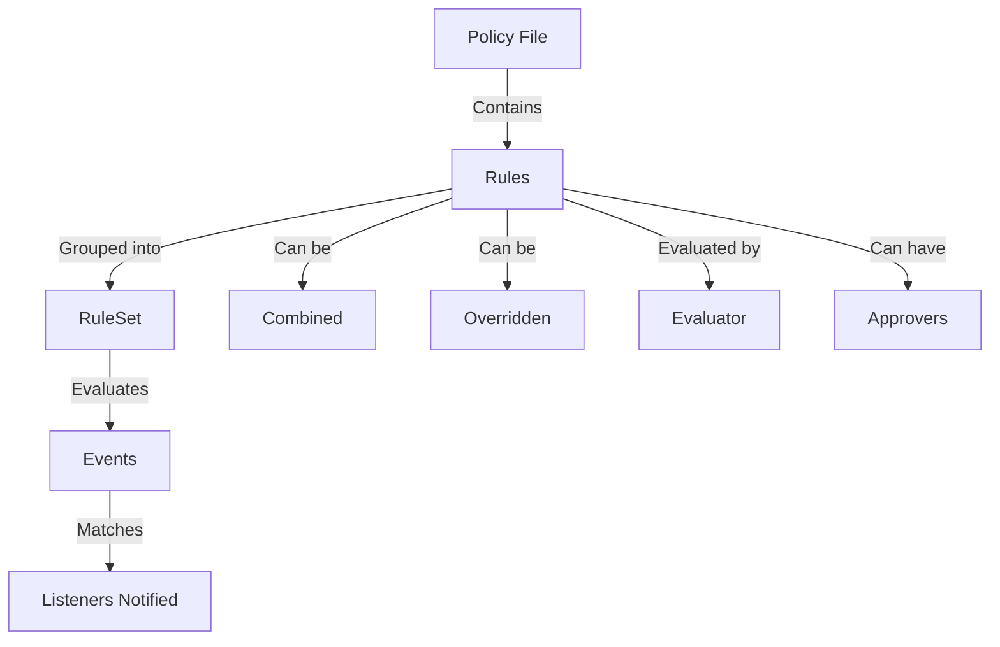

# Overview

Rules in SECL (Security Event Correlation Language) are defined as part of a policy file. A policy file is composed of a list of rules and macros. Each rule has an ID, expression, and other attributes that define its behavior and scope.

# <SwmToken path="pkg/security/secl/rules/ruleset.go" pos="182:2:2" line-data="// RuleSet holds a list of rules, grouped in bucket. An event can be evaluated">`RuleSet`</SwmToken>

Rules are grouped into a <SwmToken path="pkg/security/secl/rules/ruleset.go" pos="182:2:2" line-data="// RuleSet holds a list of rules, grouped in bucket. An event can be evaluated">`RuleSet`</SwmToken>, which holds a list of rules and can evaluate events against these rules. If an event matches a rule, the listeners for the <SwmToken path="pkg/security/secl/rules/ruleset.go" pos="182:2:2" line-data="// RuleSet holds a list of rules, grouped in bucket. An event can be evaluated">`RuleSet`</SwmToken> are notified.

<SwmSnippet path="/pkg/security/secl/rules/ruleset.go" line="182">

---

The <SwmToken path="pkg/security/secl/rules/ruleset.go" pos="182:2:2" line-data="// RuleSet holds a list of rules, grouped in bucket. An event can be evaluated">`RuleSet`</SwmToken> struct holds a list of rules, grouped in buckets. An event can be evaluated against it, and if the rule matches, the listeners for this rule set are notified.

```go
// RuleSet holds a list of rules, grouped in bucket. An event can be evaluated
// against it. If the rule matches, the listeners for this rule set are notified
type RuleSet struct {
	opts             *Opts
	evalOpts         *eval.Opts
	eventRuleBuckets map[eval.EventType]*RuleBucket
	rules            map[eval.RuleID]*Rule
	policies         []*Policy
	fieldEvaluators  map[string]eval.Evaluator
	model            eval.Model
	eventCtor        func() eval.Event
	fakeEventCtor    func() eval.Event
	listenersLock    sync.RWMutex
	listeners        []RuleSetListener
	globalVariables  eval.GlobalVariables
	scopedVariables  map[Scope]VariableProvider
	// fields holds the list of event field queries (like "process.uid") used by the entire set of rules
	fields []string
	logger log.Logger
	pool   *eval.ContextPool
```

---

</SwmSnippet>

# Policy Struct

The <SwmToken path="pkg/security/secl/rules/ruleset.go" pos="189:6:6" line-data="	policies         []*Policy">`Policy`</SwmToken> struct represents a policy file which is composed of a list of rules and macros. This struct is essential for defining and managing rules within the system.

# Adding Rules

The <SwmToken path="pkg/security/secl/rules/policy.go" pos="44:2:2" line-data="// AddRule adds a rule to the policy">`AddRule`</SwmToken> function adds a rule to the policy. This function links the rule to the policy and appends it to the list of rules.

<SwmSnippet path="/pkg/security/secl/rules/policy.go" line="44">

---

The <SwmToken path="pkg/security/secl/rules/policy.go" pos="44:2:2" line-data="// AddRule adds a rule to the policy">`AddRule`</SwmToken> function is defined here, showing how it appends a rule to the policy's list of rules.

```go
// AddRule adds a rule to the policy
func (p *Policy) AddRule(def *RuleDefinition) {
	def.Policy = p
	p.Rules = append(p.Rules, def)
}
```

---

</SwmSnippet>

# Evaluating Rules

Rules are evaluated using an evaluator that checks if the event matches the rule's expression. If the rule matches, it can trigger actions or notify listeners.

# Combining and Overriding Rules

Rules can be combined using different policies, and they can be overridden by other rules. This allows for flexible and dynamic rule management.

# Approvers

Rules can also have approvers, which are filter values indexed by field. Approvers are used to determine if a rule can be applied to a specific event.

# Main Functions

There are several main functions in this folder. Some of them are <SwmToken path="pkg/security/secl/rules/ruleset.go" pos="73:2:2" line-data="// MergeWith merges macro m2 into m">`MergeWith`</SwmToken>, <SwmToken path="pkg/security/secl/rules/ruleset.go" pos="117:2:2" line-data="// GetTag returns the tag value associated with a tag key">`GetTag`</SwmToken>, and <SwmToken path="pkg/security/secl/rules/ruleset.go" pos="218:2:2" line-data="// GetRules returns the active rules">`GetRules`</SwmToken>. We will dive a little into <SwmToken path="pkg/security/secl/rules/ruleset.go" pos="73:2:2" line-data="// MergeWith merges macro m2 into m">`MergeWith`</SwmToken> and <SwmToken path="pkg/security/secl/rules/ruleset.go" pos="218:2:2" line-data="// GetRules returns the active rules">`GetRules`</SwmToken>.

## <SwmToken path="pkg/security/secl/rules/ruleset.go" pos="73:2:2" line-data="// MergeWith merges macro m2 into m">`MergeWith`</SwmToken>

The <SwmToken path="pkg/security/secl/rules/ruleset.go" pos="73:2:2" line-data="// MergeWith merges macro m2 into m">`MergeWith`</SwmToken> function in the <SwmToken path="pkg/security/secl/rules/ruleset.go" pos="74:6:6" line-data="func (m *MacroDefinition) MergeWith(m2 *MacroDefinition) error {">`MacroDefinition`</SwmToken> struct is used to merge another macro into the current macro. It handles different merge policies, such as merging values or overriding them.

<SwmSnippet path="/pkg/security/secl/rules/ruleset.go" line="73">

---

The <SwmToken path="pkg/security/secl/rules/ruleset.go" pos="73:2:2" line-data="// MergeWith merges macro m2 into m">`MergeWith`</SwmToken> function is defined here, showing how it merges another macro into the current macro based on different merge policies.

```go
// MergeWith merges macro m2 into m
func (m *MacroDefinition) MergeWith(m2 *MacroDefinition) error {
	switch m2.Combine {
	case MergePolicy:
		if m.Expression != "" || m2.Expression != "" {
			return &ErrMacroLoad{Definition: m2, Err: ErrCannotMergeExpression}
		}
		m.Values = append(m.Values, m2.Values...)
	case OverridePolicy:
		m.Values = m2.Values
	default:
		return &ErrMacroLoad{Definition: m2, Err: ErrDefinitionIDConflict}
	}
	return nil
}
```

---

</SwmSnippet>

## <SwmToken path="pkg/security/secl/rules/ruleset.go" pos="218:2:2" line-data="// GetRules returns the active rules">`GetRules`</SwmToken>

The <SwmToken path="pkg/security/secl/rules/ruleset.go" pos="218:2:2" line-data="// GetRules returns the active rules">`GetRules`</SwmToken> function in the <SwmToken path="pkg/security/secl/rules/ruleset.go" pos="182:2:2" line-data="// RuleSet holds a list of rules, grouped in bucket. An event can be evaluated">`RuleSet`</SwmToken> struct returns the active rules in the ruleset. It is used in various parts of the codebase to retrieve and work with the current set of rules.

<SwmSnippet path="/pkg/security/secl/rules/ruleset.go" line="218">

---

The <SwmToken path="pkg/security/secl/rules/ruleset.go" pos="218:2:2" line-data="// GetRules returns the active rules">`GetRules`</SwmToken> function is defined here, showing how it returns the active rules in the <SwmToken path="pkg/security/secl/rules/ruleset.go" pos="219:6:6" line-data="func (rs *RuleSet) GetRules() map[eval.RuleID]*Rule {">`RuleSet`</SwmToken>.

```go
// GetRules returns the active rules
func (rs *RuleSet) GetRules() map[eval.RuleID]*Rule {
	return rs.rules
}
```

---

</SwmSnippet>

&nbsp;

*This is an auto-generated document by Swimm AI 🌊 and has not yet been verified by a human*

<SwmMeta version="3.0.0" repo-id="Z2l0aHViJTNBJTNBZGF0YWRvZy1hZ2VudCUzQSUzQVN3aW1tLURlbW8=" repo-name="datadog-agent"><sup>Powered by [Swimm](/)</sup></SwmMeta>
