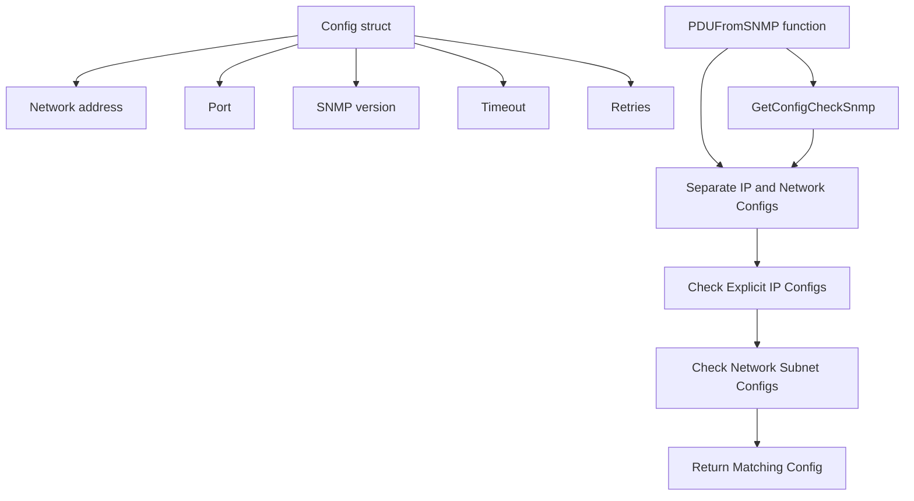

# Overview

The <SwmToken path="pkg/snmp/snmp.go" pos="242:11:11" line-data="		return nil, fmt.Errorf(&quot;SNMP version not supported: %s&quot;, c.Version)">`SNMP`</SwmToken> package is responsible for handling SNMP (Simple Network Management Protocol) operations within the Datadog Agent. It includes configurations, utilities, and functions to interact with SNMP-enabled devices.

# Configuration

The <SwmToken path="pkg/snmp/snmp.go" pos="51:2:2" line-data="// Config holds configuration for a particular subnet">`Config`</SwmToken> struct in the <SwmToken path="pkg/snmp/snmp.go" pos="242:11:11" line-data="		return nil, fmt.Errorf(&quot;SNMP version not supported: %s&quot;, c.Version)">`SNMP`</SwmToken> package holds the configuration details for a particular subnet, including network address, port, SNMP version, timeout, retries, and other SNMP-specific settings.

<SwmSnippet path="/pkg/snmp/snmp.go" line="51">

---

The <SwmToken path="pkg/snmp/snmp.go" pos="51:2:2" line-data="// Config holds configuration for a particular subnet">`Config`</SwmToken> struct holds configuration details for a particular subnet, including network address, port, SNMP version, timeout, retries, and other SNMP-specific settings.

```go
// Config holds configuration for a particular subnet
type Config struct {
	Network                     string          `mapstructure:"network_address"`
	Port                        uint16          `mapstructure:"port"`
	Version                     string          `mapstructure:"snmp_version"`
	Timeout                     int             `mapstructure:"timeout"`
	Retries                     int             `mapstructure:"retries"`
	OidBatchSize                int             `mapstructure:"oid_batch_size"`
	Community                   string          `mapstructure:"community_string"`
	User                        string          `mapstructure:"user"`
	AuthKey                     string          `mapstructure:"authKey"`
	AuthProtocol                string          `mapstructure:"authProtocol"`
	PrivKey                     string          `mapstructure:"privKey"`
	PrivProtocol                string          `mapstructure:"privProtocol"`
	ContextEngineID             string          `mapstructure:"context_engine_id"`
	ContextName                 string          `mapstructure:"context_name"`
	IgnoredIPAddresses          map[string]bool `mapstructure:"ignored_ip_addresses"`
	ADIdentifier                string          `mapstructure:"ad_identifier"`
	Loader                      string          `mapstructure:"loader"`
	CollectDeviceMetadataConfig *bool           `mapstructure:"collect_device_metadata"`
	CollectDeviceMetadata       bool
```

---

</SwmSnippet>

# Default Values

Constants such as <SwmToken path="pkg/snmp/snmp.go" pos="28:1:1" line-data="	defaultPort    = 161">`defaultPort`</SwmToken>, <SwmToken path="pkg/snmp/snmp.go" pos="29:1:1" line-data="	defaultTimeout = 5">`defaultTimeout`</SwmToken>, and <SwmToken path="pkg/snmp/snmp.go" pos="30:1:1" line-data="	defaultRetries = 3">`defaultRetries`</SwmToken> define default values for SNMP operations, ensuring consistent behavior across the application.

<SwmSnippet path="/pkg/snmp/snmp.go" line="28">

---

Constants such as <SwmToken path="pkg/snmp/snmp.go" pos="28:1:1" line-data="	defaultPort    = 161">`defaultPort`</SwmToken>, <SwmToken path="pkg/snmp/snmp.go" pos="29:1:1" line-data="	defaultTimeout = 5">`defaultTimeout`</SwmToken>, and <SwmToken path="pkg/snmp/snmp.go" pos="30:1:1" line-data="	defaultRetries = 3">`defaultRetries`</SwmToken> define default values for SNMP operations.

```go
	defaultPort    = 161
	defaultTimeout = 5
	defaultRetries = 3
)
```

---

</SwmSnippet>

# Main Functions

There are several main functions related to SNMP. Some of them are <SwmToken path="pkg/snmp/snmpparse/config_snmp.go" pos="60:2:2" line-data="// ParseConfigSnmp extracts all SNMPConfigs from an autodiscovery config.">`ParseConfigSnmp`</SwmToken>, <SwmToken path="pkg/snmp/snmpparse/config_snmp.go" pos="51:2:2" line-data="// SetDefault sets the standard default config values">`SetDefault`</SwmToken>, and <SwmToken path="pkg/snmp/snmp.go" pos="229:9:9" line-data="func (c *Config) BuildSNMPParams(deviceIP string) (*gosnmp.GoSNMP, error) {">`BuildSNMPParams`</SwmToken>.

## <SwmToken path="pkg/snmp/snmpparse/config_snmp.go" pos="60:2:2" line-data="// ParseConfigSnmp extracts all SNMPConfigs from an autodiscovery config.">`ParseConfigSnmp`</SwmToken>

The <SwmToken path="pkg/snmp/snmpparse/config_snmp.go" pos="60:2:2" line-data="// ParseConfigSnmp extracts all SNMPConfigs from an autodiscovery config.">`ParseConfigSnmp`</SwmToken> function extracts all SNMP configurations from an autodiscovery config. It initializes an array to hold SNMP instances, sets default values using <SwmToken path="pkg/snmp/snmpparse/config_snmp.go" pos="51:2:2" line-data="// SetDefault sets the standard default config values">`SetDefault`</SwmToken>, and unmarshals the configuration data into the <SwmToken path="pkg/snmp/snmpparse/config_snmp.go" pos="52:7:7" line-data="func SetDefault(sc *SNMPConfig) {">`SNMPConfig`</SwmToken> struct.

<SwmSnippet path="/pkg/snmp/snmpparse/config_snmp.go" line="60">

---

The <SwmToken path="pkg/snmp/snmpparse/config_snmp.go" pos="60:2:2" line-data="// ParseConfigSnmp extracts all SNMPConfigs from an autodiscovery config.">`ParseConfigSnmp`</SwmToken> function extracts all SNMP configurations from an autodiscovery config.

```go
// ParseConfigSnmp extracts all SNMPConfigs from an autodiscovery config.
// Any loading errors are logged but not returned.
func ParseConfigSnmp(c integration.Config) []SNMPConfig {
	//an array containing all the snmp instances
	snmpconfigs := []SNMPConfig{}

	for _, inst := range c.Instances {
		instance := SNMPConfig{}
		SetDefault(&instance)
		err := yaml.Unmarshal(inst, &instance)
		if err != nil {
			fmt.Printf("unable to get snmp config: %v", err)
		}
		// add the instance(type SNMPConfig) to the array snmpconfigs
		snmpconfigs = append(snmpconfigs, instance)
	}

	return snmpconfigs
}
```

---

</SwmSnippet>

## <SwmToken path="pkg/snmp/snmpparse/config_snmp.go" pos="51:2:2" line-data="// SetDefault sets the standard default config values">`SetDefault`</SwmToken>

The <SwmToken path="pkg/snmp/snmpparse/config_snmp.go" pos="51:2:2" line-data="// SetDefault sets the standard default config values">`SetDefault`</SwmToken> function sets the standard default values for the <SwmToken path="pkg/snmp/snmpparse/config_snmp.go" pos="52:7:7" line-data="func SetDefault(sc *SNMPConfig) {">`SNMPConfig`</SwmToken> struct, such as port, version, timeout, and retries. This ensures that the SNMP configuration has consistent default values.

<SwmSnippet path="/pkg/snmp/snmpparse/config_snmp.go" line="51">

---

The <SwmToken path="pkg/snmp/snmpparse/config_snmp.go" pos="51:2:2" line-data="// SetDefault sets the standard default config values">`SetDefault`</SwmToken> function sets the standard default values for the <SwmToken path="pkg/snmp/snmpparse/config_snmp.go" pos="52:7:7" line-data="func SetDefault(sc *SNMPConfig) {">`SNMPConfig`</SwmToken> struct.

```go
// SetDefault sets the standard default config values
func SetDefault(sc *SNMPConfig) {
	sc.Port = 161
	sc.Version = ""
	sc.Timeout = 2
	sc.Retries = 3

}
```

---

</SwmSnippet>

## <SwmToken path="pkg/snmp/snmp.go" pos="229:9:9" line-data="func (c *Config) BuildSNMPParams(deviceIP string) (*gosnmp.GoSNMP, error) {">`BuildSNMPParams`</SwmToken>

The <SwmToken path="pkg/snmp/snmp.go" pos="229:9:9" line-data="func (c *Config) BuildSNMPParams(deviceIP string) (*gosnmp.GoSNMP, error) {">`BuildSNMPParams`</SwmToken> function constructs SNMP parameters based on the provided configuration. It validates the SNMP version and authentication mechanisms, and sets the appropriate values in the SNMP parameters.

<SwmSnippet path="/pkg/snmp/snmp.go" line="229">

---

The <SwmToken path="pkg/snmp/snmp.go" pos="229:9:9" line-data="func (c *Config) BuildSNMPParams(deviceIP string) (*gosnmp.GoSNMP, error) {">`BuildSNMPParams`</SwmToken> function constructs SNMP parameters based on the provided configuration.

```go
func (c *Config) BuildSNMPParams(deviceIP string) (*gosnmp.GoSNMP, error) {
	if c.Community == "" && c.User == "" {
		return nil, errors.New("No authentication mechanism specified")
	}

	var version gosnmp.SnmpVersion
	if c.Version == "1" {
		version = gosnmp.Version1
	} else if c.Version == "2" || (c.Version == "" && c.Community != "") {
		version = gosnmp.Version2c
	} else if c.Version == "3" || (c.Version == "" && c.User != "") {
		version = gosnmp.Version3
	} else {
		return nil, fmt.Errorf("SNMP version not supported: %s", c.Version)
	}

	authProtocol, err := gosnmplib.GetAuthProtocol(c.AuthProtocol)
	if err != nil {
		return nil, err
	}
```

---

</SwmSnippet>

# SNMP Endpoints

SNMP Endpoints are crucial for retrieving and managing SNMP configurations.

## <SwmToken path="pkg/snmp/snmpparse/config_snmp.go" pos="142:2:2" line-data="// GetConfigCheckSnmp returns each SNMPConfig for all running config checks, by querying the local agent.">`GetConfigCheckSnmp`</SwmToken>

The <SwmToken path="pkg/snmp/snmpparse/config_snmp.go" pos="142:2:2" line-data="// GetConfigCheckSnmp returns each SNMPConfig for all running config checks, by querying the local agent.">`GetConfigCheckSnmp`</SwmToken> function retrieves SNMP configurations for all running config checks by querying the local agent. It constructs an endpoint using <SwmToken path="pkg/snmp/snmpparse/config_snmp.go" pos="148:8:10" line-data="	endpoint, err := apiutil.NewIPCEndpoint(conf, &quot;/agent/config-check&quot;)">`apiutil.NewIPCEndpoint`</SwmToken> and performs a GET request to fetch the configurations. The response is then unmarshalled into an <SwmToken path="pkg/snmp/snmpparse/config_snmp.go" pos="160:5:7" line-data="	cr := integration.ConfigCheckResponse{}">`integration.ConfigCheckResponse`</SwmToken> object, and the SNMP configurations are extracted and returned.

<SwmSnippet path="/pkg/snmp/snmpparse/config_snmp.go" line="142">

---

The <SwmToken path="pkg/snmp/snmpparse/config_snmp.go" pos="142:2:2" line-data="// GetConfigCheckSnmp returns each SNMPConfig for all running config checks, by querying the local agent.">`GetConfigCheckSnmp`</SwmToken> function retrieves SNMP configurations for all running config checks by querying the local agent.

```go
// GetConfigCheckSnmp returns each SNMPConfig for all running config checks, by querying the local agent.
// If the agent isn't running or is unreachable, this will fail.
func GetConfigCheckSnmp(conf config.Component) ([]SNMPConfig, error) {
	// TODO: change the URL if the snmp check is a cluster check
	// add /agent/config-check to cluster agent API
	// Copy the code from comp/core/autodiscovery/autodiscoveryimpl/autoconfig.go#writeConfigCheck
	endpoint, err := apiutil.NewIPCEndpoint(conf, "/agent/config-check")
	if err != nil {
		return nil, err
	}
	urlValues := url.Values{}
	urlValues.Set("raw", "true")

	res, err := endpoint.DoGet(apiutil.WithValues(urlValues))
	if err != nil {
		return nil, err
	}

	cr := integration.ConfigCheckResponse{}
	err = json.Unmarshal(res, &cr)
	if err != nil {
```

---

</SwmSnippet>

## <SwmToken path="pkg/snmp/snmpparse/config_snmp.go" pos="180:2:2" line-data="// GetIPConfig finds the SNMPConfig for a specific IP address.">`GetIPConfig`</SwmToken>

The <SwmToken path="pkg/snmp/snmpparse/config_snmp.go" pos="180:2:2" line-data="// GetIPConfig finds the SNMPConfig for a specific IP address.">`GetIPConfig`</SwmToken> function finds the SNMP configuration for a specific IP address. It first separates the configurations into those with explicit IP addresses and those with network addresses. It then checks if the given IP address matches any explicit IP address configurations or if it falls within any configured subnets. If a match is found, the corresponding SNMP configuration is returned.

<SwmSnippet path="/pkg/snmp/snmpparse/config_snmp.go" line="180">

---

The <SwmToken path="pkg/snmp/snmpparse/config_snmp.go" pos="180:2:2" line-data="// GetIPConfig finds the SNMPConfig for a specific IP address.">`GetIPConfig`</SwmToken> function finds the SNMP configuration for a specific IP address.

```go
// GetIPConfig finds the SNMPConfig for a specific IP address.
// If the IP is explicitly configured, that will be returned;
// if it isn't, but it is part of a configured subnet, then the
// subnet config will be returned. If there are no matches, this
// will return an empty SNMPConfig.
func GetIPConfig(ipAddress string, SnmpConfigList []SNMPConfig) SNMPConfig {
	ipAddressConfigs := []SNMPConfig{}
	netAddressConfigs := []SNMPConfig{}

	//split the SnmpConfigList to get the IP addresses separated from
	//the network addresses
	for _, snmpconfig := range SnmpConfigList {
		if snmpconfig.IPAddress != "" {
			ipAddressConfigs = append(ipAddressConfigs, snmpconfig)
		}
		if snmpconfig.NetAddress != "" {
			netAddressConfigs = append(netAddressConfigs, snmpconfig)
		}
	}

	//check if the ip address is explicitly mentioned
```

---

</SwmSnippet>

&nbsp;

*This is an auto-generated document by Swimm AI 🌊 and has not yet been verified by a human*

<SwmMeta version="3.0.0" repo-id="Z2l0aHViJTNBJTNBZGF0YWRvZy1hZ2VudCUzQSUzQVN3aW1tLURlbW8=" repo-name="datadog-agent"><sup>Powered by [Swimm](/)</sup></SwmMeta>
