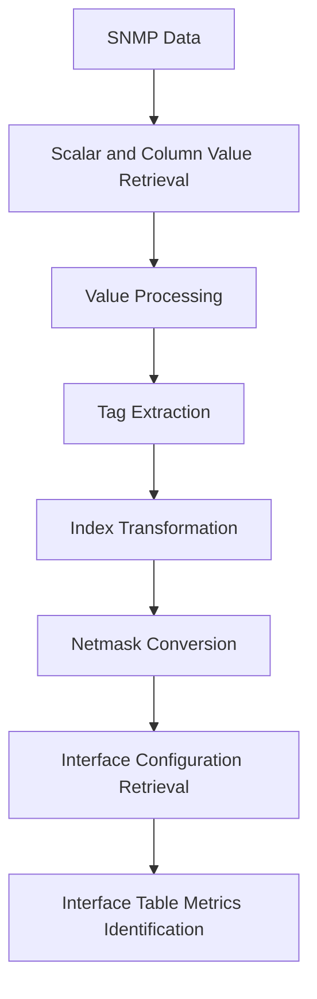

# Understanding SNMP Report Utilities

SNMP Report Utilities are a set of functions and constants designed to process and format SNMP data for reporting. These utilities facilitate the extraction, transformation, and formatting of SNMP data to generate meaningful reports.

## Scalar and Column Value Retrieval

Functions like <SwmToken path="pkg/collector/corechecks/snmp/internal/report/report_utils.go" pos="27:2:2" line-data="func getScalarValueFromSymbol(values *valuestore.ResultValueStore, symbol profiledefinition.SymbolConfig) (valuestore.ResultValue, error) {">`getScalarValueFromSymbol`</SwmToken> and <SwmToken path="pkg/collector/corechecks/snmp/internal/report/report_utils.go" pos="35:2:2" line-data="func getColumnValueFromSymbol(values *valuestore.ResultValueStore, symbol profiledefinition.SymbolConfig) (map[string]valuestore.ResultValue, error) {">`getColumnValueFromSymbol`</SwmToken> are used to retrieve scalar and column values from SNMP results.

<SwmSnippet path="/pkg/collector/corechecks/snmp/internal/report/report_utils.go" line="27">

---

The <SwmToken path="pkg/collector/corechecks/snmp/internal/report/report_utils.go" pos="27:2:2" line-data="func getScalarValueFromSymbol(values *valuestore.ResultValueStore, symbol profiledefinition.SymbolConfig) (valuestore.ResultValue, error) {">`getScalarValueFromSymbol`</SwmToken> function retrieves a scalar value from the SNMP result store using the provided symbol configuration. It processes the value using the <SwmToken path="pkg/collector/corechecks/snmp/internal/report/report_utils.go" pos="32:3:3" line-data="	return processValueUsingSymbolConfig(value, symbol)">`processValueUsingSymbolConfig`</SwmToken> function.

```go
func getScalarValueFromSymbol(values *valuestore.ResultValueStore, symbol profiledefinition.SymbolConfig) (valuestore.ResultValue, error) {
	value, err := values.GetScalarValue(symbol.OID)
	if err != nil {
		return valuestore.ResultValue{}, err
	}
	return processValueUsingSymbolConfig(value, symbol)
}
```

---

</SwmSnippet>

## Value Processing

The function <SwmToken path="pkg/collector/corechecks/snmp/internal/report/report_utils.go" pos="32:3:3" line-data="	return processValueUsingSymbolConfig(value, symbol)">`processValueUsingSymbolConfig`</SwmToken> processes values using symbol configurations, including extracting and formatting values.

<SwmSnippet path="/pkg/collector/corechecks/snmp/internal/report/report_utils.go" line="52">

---

The <SwmToken path="pkg/collector/corechecks/snmp/internal/report/report_utils.go" pos="52:2:2" line-data="func processValueUsingSymbolConfig(value valuestore.ResultValue, symbol profiledefinition.SymbolConfig) (valuestore.ResultValue, error) {">`processValueUsingSymbolConfig`</SwmToken> function handles value extraction, pattern matching, and formatting based on the symbol's configuration.

```go
func processValueUsingSymbolConfig(value valuestore.ResultValue, symbol profiledefinition.SymbolConfig) (valuestore.ResultValue, error) {
	if symbol.ExtractValueCompiled != nil {
		extractedValue, err := value.ExtractStringValue(symbol.ExtractValueCompiled)
		if err != nil {
			log.Debugf("error extracting value from `%v` with pattern `%v`: %v", value, symbol.ExtractValueCompiled, err)
			return valuestore.ResultValue{}, err
		}
		value = extractedValue
	}
	if symbol.MatchPatternCompiled != nil {
		strValue, err := value.ToString()
		if err != nil {
			log.Debugf("error converting value to string (value=%v): %v", value, err)
			return valuestore.ResultValue{}, err
		}

		if symbol.MatchPatternCompiled.MatchString(strValue) {
			replacedVal := checkconfig.RegexReplaceValue(strValue, symbol.MatchPatternCompiled, symbol.MatchValue)
			if replacedVal == "" {
				return valuestore.ResultValue{}, fmt.Errorf("the pattern `%v` matched value `%v`, but template `%s` is not compatible", symbol.MatchPattern, strValue, symbol.MatchValue)
			}
```

---

</SwmSnippet>

## Tag Extraction

The function <SwmToken path="pkg/collector/corechecks/snmp/internal/report/report_utils.go" pos="88:2:2" line-data="// getTagsFromMetricTagConfigList retrieve tags using the metric config and values">`getTagsFromMetricTagConfigList`</SwmToken> extracts tags from metric configurations based on SNMP data.

<SwmSnippet path="/pkg/collector/corechecks/snmp/internal/report/report_utils.go" line="88">

---

The <SwmToken path="pkg/collector/corechecks/snmp/internal/report/report_utils.go" pos="88:2:2" line-data="// getTagsFromMetricTagConfigList retrieve tags using the metric config and values">`getTagsFromMetricTagConfigList`</SwmToken> function retrieves tags using the metric config and values.

```go
// getTagsFromMetricTagConfigList retrieve tags using the metric config and values
func getTagsFromMetricTagConfigList(mtcl profiledefinition.MetricTagConfigList, fullIndex string, values *valuestore.ResultValueStore) []string {
	var rowTags []string
	indexes := strings.Split(fullIndex, ".")
	for _, metricTag := range mtcl {
		// get tag using `index` field
		if metricTag.Index > 0 {
			index := metricTag.Index - 1 // `index` metric config is 1-based
			if index >= uint(len(indexes)) {
				log.Debugf("error getting tags. index `%d` not found in indexes `%v`", metricTag.Index, indexes)
				continue
			}
			tagValue, err := checkconfig.GetMappedValue(indexes[index], metricTag.Mapping)
			if err != nil {
				log.Debugf("error getting tags. mapping for `%s` does not exist. mapping=`%v`, indexes=`%v`", indexes[index], metricTag.Mapping, indexes)
				continue
			}
			rowTags = append(rowTags, metricTag.Tag+":"+tagValue)
		}
		// get tag using another column value
		if metricTag.Symbol.OID != "" {
```

---

</SwmSnippet>

## Index Transformation

The function <SwmToken path="pkg/collector/corechecks/snmp/internal/report/report_utils.go" pos="140:2:2" line-data="// transformIndex change a source index into a new index using a list of transform rules.">`transformIndex`</SwmToken> changes a source index into a new index using a list of transform rules.

<SwmSnippet path="/pkg/collector/corechecks/snmp/internal/report/report_utils.go" line="140">

---

The <SwmToken path="pkg/collector/corechecks/snmp/internal/report/report_utils.go" pos="140:2:2" line-data="// transformIndex change a source index into a new index using a list of transform rules.">`transformIndex`</SwmToken> function extracts a subset of the source index based on the provided transform rules.

```go
// transformIndex change a source index into a new index using a list of transform rules.
// A transform rule has start/end fields, it is used to extract a subset of the source index.
func transformIndex(indexes []string, transformRules []profiledefinition.MetricIndexTransform) []string {
	var newIndex []string

	for _, rule := range transformRules {
		start := rule.Start
		end := rule.End + 1
		if end > uint(len(indexes)) {
			return nil
		}
		newIndex = append(newIndex, indexes[start:end]...)
	}
	return newIndex
}
```

---

</SwmSnippet>

## Netmask Conversion

The function <SwmToken path="pkg/collector/corechecks/snmp/internal/report/report_utils.go" pos="156:2:2" line-data="func netmaskToPrefixlen(netmask string) int {">`netmaskToPrefixlen`</SwmToken> converts a netmask to a prefix length.

<SwmSnippet path="/pkg/collector/corechecks/snmp/internal/report/report_utils.go" line="156">

---

The <SwmToken path="pkg/collector/corechecks/snmp/internal/report/report_utils.go" pos="156:2:2" line-data="func netmaskToPrefixlen(netmask string) int {">`netmaskToPrefixlen`</SwmToken> function converts a netmask string to its corresponding prefix length.

```go
func netmaskToPrefixlen(netmask string) int {
	stringMask := net.IPMask(net.ParseIP(netmask).To4())
	length, _ := stringMask.Size()
	return length
}
```

---

</SwmSnippet>

## Interface Configuration Retrieval

The function <SwmToken path="pkg/collector/corechecks/snmp/internal/report/report_utils.go" pos="162:2:2" line-data="// getInterfaceConfig retrieves snmpintegration.InterfaceConfig by index and tags">`getInterfaceConfig`</SwmToken> retrieves interface configurations based on SNMP data.

<SwmSnippet path="/pkg/collector/corechecks/snmp/internal/report/report_utils.go" line="162">

---

The <SwmToken path="pkg/collector/corechecks/snmp/internal/report/report_utils.go" pos="162:2:2" line-data="// getInterfaceConfig retrieves snmpintegration.InterfaceConfig by index and tags">`getInterfaceConfig`</SwmToken> function retrieves SNMP interface configurations by index and tags.

```go
// getInterfaceConfig retrieves snmpintegration.InterfaceConfig by index and tags
func getInterfaceConfig(interfaceConfigs []snmpintegration.InterfaceConfig, index string, tags []string) (snmpintegration.InterfaceConfig, error) {
	var ifName string
	for _, tag := range tags {
		tagElems := strings.SplitN(tag, ":", 2)
		if len(tagElems) == 2 && tagElems[0] == "interface" {
			ifName = tagElems[1]
			break
		}
	}
	for _, ifConfig := range interfaceConfigs {
		if (ifConfig.MatchField == "name" && ifConfig.MatchValue == ifName) ||
			(ifConfig.MatchField == "index" && ifConfig.MatchValue == index) {
			return ifConfig, nil
		}
	}
	return snmpintegration.InterfaceConfig{}, fmt.Errorf("no matching interface found for index=%s, tags=%s", index, tags)
}
```

---

</SwmSnippet>

## Interface Table Metrics Identification

The function <SwmToken path="pkg/collector/corechecks/snmp/internal/report/report_utils.go" pos="208:2:2" line-data="// isInterfaceTableMetric takes in an OID and returns">`isInterfaceTableMetric`</SwmToken> identifies interface table metrics using the constants <SwmToken path="pkg/collector/corechecks/snmp/internal/report/report_utils.go" pos="213:10:10" line-data="	return strings.HasPrefix(oid, ifTablePrefix) || strings.HasPrefix(oid, ifXTablePrefix)">`ifTablePrefix`</SwmToken> and <SwmToken path="pkg/collector/corechecks/snmp/internal/report/report_utils.go" pos="213:22:22" line-data="	return strings.HasPrefix(oid, ifTablePrefix) || strings.HasPrefix(oid, ifXTablePrefix)">`ifXTablePrefix`</SwmToken>.

<SwmSnippet path="/pkg/collector/corechecks/snmp/internal/report/report_utils.go" line="208">

---

The <SwmToken path="pkg/collector/corechecks/snmp/internal/report/report_utils.go" pos="208:2:2" line-data="// isInterfaceTableMetric takes in an OID and returns">`isInterfaceTableMetric`</SwmToken> function checks if an OID matches the interface table prefixes from the <SwmToken path="pkg/collector/corechecks/snmp/internal/report/report_utils.go" pos="210:4:6" line-data="// the IF-MIB">`IF-MIB`</SwmToken>.

```go
// isInterfaceTableMetric takes in an OID and returns
// true if the prefix matches ifTable or ifXTable from
// the IF-MIB
func isInterfaceTableMetric(oid string) bool {
	oid = strings.TrimPrefix(oid, ".")
	return strings.HasPrefix(oid, ifTablePrefix) || strings.HasPrefix(oid, ifXTablePrefix)
}
```

---

</SwmSnippet>

&nbsp;

*This is an auto-generated document by Swimm AI 🌊 and has not yet been verified by a human*

<SwmMeta version="3.0.0" repo-id="Z2l0aHViJTNBJTNBZGF0YWRvZy1hZ2VudCUzQSUzQVN3aW1tLURlbW8=" repo-name="datadog-agent"><sup>Powered by [Swimm](/)</sup></SwmMeta>
