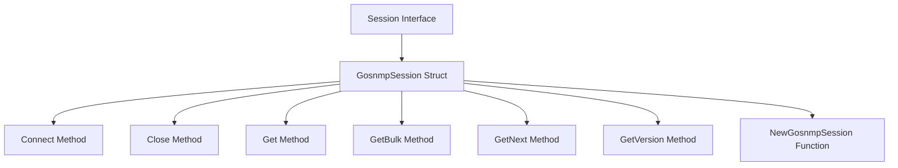

<SwmSnippet path="/pkg/collector/corechecks/snmp/internal/session/session.go" line="29">

---

# Session Interface

The <SwmToken path="pkg/collector/corechecks/snmp/internal/session/session.go" pos="29:2:2" line-data="// Session interface for connecting to a snmp device">`Session`</SwmToken> interface defines methods for connecting to an SNMP device, closing the connection, and sending various SNMP commands. This interface includes methods such as <SwmToken path="pkg/collector/corechecks/snmp/internal/session/session.go" pos="31:1:1" line-data="	Connect() error">`Connect`</SwmToken>, <SwmToken path="pkg/collector/corechecks/snmp/internal/session/session.go" pos="32:1:1" line-data="	Close() error">`Close`</SwmToken>, <SwmToken path="pkg/collector/corechecks/snmp/internal/session/session.go" pos="33:1:1" line-data="	Get(oids []string) (result *gosnmp.SnmpPacket, err error)">`Get`</SwmToken>, <SwmToken path="pkg/collector/corechecks/snmp/internal/session/session.go" pos="34:1:1" line-data="	GetBulk(oids []string, bulkMaxRepetitions uint32) (result *gosnmp.SnmpPacket, err error)">`GetBulk`</SwmToken>, <SwmToken path="pkg/collector/corechecks/snmp/internal/session/session.go" pos="35:1:1" line-data="	GetNext(oids []string) (result *gosnmp.SnmpPacket, err error)">`GetNext`</SwmToken>, and <SwmToken path="pkg/collector/corechecks/snmp/internal/session/session.go" pos="36:1:1" line-data="	GetVersion() gosnmp.SnmpVersion">`GetVersion`</SwmToken>.

```go
// Session interface for connecting to a snmp device
type Session interface {
	Connect() error
	Close() error
	Get(oids []string) (result *gosnmp.SnmpPacket, err error)
	GetBulk(oids []string, bulkMaxRepetitions uint32) (result *gosnmp.SnmpPacket, err error)
	GetNext(oids []string) (result *gosnmp.SnmpPacket, err error)
	GetVersion() gosnmp.SnmpVersion
}
```

---

</SwmSnippet>

<SwmSnippet path="/pkg/collector/corechecks/snmp/internal/session/session.go" line="39">

---

# <SwmToken path="pkg/collector/corechecks/snmp/internal/session/session.go" pos="39:2:2" line-data="// GosnmpSession is used to connect to a snmp device">`GosnmpSession`</SwmToken> Struct

The <SwmToken path="pkg/collector/corechecks/snmp/internal/session/session.go" pos="39:2:2" line-data="// GosnmpSession is used to connect to a snmp device">`GosnmpSession`</SwmToken> struct implements the <SwmToken path="pkg/collector/corechecks/snmp/internal/session/session.go" pos="29:2:2" line-data="// Session interface for connecting to a snmp device">`Session`</SwmToken> interface and uses an instance of <SwmToken path="pkg/collector/corechecks/snmp/internal/session/session.go" pos="41:3:5" line-data="	gosnmpInst gosnmp.GoSNMP">`gosnmp.GoSNMP`</SwmToken> to manage SNMP communication.

```go
// GosnmpSession is used to connect to a snmp device
type GosnmpSession struct {
	gosnmpInst gosnmp.GoSNMP
}
```

---

</SwmSnippet>

<SwmSnippet path="/pkg/collector/corechecks/snmp/internal/session/session.go" line="44">

---

# Connect Method

The <SwmToken path="pkg/collector/corechecks/snmp/internal/session/session.go" pos="44:2:2" line-data="// Connect is used to create a new connection">`Connect`</SwmToken> method in <SwmToken path="pkg/collector/corechecks/snmp/internal/session/session.go" pos="45:6:6" line-data="func (s *GosnmpSession) Connect() error {">`GosnmpSession`</SwmToken> establishes a connection to the SNMP device using the <SwmToken path="pkg/collector/corechecks/snmp/internal/session/session.go" pos="46:5:7" line-data="	return s.gosnmpInst.Connect()">`gosnmpInst.Connect`</SwmToken> method.

```go
// Connect is used to create a new connection
func (s *GosnmpSession) Connect() error {
	return s.gosnmpInst.Connect()
}
```

---

</SwmSnippet>

<SwmSnippet path="/pkg/collector/corechecks/snmp/internal/session/session.go" line="49">

---

# Close Method

The <SwmToken path="pkg/collector/corechecks/snmp/internal/session/session.go" pos="49:2:2" line-data="// Close is used to close the connection">`Close`</SwmToken> method in <SwmToken path="pkg/collector/corechecks/snmp/internal/session/session.go" pos="50:6:6" line-data="func (s *GosnmpSession) Close() error {">`GosnmpSession`</SwmToken> terminates the connection to the SNMP device using the <SwmToken path="pkg/collector/corechecks/snmp/internal/session/session.go" pos="51:5:9" line-data="	return s.gosnmpInst.Conn.Close()">`gosnmpInst.Conn.Close`</SwmToken> method.

```go
// Close is used to close the connection
func (s *GosnmpSession) Close() error {
	return s.gosnmpInst.Conn.Close()
}
```

---

</SwmSnippet>

<SwmSnippet path="/pkg/collector/corechecks/snmp/internal/session/session.go" line="54">

---

# Get Method

The <SwmToken path="pkg/collector/corechecks/snmp/internal/session/session.go" pos="54:2:2" line-data="// Get will send a SNMPGET command">`Get`</SwmToken> method in <SwmToken path="pkg/collector/corechecks/snmp/internal/session/session.go" pos="55:6:6" line-data="func (s *GosnmpSession) Get(oids []string) (result *gosnmp.SnmpPacket, err error) {">`GosnmpSession`</SwmToken> sends an SNMP GET command to retrieve data from the device using the <SwmToken path="pkg/collector/corechecks/snmp/internal/session/session.go" pos="56:5:7" line-data="	return s.gosnmpInst.Get(oids)">`gosnmpInst.Get`</SwmToken> method.

```go
// Get will send a SNMPGET command
func (s *GosnmpSession) Get(oids []string) (result *gosnmp.SnmpPacket, err error) {
	return s.gosnmpInst.Get(oids)
}
```

---

</SwmSnippet>

<SwmSnippet path="/pkg/collector/corechecks/snmp/internal/session/session.go" line="59">

---

# <SwmToken path="pkg/collector/corechecks/snmp/internal/session/session.go" pos="59:2:2" line-data="// GetBulk will send a SNMP BULKGET command">`GetBulk`</SwmToken> Method

The <SwmToken path="pkg/collector/corechecks/snmp/internal/session/session.go" pos="59:2:2" line-data="// GetBulk will send a SNMP BULKGET command">`GetBulk`</SwmToken> method in <SwmToken path="pkg/collector/corechecks/snmp/internal/session/session.go" pos="60:6:6" line-data="func (s *GosnmpSession) GetBulk(oids []string, bulkMaxRepetitions uint32) (result *gosnmp.SnmpPacket, err error) {">`GosnmpSession`</SwmToken> sends an SNMP BULKGET command to retrieve bulk data from the device using the <SwmToken path="pkg/collector/corechecks/snmp/internal/session/session.go" pos="61:5:7" line-data="	return s.gosnmpInst.GetBulk(oids, 0, bulkMaxRepetitions)">`gosnmpInst.GetBulk`</SwmToken> method.

```go
// GetBulk will send a SNMP BULKGET command
func (s *GosnmpSession) GetBulk(oids []string, bulkMaxRepetitions uint32) (result *gosnmp.SnmpPacket, err error) {
	return s.gosnmpInst.GetBulk(oids, 0, bulkMaxRepetitions)
}
```

---

</SwmSnippet>

<SwmSnippet path="/pkg/collector/corechecks/snmp/internal/session/session.go" line="64">

---

# <SwmToken path="pkg/collector/corechecks/snmp/internal/session/session.go" pos="64:2:2" line-data="// GetNext will send a SNMP GETNEXT command">`GetNext`</SwmToken> Method

The <SwmToken path="pkg/collector/corechecks/snmp/internal/session/session.go" pos="64:2:2" line-data="// GetNext will send a SNMP GETNEXT command">`GetNext`</SwmToken> method in <SwmToken path="pkg/collector/corechecks/snmp/internal/session/session.go" pos="65:6:6" line-data="func (s *GosnmpSession) GetNext(oids []string) (result *gosnmp.SnmpPacket, err error) {">`GosnmpSession`</SwmToken> sends an SNMP GETNEXT command to retrieve the next data from the device using the <SwmToken path="pkg/collector/corechecks/snmp/internal/session/session.go" pos="66:5:7" line-data="	return s.gosnmpInst.GetNext(oids)">`gosnmpInst.GetNext`</SwmToken> method.

```go
// GetNext will send a SNMP GETNEXT command
func (s *GosnmpSession) GetNext(oids []string) (result *gosnmp.SnmpPacket, err error) {
	return s.gosnmpInst.GetNext(oids)
}
```

---

</SwmSnippet>

<SwmSnippet path="/pkg/collector/corechecks/snmp/internal/session/session.go" line="69">

---

# <SwmToken path="pkg/collector/corechecks/snmp/internal/session/session.go" pos="69:2:2" line-data="// GetVersion returns the snmp version used">`GetVersion`</SwmToken> Method

The <SwmToken path="pkg/collector/corechecks/snmp/internal/session/session.go" pos="69:2:2" line-data="// GetVersion returns the snmp version used">`GetVersion`</SwmToken> method returns the SNMP version being used for the session, which is essential for ensuring compatibility with the SNMP device.

```go
// GetVersion returns the snmp version used
func (s *GosnmpSession) GetVersion() gosnmp.SnmpVersion {
	return s.gosnmpInst.Version
}
```

---

</SwmSnippet>

<SwmSnippet path="/pkg/collector/corechecks/snmp/internal/session/session.go" line="74">

---

# <SwmToken path="pkg/collector/corechecks/snmp/internal/session/session.go" pos="74:2:2" line-data="// NewGosnmpSession creates a new session">`NewGosnmpSession`</SwmToken> Function

The <SwmToken path="pkg/collector/corechecks/snmp/internal/session/session.go" pos="74:2:2" line-data="// NewGosnmpSession creates a new session">`NewGosnmpSession`</SwmToken> function creates and configures a new <SwmToken path="pkg/collector/corechecks/snmp/internal/session/session.go" pos="76:6:6" line-data="	s := &amp;GosnmpSession{}">`GosnmpSession`</SwmToken> instance based on the provided configuration. It sets up authentication, privacy protocols, and other session parameters.

```go
// NewGosnmpSession creates a new session
func NewGosnmpSession(config *checkconfig.CheckConfig) (Session, error) {
	s := &GosnmpSession{}
	if config.OidBatchSize > gosnmp.MaxOids {
		return nil, fmt.Errorf("config oidBatchSize (%d) cannot be higher than gosnmp.MaxOids: %d", config.OidBatchSize, gosnmp.MaxOids)
	}

	if config.CommunityString != "" {
		if config.SnmpVersion == "1" {
			s.gosnmpInst.Version = gosnmp.Version1
		} else {
			s.gosnmpInst.Version = gosnmp.Version2c
		}
		s.gosnmpInst.Community = config.CommunityString
	} else if config.User != "" {
		if config.AuthKey != "" && config.AuthProtocol == "" {
			config.AuthProtocol = "md5"
		}
		if config.PrivKey != "" && config.PrivProtocol == "" {
			config.PrivProtocol = "des"
		}
```

---

</SwmSnippet>

<SwmSnippet path="/pkg/collector/corechecks/snmp/internal/session/session.go" line="148">

---

# <SwmToken path="pkg/collector/corechecks/snmp/internal/session/session.go" pos="148:2:2" line-data="// FetchSysObjectID fetches the sys object id from the device">`FetchSysObjectID`</SwmToken> Function

The <SwmToken path="pkg/collector/corechecks/snmp/internal/session/session.go" pos="148:2:2" line-data="// FetchSysObjectID fetches the sys object id from the device">`FetchSysObjectID`</SwmToken> function fetches the system object ID from the SNMP device. It uses the <SwmToken path="pkg/collector/corechecks/snmp/internal/session/session.go" pos="150:10:10" line-data="	result, err := session.Get([]string{sysObjectIDOid})">`Get`</SwmToken> method to retrieve the value of the <SwmToken path="pkg/collector/corechecks/snmp/internal/session/session.go" pos="150:16:16" line-data="	result, err := session.Get([]string{sysObjectIDOid})">`sysObjectIDOid`</SwmToken> and processes the response to extract the required information.

```go
// FetchSysObjectID fetches the sys object id from the device
func FetchSysObjectID(session Session) (string, error) {
	result, err := session.Get([]string{sysObjectIDOid})
	if err != nil {
		return "", fmt.Errorf("cannot get sysobjectid: %s", err)
	}
	if len(result.Variables) != 1 {
		return "", fmt.Errorf("expected 1 value, but got %d: variables=%v", len(result.Variables), result.Variables)
	}
	pduVar := result.Variables[0]
	oid, value, err := valuestore.GetResultValueFromPDU(pduVar)
	if err != nil {
		return "", fmt.Errorf("error getting value from pdu: %s", err)
	}
	if oid != sysObjectIDOid {
		return "", fmt.Errorf("expect `%s` OID but got `%s` OID with value `%v`", sysObjectIDOid, oid, value)
	}
	strValue, err := value.ToString()
	if err != nil {
		return "", fmt.Errorf("error converting value (%#v) to string : %v", value, err)
	}
```

---

</SwmSnippet>

&nbsp;

*This is an auto-generated document by Swimm AI 🌊 and has not yet been verified by a human*

<SwmMeta version="3.0.0" repo-id="Z2l0aHViJTNBJTNBZGF0YWRvZy1hZ2VudCUzQSUzQVN3aW1tLURlbW8=" repo-name="datadog-agent"><sup>Powered by [Swimm](/)</sup></SwmMeta>
