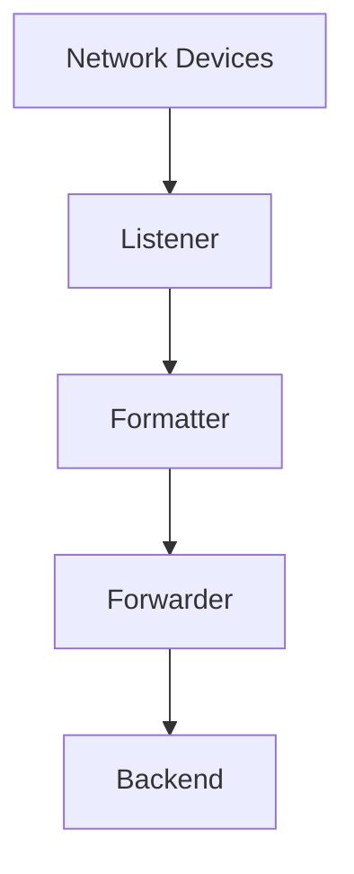

# Overview

The SNMP traps components are responsible for handling SNMP trap data. These components include functionalities for listening to, formatting, forwarding, and logging SNMP traps. The main components involved are the <SwmToken path="comp/snmptraps/listener/mock.go" pos="6:2:2" line-data="package listener">`listener`</SwmToken>, <SwmToken path="comp/snmptraps/formatter/formatterimpl/mock.go" pos="16:16:16" line-data="	&quot;github.com/DataDog/datadog-agent/comp/snmptraps/formatter&quot;">`formatter`</SwmToken>, <SwmToken path="comp/snmptraps/forwarder/component.go" pos="6:4:4" line-data="// Package forwarder defines a component that receives trap data from the">`forwarder`</SwmToken>, <SwmToken path="comp/snmptraps/config/config.go" pos="6:2:2" line-data="package config">`config`</SwmToken>, `oidresolver`, and <SwmToken path="tasks/libs/common/status.py" pos="4:2:2" line-data="class Status:">`Status`</SwmToken>.

<SwmSnippet path="/comp/snmptraps/bundle.go" line="6">

---

# Snmptraps Package

The <SwmToken path="comp/snmptraps/bundle.go" pos="6:4:4" line-data="// Package snmptraps implements the a server that listens for SNMP trap data">`snmptraps`</SwmToken> package implements a server that listens for SNMP trap data and sends it to the backend. This server is essential for receiving and processing SNMP traps from various network devices.

```go
// Package snmptraps implements the a server that listens for SNMP trap data
// and sends it to the backend.
package snmptraps
```

---

</SwmSnippet>

<SwmSnippet path="/comp/snmptraps/listener/mock.go" line="6">

---

# Listener Component

The <SwmToken path="comp/snmptraps/listener/mock.go" pos="6:2:2" line-data="package listener">`listener`</SwmToken> component listens for SNMP messages, parses them, and publishes the messages on a channel. This component acts as the entry point for incoming SNMP traps.

```go
package listener

import (
	"github.com/DataDog/datadog-agent/comp/snmptraps/packet"
)

// MockComponent just holds a channel to which tests can write.
type MockComponent interface {
	Component
	Send(*packet.SnmpPacket)
}
```

---

</SwmSnippet>

<SwmSnippet path="/comp/snmptraps/formatter/formatterimpl/mock.go" line="6">

---

# Formatter Component

The <SwmToken path="comp/snmptraps/formatter/formatterimpl/mock.go" pos="16:16:16" line-data="	&quot;github.com/DataDog/datadog-agent/comp/snmptraps/formatter&quot;">`formatter`</SwmToken> component is responsible for formatting SNMP traps. It takes SNMP packets and converts them into a format suitable for further processing or forwarding.

```go
package formatterimpl

import (
	"bytes"
	"crypto/sha256"
	"encoding/gob"
	"encoding/hex"

	"go.uber.org/fx"

	"github.com/DataDog/datadog-agent/comp/snmptraps/formatter"
	"github.com/DataDog/datadog-agent/comp/snmptraps/packet"
	"github.com/DataDog/datadog-agent/pkg/util/fxutil"
)

// MockModule provides a dummy formatter that just hashes packets.
func MockModule() fxutil.Module {
	return fxutil.Component(
		fx.Provide(newDummy),
	)
}
```

---

</SwmSnippet>

<SwmSnippet path="/comp/snmptraps/forwarder/component.go" line="1">

---

# Forwarder Component

The <SwmToken path="comp/snmptraps/forwarder/component.go" pos="6:4:4" line-data="// Package forwarder defines a component that receives trap data from the">`forwarder`</SwmToken> component receives trap data from the listener, formats it properly, and sends it to the backend. This ensures that the processed SNMP traps are forwarded to the appropriate destination for further analysis.

```go
// Unless explicitly stated otherwise all files in this repository are licensed
// under the Apache License Version 2.0.
// This product includes software developed at Datadog (https://www.datadoghq.com/).
// Copyright 2023-present Datadog, Inc.

// Package forwarder defines a component that receives trap data from the
// listener component, formats it properly, and sends it to the backend.
package forwarder

// team: network-device-monitoring
```

---

</SwmSnippet>

<SwmSnippet path="/comp/snmptraps/config/config.go" line="1">

---

# Configuration

The <SwmToken path="comp/snmptraps/config/config.go" pos="6:2:2" line-data="package config">`config`</SwmToken> component provides the configuration for the traps server, defining the necessary settings and parameters required for the server to operate correctly.

```go
// Unless explicitly stated otherwise all files in this repository are licensed
// under the Apache License Version 2.0.
// This product includes software developed at Datadog (https://www.datadoghq.com/).
// Copyright 2020-present Datadog, Inc.

package config

import (
	"fmt"
	"hash/fnv"
```

---

</SwmSnippet>

# OID Resolver Component

The `oidresolver` component resolves Object Identifiers (OIDs) to retrieve metadata for traps and variables. This is essential for understanding the context and details of the received SNMP traps.

# Status Component

The <SwmToken path="tasks/libs/common/status.py" pos="4:2:2" line-data="class Status:">`Status`</SwmToken> package within <SwmToken path="comp/snmptraps/bundle.go" pos="6:4:4" line-data="// Package snmptraps implements the a server that listens for SNMP trap data">`snmptraps`</SwmToken> exposes the expvars used for status tracking to the component system. This helps in monitoring the status and performance of the SNMP trap handling components.

&nbsp;

*This is an auto-generated document by Swimm AI 🌊 and has not yet been verified by a human*

<SwmMeta version="3.0.0" repo-id="Z2l0aHViJTNBJTNBZGF0YWRvZy1hZ2VudCUzQSUzQVN3aW1tLURlbW8=" repo-name="datadog-agent"><sup>Powered by [Swimm](/)</sup></SwmMeta>
