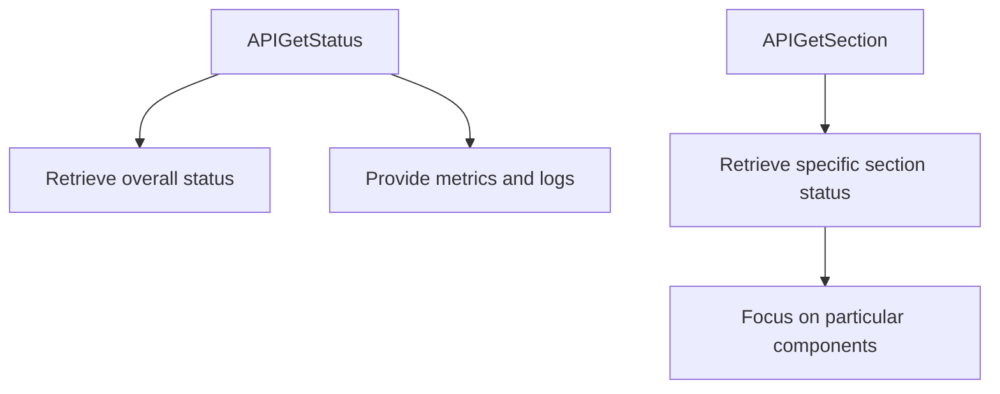

# Understanding Status in Core

Status refers to the mechanism by which components can register a status provider. These providers are used to populate information when the status command is executed.

The status component interface is implemented in the <SwmToken path="comp/core/status/statusimpl/status.go" pos="6:4:4" line-data="// Package statusimpl implements the status component interface">`statusimpl`</SwmToken> package, which defines how status information is collected and displayed. The <SwmToken path="comp/core/status/statusimpl/status.go" pos="156:6:6" line-data="func (s *statusImplementation) GetStatus(format string, verbose bool, excludeSections ...string) ([]byte, error) {">`statusImplementation`</SwmToken> struct manages various providers and organizes them by section, ensuring that the status information is sorted and displayed correctly.

## Status Providers

Components can register a status provider. When the status command is executed, we will populate the information displayed using all the status providers.

### Header Providers Interface

Header providers are a type of status provider that render the name and index of the component, and populate the status map with JSON data.

### Regular Providers Interface

Regular providers render the text and HTML output of the status information, ensuring that the status data is displayed in various formats.

## Adding a Status Provider

To add a status provider, implement the required interfaces and register the provider with the status component. This allows the provider to contribute to the overall status information.

## Testing

Testing ensures that the status providers correctly populate and render the status information. This includes verifying the JSON, text, and HTML outputs.

## Main Functions

There are several main functions in this folder. Some of them are <SwmToken path="comp/core/status/statusimpl/status.go" pos="163:7:7" line-data="			if present(sc.Name(), excludeSections) {">`Name`</SwmToken>, <SwmToken path="comp/core/status/statusimpl/status.go" pos="174:7:7" line-data="				if present(provider.Section(), excludeSections) {">`Section`</SwmToken>, <SwmToken path="comp/core/status/statusimpl/status.go" pos="160:4:4" line-data="	case &quot;json&quot;:">`json`</SwmToken>, <SwmToken path="tasks/kernel_matrix_testing/tool.py" pos="19:5:5" line-data="    def colored(text: str, color: str | None) -&gt; str:  # noqa: U100">`text`</SwmToken>, <SwmToken path="comp/core/status/statusimpl/status.go" pos="251:4:4" line-data="	case &quot;html&quot;:">`html`</SwmToken>, `populateStatus`, `getStatusInfo`, <SwmToken path="comp/core/status/statusimpl/status.go" pos="156:9:9" line-data="func (s *statusImplementation) GetStatus(format string, verbose bool, excludeSections ...string) ([]byte, error) {">`GetStatus`</SwmToken>, <SwmToken path="comp/core/status/statusimpl/status.go" pos="283:9:9" line-data="func (s *statusImplementation) GetStatusBySections(sections []string, format string, verbose bool) ([]byte, error) {">`GetStatusBySections`</SwmToken>, and <SwmToken path="comp/core/status/statusimpl/status.go" pos="149:3:3" line-data="			c.getSections,">`getSections`</SwmToken>. We will dive a little into <SwmToken path="comp/core/status/statusimpl/status.go" pos="156:9:9" line-data="func (s *statusImplementation) GetStatus(format string, verbose bool, excludeSections ...string) ([]byte, error) {">`GetStatus`</SwmToken> and <SwmToken path="comp/core/status/statusimpl/status.go" pos="283:9:9" line-data="func (s *statusImplementation) GetStatusBySections(sections []string, format string, verbose bool) ([]byte, error) {">`GetStatusBySections`</SwmToken>.

<SwmSnippet path="/comp/core/status/statusimpl/status.go" line="156">

---

### <SwmToken path="comp/core/status/statusimpl/status.go" pos="156:9:9" line-data="func (s *statusImplementation) GetStatus(format string, verbose bool, excludeSections ...string) ([]byte, error) {">`GetStatus`</SwmToken>

The <SwmToken path="comp/core/status/statusimpl/status.go" pos="156:9:9" line-data="func (s *statusImplementation) GetStatus(format string, verbose bool, excludeSections ...string) ([]byte, error) {">`GetStatus`</SwmToken> function is responsible for retrieving the status information in various formats such as JSON and text. It iterates through the sorted header providers and section providers to populate the status data.

```go
func (s *statusImplementation) GetStatus(format string, verbose bool, excludeSections ...string) ([]byte, error) {
	var errs []error

	switch format {
	case "json":
		stats := make(map[string]interface{})
		for _, sc := range s.sortedHeaderProviders {
			if present(sc.Name(), excludeSections) {
				continue
			}

			if err := sc.JSON(verbose, stats); err != nil {
				errs = append(errs, err)
			}
		}

		for _, providers := range s.sortedProvidersBySection {
			for _, provider := range providers {
				if present(provider.Section(), excludeSections) {
					continue
				}
```

---

</SwmSnippet>

<SwmSnippet path="/comp/core/status/statusimpl/status.go" line="283">

---

### <SwmToken path="comp/core/status/statusimpl/status.go" pos="283:9:9" line-data="func (s *statusImplementation) GetStatusBySections(sections []string, format string, verbose bool) ([]byte, error) {">`GetStatusBySections`</SwmToken>

The <SwmToken path="comp/core/status/statusimpl/status.go" pos="283:9:9" line-data="func (s *statusImplementation) GetStatusBySections(sections []string, format string, verbose bool) ([]byte, error) {">`GetStatusBySections`</SwmToken> function retrieves status information for specified sections. It supports multiple formats including JSON, text, and HTML. This function is useful for getting detailed status information for specific parts of the system.

```go
func (s *statusImplementation) GetStatusBySections(sections []string, format string, verbose bool) ([]byte, error) {
	var errs []error

	if len(sections) == 1 && sections[0] == "header" {
		providers := s.sortedHeaderProviders
		switch format {
		case "json":
			stats := make(map[string]interface{})

			for _, sc := range providers {
				if err := sc.JSON(verbose, stats); err != nil {
					errs = append(errs, err)
				}
			}

			if len(errs) > 0 {
				errorsInfo := []string{}
				for _, error := range errs {
					errorsInfo = append(errorsInfo, error.Error())
				}
				stats["errors"] = errorsInfo
```

---

</SwmSnippet>

<SwmSnippet path="/comp/core/status/statusimpl/status.go" line="53">

---

### <SwmToken path="comp/core/status/statusimpl/status.go" pos="53:1:1" line-data="	APIGetStatus      api.AgentEndpointProvider">`APIGetStatus`</SwmToken>

The <SwmToken path="comp/core/status/statusimpl/status.go" pos="53:1:1" line-data="	APIGetStatus      api.AgentEndpointProvider">`APIGetStatus`</SwmToken> endpoint is used to retrieve the overall status of the agent. It provides a comprehensive view of the current state, including various metrics and logs.

```go
	APIGetStatus      api.AgentEndpointProvider
	APIGetSection     api.AgentEndpointProvider
```

---

</SwmSnippet>

<SwmSnippet path="/comp/core/status/statusimpl/status.go" line="54">

---

### <SwmToken path="comp/core/status/statusimpl/status.go" pos="54:1:1" line-data="	APIGetSection     api.AgentEndpointProvider">`APIGetSection`</SwmToken>

The <SwmToken path="comp/core/status/statusimpl/status.go" pos="54:1:1" line-data="	APIGetSection     api.AgentEndpointProvider">`APIGetSection`</SwmToken> endpoint is used to retrieve the status of a specific section. This allows for more granular monitoring and troubleshooting by focusing on particular components or functionalities.

```go
	APIGetSection     api.AgentEndpointProvider
	APIGetSectionList api.AgentEndpointProvider
```

---

</SwmSnippet>

&nbsp;

*This is an auto-generated document by Swimm AI 🌊 and has not yet been verified by a human*

<SwmMeta version="3.0.0" repo-id="Z2l0aHViJTNBJTNBZGF0YWRvZy1hZ2VudCUzQSUzQVN3aW1tLURlbW8=" repo-name="datadog-agent"><sup>Powered by [Swimm](/)</sup></SwmMeta>
