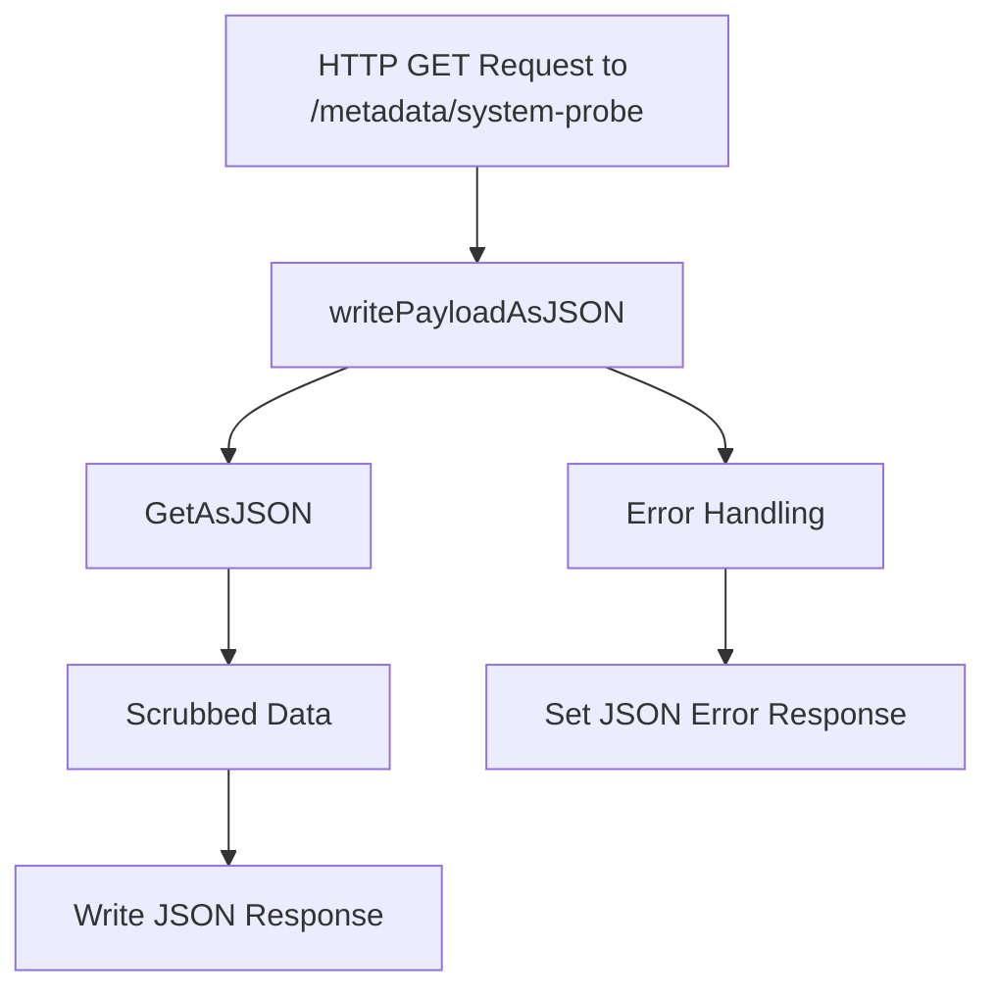

# Overview

The System Probe is a component responsible for collecting network data. It works cooperatively with other binaries such as the main agent, trace-agent, and process-agent. The System Probe's collected data is accessible by the process-agent and plays a crucial role in gathering metadata related to the system's network activities.

# System Probe Metadata Structure

The metadata collected by the System Probe is structured and managed within the <SwmToken path="comp/metadata/systemprobe/impl/system_probe.go" pos="43:2:2" line-data="// Payload handles the JSON unmarshalling of the metadata payload">`Payload`</SwmToken> type. This includes fields like <SwmToken path="comp/metadata/systemprobe/impl/system_probe.go" pos="45:1:1" line-data="	Hostname  string                 `json:&quot;hostname&quot;`">`Hostname`</SwmToken>, <SwmToken path="comp/metadata/systemprobe/impl/system_probe.go" pos="46:1:1" line-data="	Timestamp int64                  `json:&quot;timestamp&quot;`">`Timestamp`</SwmToken>, and <SwmToken path="comp/metadata/systemprobe/impl/system_probe.go" pos="43:16:16" line-data="// Payload handles the JSON unmarshalling of the metadata payload">`metadata`</SwmToken>.

<SwmSnippet path="/comp/metadata/systemprobe/impl/system_probe.go" line="43">

---

The <SwmToken path="comp/metadata/systemprobe/impl/system_probe.go" pos="43:2:2" line-data="// Payload handles the JSON unmarshalling of the metadata payload">`Payload`</SwmToken> type handles the JSON unmarshalling of the metadata payload, including fields such as <SwmToken path="comp/metadata/systemprobe/impl/system_probe.go" pos="45:1:1" line-data="	Hostname  string                 `json:&quot;hostname&quot;`">`Hostname`</SwmToken>, <SwmToken path="comp/metadata/systemprobe/impl/system_probe.go" pos="46:1:1" line-data="	Timestamp int64                  `json:&quot;timestamp&quot;`">`Timestamp`</SwmToken>, and <SwmToken path="comp/metadata/systemprobe/impl/system_probe.go" pos="43:16:16" line-data="// Payload handles the JSON unmarshalling of the metadata payload">`metadata`</SwmToken>.

```go
// Payload handles the JSON unmarshalling of the metadata payload
type Payload struct {
	Hostname  string                 `json:"hostname"`
	Timestamp int64                  `json:"timestamp"`
	Metadata  map[string]interface{} `json:"system_probe_metadata"`
}
```

---

</SwmSnippet>

# System Probe Configuration

The agent configurations are scrubbed from any sensitive information. Sending <SwmToken path="comp/metadata/systemprobe/impl/system_probe.go" pos="99:32:34" line-data="	sb.InventoryPayload = util.CreateInventoryPayload(deps.Config, deps.Log, deps.Serializer, sb.getPayload, &quot;system-probe.json&quot;)">`system-probe`</SwmToken> configuration can be disabled using <SwmToken path="comp/metadata/systemprobe/impl/system_probe.go" pos="124:11:11" line-data="	if !sb.conf.GetBool(&quot;inventories_configuration_enabled&quot;) {">`inventories_configuration_enabled`</SwmToken>.

# System Probe Metadata Payload

This package populates some of the <SwmToken path="comp/metadata/systemprobe/impl/system_probe.go" pos="99:32:34" line-data="	sb.InventoryPayload = util.CreateInventoryPayload(deps.Config, deps.Log, deps.Serializer, sb.getPayload, &quot;system-probe.json&quot;)">`system-probe`</SwmToken> related fields in the `inventories` product in <SwmToken path="comp/metadata/systemprobe/impl/system_probe.go" pos="3:14:14" line-data="// This product includes software developed at Datadog (https://www.datadoghq.com/).">`Datadog`</SwmToken>. This is enabled by default but can be turned off using `inventories_enabled` config. The payload is sent every 10 minutes.

# Dependencies and Output

Dependencies for the System Probe metadata component are defined in the <SwmToken path="comp/metadata/systemprobe/impl/system_probe.go" pos="72:2:2" line-data="// Requires defines the dependencies for the systemprobe metadata component">`Requires`</SwmToken> type, which includes logging, configuration, and serializer components. The output of the System Probe metadata component is defined by the <SwmToken path="comp/metadata/systemprobe/impl/system_probe.go" pos="82:2:2" line-data="// Provides defines the output of the systemprobe metadatacomponent">`Provides`</SwmToken> type, which includes the component itself, metadata provider, flare provider, and endpoint.

<SwmSnippet path="/comp/metadata/systemprobe/impl/system_probe.go" line="72">

---

The <SwmToken path="comp/metadata/systemprobe/impl/system_probe.go" pos="72:2:2" line-data="// Requires defines the dependencies for the systemprobe metadata component">`Requires`</SwmToken> type defines the dependencies for the systemprobe metadata component, including logging, configuration, and serializer components.

```go
// Requires defines the dependencies for the systemprobe metadata component
type Requires struct {
	Log        log.Component
	Config     config.Component
	Serializer serializer.MetricSerializer
	// We need the authtoken to be created so we requires the comp. It will be used by configFetcher.
	AuthToken      authtoken.Component
	SysProbeConfig optional.Option[sysprobeconfig.Component]
}
```

---

</SwmSnippet>

<SwmSnippet path="/comp/metadata/systemprobe/impl/system_probe.go" line="82">

---

The <SwmToken path="comp/metadata/systemprobe/impl/system_probe.go" pos="82:2:2" line-data="// Provides defines the output of the systemprobe metadatacomponent">`Provides`</SwmToken> type defines the output of the systemprobe metadata component, including the component itself, metadata provider, flare provider, and endpoint.

```go
// Provides defines the output of the systemprobe metadatacomponent
type Provides struct {
	Comp             systemprobemetadata.Component
	MetadataProvider runnerimpl.Provider
	FlareProvider    flaretypes.Provider
	Endpoint         api.AgentEndpointProvider
}
```

---

</SwmSnippet>

# Main Functions

There are several main functions in the System Probe. Some of them are <SwmToken path="comp/metadata/systemprobe/impl/system_probe.go" pos="99:28:28" line-data="	sb.InventoryPayload = util.CreateInventoryPayload(deps.Config, deps.Log, deps.Serializer, sb.getPayload, &quot;system-probe.json&quot;)">`getPayload`</SwmToken>, <SwmToken path="comp/metadata/systemprobe/impl/system_probe.go" pos="119:9:9" line-data="func (sb *systemprobe) getConfigLayers() map[string]interface{} {">`getConfigLayers`</SwmToken>, and <SwmToken path="comp/metadata/systemprobe/impl/system_probe.go" pos="90:2:2" line-data="// NewComponent creates a new systemprobe metadata Component">`NewComponent`</SwmToken>. We will dive a little into <SwmToken path="comp/metadata/systemprobe/impl/system_probe.go" pos="99:28:28" line-data="	sb.InventoryPayload = util.CreateInventoryPayload(deps.Config, deps.Log, deps.Serializer, sb.getPayload, &quot;system-probe.json&quot;)">`getPayload`</SwmToken> and <SwmToken path="comp/metadata/systemprobe/impl/system_probe.go" pos="119:9:9" line-data="func (sb *systemprobe) getConfigLayers() map[string]interface{} {">`getConfigLayers`</SwmToken>.

## <SwmToken path="comp/metadata/systemprobe/impl/system_probe.go" pos="99:28:28" line-data="	sb.InventoryPayload = util.CreateInventoryPayload(deps.Config, deps.Log, deps.Serializer, sb.getPayload, &quot;system-probe.json&quot;)">`getPayload`</SwmToken>

The <SwmToken path="comp/metadata/systemprobe/impl/system_probe.go" pos="99:28:28" line-data="	sb.InventoryPayload = util.CreateInventoryPayload(deps.Config, deps.Log, deps.Serializer, sb.getPayload, &quot;system-probe.json&quot;)">`getPayload`</SwmToken> function is responsible for generating the payload that includes metadata collected by the System Probe. This function calls <SwmToken path="comp/metadata/systemprobe/impl/system_probe.go" pos="119:9:9" line-data="func (sb *systemprobe) getConfigLayers() map[string]interface{} {">`getConfigLayers`</SwmToken> to fetch the configuration layers and includes them in the payload.

<SwmSnippet path="/comp/metadata/systemprobe/impl/system_probe.go" line="179">

---

The <SwmToken path="comp/metadata/systemprobe/impl/system_probe.go" pos="99:28:28" line-data="	sb.InventoryPayload = util.CreateInventoryPayload(deps.Config, deps.Log, deps.Serializer, sb.getPayload, &quot;system-probe.json&quot;)">`getPayload`</SwmToken> function generates the payload with the current timestamp and metadata collected by <SwmToken path="comp/metadata/systemprobe/impl/system_probe.go" pos="180:6:6" line-data="		Metadata:  sb.getConfigLayers(),">`getConfigLayers`</SwmToken>.

```go
		Timestamp: time.Now().UnixNano(),
		Metadata:  sb.getConfigLayers(),
	}
```

---

</SwmSnippet>

## <SwmToken path="comp/metadata/systemprobe/impl/system_probe.go" pos="119:9:9" line-data="func (sb *systemprobe) getConfigLayers() map[string]interface{} {">`getConfigLayers`</SwmToken>

The <SwmToken path="comp/metadata/systemprobe/impl/system_probe.go" pos="119:9:9" line-data="func (sb *systemprobe) getConfigLayers() map[string]interface{} {">`getConfigLayers`</SwmToken> function fetches various configuration layers of the System Probe. It collects configurations from different sources such as files, environment variables, and remote configurations, and structures them into a metadata map.

<SwmSnippet path="/comp/metadata/systemprobe/impl/system_probe.go" line="119">

---

The <SwmToken path="comp/metadata/systemprobe/impl/system_probe.go" pos="119:9:9" line-data="func (sb *systemprobe) getConfigLayers() map[string]interface{} {">`getConfigLayers`</SwmToken> function collects configurations from different sources and structures them into a metadata map.

```go
func (sb *systemprobe) getConfigLayers() map[string]interface{} {
	metadata := map[string]interface{}{
		"agent_version": version.AgentVersion,
	}

	if !sb.conf.GetBool("inventories_configuration_enabled") {
		return metadata
	}

	sysprobeConf, isSet := sb.sysprobeConf.Get()
	if !isSet {
		sb.log.Debugf("system-probe config not available: disabling systemprobe metadata")
		return metadata
	}

	rawLayers, err := fetchSystemProbeConfigBySource(sysprobeConf)
	if err != nil {
		sb.log.Debugf("error fetching system-probe config layers: %s", err)
		return metadata
	}
```

---

</SwmSnippet>

## <SwmToken path="comp/metadata/systemprobe/impl/system_probe.go" pos="90:2:2" line-data="// NewComponent creates a new systemprobe metadata Component">`NewComponent`</SwmToken>

The <SwmToken path="comp/metadata/systemprobe/impl/system_probe.go" pos="90:2:2" line-data="// NewComponent creates a new systemprobe metadata Component">`NewComponent`</SwmToken> function initializes a new System Probe metadata component. It sets up dependencies, creates an inventory payload, and provides the necessary components such as metadata provider and flare provider.

<SwmSnippet path="/comp/metadata/systemprobe/impl/system_probe.go" line="90">

---

The <SwmToken path="comp/metadata/systemprobe/impl/system_probe.go" pos="90:2:2" line-data="// NewComponent creates a new systemprobe metadata Component">`NewComponent`</SwmToken> function creates a new systemprobe metadata Component, setting up dependencies and providing necessary components.

```go
// NewComponent creates a new systemprobe metadata Component
func NewComponent(deps Requires) Provides {
	hname, _ := hostname.Get(context.Background())
	sb := &systemprobe{
		log:          deps.Log,
		conf:         deps.Config,
		hostname:     hname,
		sysprobeConf: deps.SysProbeConfig,
	}
	sb.InventoryPayload = util.CreateInventoryPayload(deps.Config, deps.Log, deps.Serializer, sb.getPayload, "system-probe.json")

	return Provides{
		Comp:             sb,
		MetadataProvider: sb.MetadataProvider(),
		FlareProvider:    sb.FlareProvider(),
		Endpoint:         api.NewAgentEndpointProvider(sb.writePayloadAsJSON, "/metadata/system-probe", "GET"),
	}
}
```

---

</SwmSnippet>

# System Probe Endpoints

The <SwmToken path="comp/metadata/systemprobe/impl/system_probe.go" pos="105:10:10" line-data="		Endpoint:         api.NewAgentEndpointProvider(sb.writePayloadAsJSON, &quot;/metadata/system-probe&quot;, &quot;GET&quot;),">`writePayloadAsJSON`</SwmToken> function is an endpoint that handles HTTP GET requests to the <SwmPath>[cmd/system-probe/](cmd/system-probe/)</SwmPath> URL. It retrieves the system probe metadata payload, scrubs the data, and writes it as a JSON response. If an error occurs during data retrieval, it sets a JSON error response.

<SwmSnippet path="/comp/metadata/systemprobe/impl/system_probe.go" line="109">

---

The <SwmToken path="comp/metadata/systemprobe/impl/system_probe.go" pos="109:9:9" line-data="func (sb *systemprobe) writePayloadAsJSON(w http.ResponseWriter, _ *http.Request) {">`writePayloadAsJSON`</SwmToken> function handles HTTP GET requests, retrieves the system probe metadata payload, scrubs the data, and writes it as a JSON response.

```go
func (sb *systemprobe) writePayloadAsJSON(w http.ResponseWriter, _ *http.Request) {
	// GetAsJSON calls getPayload which already scrub the data
	scrubbed, err := sb.GetAsJSON()
	if err != nil {
		httputils.SetJSONError(w, err, 500)
		return
	}
	w.Write(scrubbed)
}
```

---

</SwmSnippet>

&nbsp;

*This is an auto-generated document by Swimm AI 🌊 and has not yet been verified by a human*

<SwmMeta version="3.0.0" repo-id="Z2l0aHViJTNBJTNBZGF0YWRvZy1hZ2VudCUzQSUzQVN3aW1tLURlbW8=" repo-name="datadog-agent"><sup>Powered by [Swimm](/)</sup></SwmMeta>
