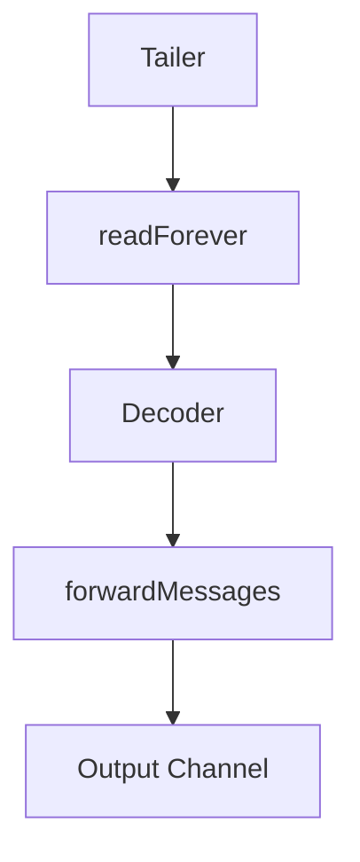

## Overview

Tailers are responsible for gathering log messages and sending them for further handling by the remainder of the logs agent. It is the responsibility of a launcher to create and manage tailers. A tailer sends log messages via a <SwmToken path="pkg/logs/tailers/file/tailer.go" pos="125:3:8" line-data="	OutputChan    chan *message.Message // Required">`chan *message.Message`</SwmToken>.

## <SwmToken path="pkg/logs/tailers/tailer_tracker.go" pos="45:2:2" line-data="// TailerContainer is a container for a concrete tailer type.">`TailerContainer`</SwmToken>

The <SwmToken path="pkg/logs/tailers/tailer_tracker.go" pos="45:2:2" line-data="// TailerContainer is a container for a concrete tailer type.">`TailerContainer`</SwmToken> is a container for managing multiple tailers. It provides methods to add, remove, and retrieve tailers, ensuring they are properly managed and accessible.

<SwmSnippet path="/pkg/logs/tailers/tailer_tracker.go" line="45">

---

The <SwmToken path="pkg/logs/tailers/tailer_tracker.go" pos="45:2:2" line-data="// TailerContainer is a container for a concrete tailer type.">`TailerContainer`</SwmToken> struct and its methods are defined here. It uses a map to store tailers and provides thread-safe access to them.

```go
// TailerContainer is a container for a concrete tailer type.
type TailerContainer[T Tailer] struct {
	sync.RWMutex
	tailers map[string]T
}

// NewTailerContainer creates a new TailerContainer instance.
func NewTailerContainer[T Tailer]() *TailerContainer[T] {
	return &TailerContainer[T]{
		tailers: make(map[string]T),
	}
}

// Get returns a tailer with the provided id if it exists.
func (t *TailerContainer[T]) Get(id string) (T, bool) {
	t.RLock()
	defer t.RUnlock()
	tailer, ok := t.tailers[id]
	return tailer, ok
}
```

---

</SwmSnippet>

## <SwmToken path="pkg/logs/tailers/file/tailer.go" pos="123:2:2" line-data="// TailerOptions holds all possible parameters that NewTailer requires in addition to optional parameters that can be optionally passed into. This can be used for more optional parameters if required in future">`TailerOptions`</SwmToken>

The <SwmToken path="pkg/logs/tailers/file/tailer.go" pos="123:2:2" line-data="// TailerOptions holds all possible parameters that NewTailer requires in addition to optional parameters that can be optionally passed into. This can be used for more optional parameters if required in future">`TailerOptions`</SwmToken> struct holds all the necessary parameters required to create a new tailer. This includes channels for output, file references, sleep durations, and decoders.

<SwmSnippet path="/pkg/logs/tailers/file/tailer.go" line="123">

---

The <SwmToken path="pkg/logs/tailers/file/tailer.go" pos="123:2:2" line-data="// TailerOptions holds all possible parameters that NewTailer requires in addition to optional parameters that can be optionally passed into. This can be used for more optional parameters if required in future">`TailerOptions`</SwmToken> struct is defined here, listing all required and optional parameters for creating a new tailer.

```go
// TailerOptions holds all possible parameters that NewTailer requires in addition to optional parameters that can be optionally passed into. This can be used for more optional parameters if required in future
type TailerOptions struct {
	OutputChan    chan *message.Message // Required
	File          *File                 // Required
	SleepDuration time.Duration         // Required
	Decoder       *decoder.Decoder      // Required
	Info          *status.InfoRegistry  // Required
	Rotated       bool                  // Optional
}
```

---

</SwmSnippet>

## Tailer

The <SwmToken path="pkg/logs/tailers/tailer_tracker.go" pos="45:16:16" line-data="// TailerContainer is a container for a concrete tailer type.">`tailer`</SwmToken> struct is responsible for tailing a file, decoding the messages it contains, and passing them to an output channel for further processing. It includes components for reading, decoding, and forwarding messages.

<SwmSnippet path="/pkg/logs/tailers/file/tailer.go" line="34">

---

The <SwmToken path="pkg/logs/tailers/file/tailer.go" pos="34:2:2" line-data="// Tailer tails a file, decodes the messages it contains, and passes them to a">`Tailer`</SwmToken> struct and its components are defined here. It outlines the operational overview of how a tailer works.

```go
// Tailer tails a file, decodes the messages it contains, and passes them to a
// supplied output channel for further processing.
//
// # Operational Overview
//
// Tailers have three components, organized as a pipeline.  The first,
// readForever, polls the file, trying to read more data.  That data is passed
// to the second component, the decoder.  The decoder produces
// decoder.Messages, which are passed to the third component, forwardMessages.
// This component translates the decoder.Messages into message.Messages and
// sends them to the tailer's output channel.
type Tailer struct {
	// lastReadOffset is the last file offset that was read.
	lastReadOffset *atomic.Int64

	// decodedOffset is the offset in the file at which the latest decoded message
	// ends.
	decodedOffset *atomic.Int64

	// file contains the logs configuration for the file to parse (path, source, ...)
	// If you are looking for the os.file use to read on the FS, see osFile.
```

---

</SwmSnippet>

## Main Functions of Tailers

The main functions of tailers include initializing, starting, stopping, and forwarding messages. These functions ensure the tailer operates correctly and efficiently.

### <SwmToken path="pkg/logs/tailers/file/tailer.go" pos="123:14:14" line-data="// TailerOptions holds all possible parameters that NewTailer requires in addition to optional parameters that can be optionally passed into. This can be used for more optional parameters if required in future">`NewTailer`</SwmToken>

The <SwmToken path="pkg/logs/tailers/file/tailer.go" pos="123:14:14" line-data="// TailerOptions holds all possible parameters that NewTailer requires in addition to optional parameters that can be optionally passed into. This can be used for more optional parameters if required in future">`NewTailer`</SwmToken> function initializes a new Tailer instance. It sets up the necessary configurations, including the file to read from, the decoder to process the log data, and the output channel to send the processed messages.

<SwmSnippet path="/pkg/logs/tailers/file/tailer.go" line="133">

---

The <SwmToken path="pkg/logs/tailers/file/tailer.go" pos="133:2:2" line-data="// NewTailer returns an initialized Tailer, read to be started.">`NewTailer`</SwmToken> function is defined here. It initializes the tailer with the provided options and sets up the necessary components for log collection.

```go
// NewTailer returns an initialized Tailer, read to be started.
//
// The resulting Tailer will read from the given `file`, decode the content
// with the given `decoder`, and send the resulting log messages to outputChan.
// The Tailer takes ownership of the decoder and will start and stop it as
// necessary.
//
// The Tailer must poll for content in the file.  The `sleepDuration` parameter
// specifies how long the tailer should wait between polls.
func NewTailer(opts *TailerOptions) *Tailer {
	var tagProvider tag.Provider
	if opts.File.Source.Config().Identifier != "" {
		tagProvider = tag.NewProvider(containers.BuildTaggerEntityName(opts.File.Source.Config().Identifier))
	} else {
		tagProvider = tag.NewLocalProvider([]string{})
	}

	forwardContext, stopForward := context.WithCancel(context.Background())
	closeTimeout := coreConfig.Datadog().GetDuration("logs_config.close_timeout") * time.Second
	windowsOpenFileTimeout := coreConfig.Datadog().GetDuration("logs_config.windows_open_file_timeout") * time.Second
```

---

</SwmSnippet>

### Stop

The <SwmToken path="pkg/logs/tailers/file/tailer.go" pos="137:24:24" line-data="// The Tailer takes ownership of the decoder and will start and stop it as">`stop`</SwmToken> function stops the Tailer from reading new log data. It ensures that all <SwmToken path="pkg/logs/tailers/file/tailer.go" pos="249:20:22" line-data="// Stop stops the tailer and returns only after all in-flight messages have">`in-flight`</SwmToken> messages are flushed to the output channel before completely stopping.

<SwmSnippet path="/pkg/logs/tailers/file/tailer.go" line="249">

---

The <SwmToken path="pkg/logs/tailers/file/tailer.go" pos="249:2:2" line-data="// Stop stops the tailer and returns only after all in-flight messages have">`Stop`</SwmToken> function is defined here. It stops the tailer and ensures all messages are flushed before stopping completely.

```go
// Stop stops the tailer and returns only after all in-flight messages have
// been flushed to the output channel.
func (t *Tailer) Stop() {
	t.stop <- struct{}{}
	t.file.Source.RemoveInput(t.file.Path)
	// wait for the decoder to be flushed
	<-t.done
}
```

---

</SwmSnippet>

### <SwmToken path="pkg/logs/tailers/file/tailer.go" pos="42:22:22" line-data="// decoder.Messages, which are passed to the third component, forwardMessages.">`forwardMessages`</SwmToken>

The <SwmToken path="pkg/logs/tailers/file/tailer.go" pos="42:22:22" line-data="// decoder.Messages, which are passed to the third component, forwardMessages.">`forwardMessages`</SwmToken> function forwards decoded log messages to the output channel. It adds metadata to each message, such as tags and offsets, before sending them.

<SwmSnippet path="/pkg/logs/tailers/file/tailer.go" line="329">

---

The <SwmToken path="pkg/logs/tailers/file/tailer.go" pos="329:2:2" line-data="// forwardMessages lets the Tailer forward log messages to the output channel">`forwardMessages`</SwmToken> function is defined here. It processes and forwards messages to the output channel, adding necessary metadata.

```go
// forwardMessages lets the Tailer forward log messages to the output channel
func (t *Tailer) forwardMessages() {
	defer func() {
		// the decoder has successfully been flushed
		t.isFinished.Store(true)
		close(t.done)
	}()
	for output := range t.decoder.OutputChan {
		offset := t.decodedOffset.Load() + int64(output.RawDataLen)
		identifier := t.Identifier()
		if t.didFileRotate.Load() {
			offset = 0
			identifier = ""
		}
		t.decodedOffset.Store(offset)
		origin := message.NewOrigin(t.file.Source.UnderlyingSource())
		origin.Identifier = identifier
		origin.Offset = strconv.FormatInt(offset, 10)
		origin.SetTags(append(t.tags, t.tagProvider.GetTags()...))
		// Ignore empty lines once the registry offset is updated
		if len(output.GetContent()) == 0 {
```

---

</SwmSnippet>

## Tailer Endpoints

Tailer endpoints include methods for starting and stopping the tailing process in different environments, such as Windows Event Log and Docker.

### Start (Windows Event Log)

The <SwmToken path="pkg/logs/tailers/file/tailer.go" pos="137:20:20" line-data="// The Tailer takes ownership of the decoder and will start and stop it as">`start`</SwmToken> method in the Windows Event Log tailer begins the process of tailing the event log. It initializes necessary channels and contexts, starts the decoder, and begins the tailing process by calling the <SwmToken path="pkg/logs/tailers/windowsevent/tailer.go" pos="101:5:5" line-data="	go t.tail(ctx, bookmark)">`tail`</SwmToken> method.

<SwmSnippet path="/pkg/logs/tailers/windowsevent/tailer.go" line="93">

---

The <SwmToken path="pkg/logs/tailers/windowsevent/tailer.go" pos="93:2:2" line-data="// Start starts tailing the event log.">`Start`</SwmToken> method for the Windows Event Log tailer is defined here. It sets up the necessary components and starts the tailing process.

```go
// Start starts tailing the event log.
func (t *Tailer) Start(bookmark string) {
	log.Infof("Starting windows event log tailing for channel %s query %s", t.config.ChannelPath, t.config.Query)
	t.doneTail = make(chan struct{})
	ctx, ctxCancel := context.WithCancel(context.Background())
	t.cancelTail = ctxCancel
	go t.forwardMessages()
	t.decoder.Start()
	go t.tail(ctx, bookmark)
}
```

---

</SwmSnippet>

<SwmSnippet path="/pkg/logs/tailers/windowsevent/tailer.go" line="104">

---

The <SwmToken path="pkg/logs/tailers/windowsevent/tailer.go" pos="104:2:2" line-data="// Stop stops the tailer">`Stop`</SwmToken> method for the Windows Event Log tailer is defined here. It stops the tailing process and ensures all components are properly shut down.

```go
// Stop stops the tailer
func (t *Tailer) Stop() {
	log.Info("Stop tailing windows event log")
	t.cancelTail()
	<-t.doneTail

	t.decoder.Stop()

	t.sub.Stop()
}
```

---

</SwmSnippet>

### Start (Docker)

The <SwmToken path="pkg/logs/tailers/file/tailer.go" pos="137:20:20" line-data="// The Tailer takes ownership of the decoder and will start and stop it as">`start`</SwmToken> method in the Docker tailer begins tailing logs from the Docker container. It determines the starting point for tailing based on the container's creation time and the agent's start time.

<SwmSnippet path="/pkg/logs/tailers/docker/tailer.go" line="104">

---

The <SwmToken path="pkg/logs/tailers/docker/tailer.go" pos="104:2:2" line-data="// Stop stops the tailer from reading new container logs,">`Stop`</SwmToken> method for the Docker tailer is defined here. It stops the tailing process and ensures all components are properly shut down.

```go
// Stop stops the tailer from reading new container logs,
// this call blocks until the decoder is completely flushed
func (t *Tailer) Stop() {
	log.Infof("Stop tailing container: %v", dockerutil.ShortContainerID(t.ContainerID))

	// signal the readForever component to stop
	t.stop <- struct{}{}

	// signal the reader itself to close.
	t.reader.Close()

	// signal the reader to stop a third way, by cancelling its context.  no-op
	// if already closed because of a timeout
	t.readerCancelFunc()

	t.Source.RemoveInput(t.ContainerID)

	// the closed readForever component will eventually close its channel to the decoder,
	// which will eventually close its channel to the message-forwarder component,
	// which will indicate it's done with this channel.
	<-t.done
```

---

</SwmSnippet>

&nbsp;

*This is an auto-generated document by Swimm AI 🌊 and has not yet been verified by a human*

<SwmMeta version="3.0.0" repo-id="Z2l0aHViJTNBJTNBZGF0YWRvZy1hZ2VudCUzQSUzQVN3aW1tLURlbW8=" repo-name="datadog-agent"><sup>Powered by [Swimm](/)</sup></SwmMeta>
