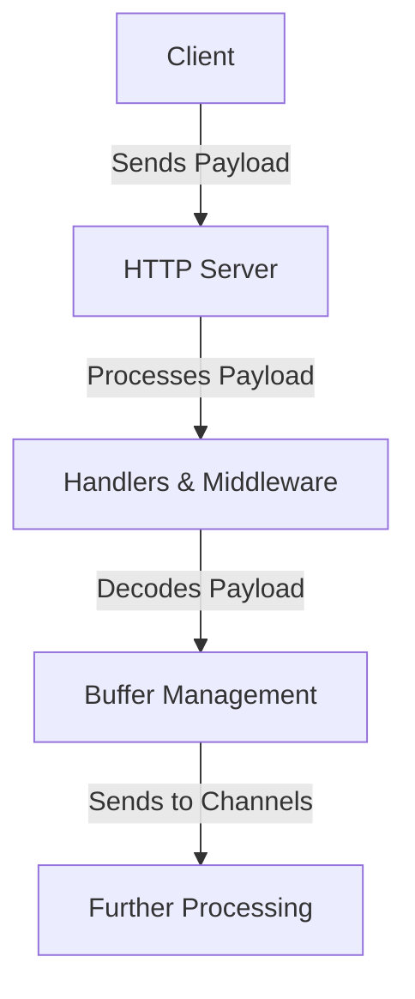

# Overview

The Trace API is responsible for implementing the HTTP server that receives payloads from clients. It handles incoming traces, processes them, and sends them to the appropriate channels for further processing. The API includes various handlers and middleware to manage different types of requests and ensure proper data flow. It also includes mechanisms for decoding payloads, managing buffer sizes, and handling different content types.

# API Endpoints

The API exposes the needed endpoints to make the agent submit payloads. The core Agent exposes a variety of HTTP and GRPC endpoints that can be organized into two groups: Control and Telemetry.

<SwmSnippet path="/pkg/trace/api/api.go" line="6">

---

The <SwmToken path="pkg/trace/api/api.go" pos="6:4:4" line-data="// Package api implements the HTTP server that receives payloads from clients.">`api`</SwmToken> package implements the HTTP server that receives payloads from clients.

```go
// Package api implements the HTTP server that receives payloads from clients.
package api

import (
```

---

</SwmSnippet>

# Main Functions

There are several main functions in this folder. Some of them are <SwmToken path="pkg/trace/api/api.go" pos="122:2:2" line-data="// NewHTTPReceiver returns a pointer to a new HTTPReceiver">`NewHTTPReceiver`</SwmToken>, <SwmToken path="pkg/trace/api/api.go" pos="737:2:2" line-data="// Languages returns the list of the languages used in the traces the agent receives.">`Languages`</SwmToken>, <SwmToken path="pkg/trace/api/api.go" pos="507:3:3" line-data="	// ProcessStats takes a stats payload and consumes it. It is considered to be originating">`ProcessStats`</SwmToken>, and <SwmToken path="pkg/trace/api/api.go" pos="132:5:5" line-data="	if conf.HasFeature(&quot;429&quot;) {">`HasFeature`</SwmToken>. We will dive a little into <SwmToken path="pkg/trace/api/api.go" pos="122:2:2" line-data="// NewHTTPReceiver returns a pointer to a new HTTPReceiver">`NewHTTPReceiver`</SwmToken> and <SwmToken path="pkg/trace/api/api.go" pos="737:2:2" line-data="// Languages returns the list of the languages used in the traces the agent receives.">`Languages`</SwmToken>.

## <SwmToken path="pkg/trace/api/api.go" pos="122:2:2" line-data="// NewHTTPReceiver returns a pointer to a new HTTPReceiver">`NewHTTPReceiver`</SwmToken>

The <SwmToken path="pkg/trace/api/api.go" pos="122:2:2" line-data="// NewHTTPReceiver returns a pointer to a new HTTPReceiver">`NewHTTPReceiver`</SwmToken> function initializes and returns a new instance of <SwmToken path="pkg/trace/api/api.go" pos="122:16:16" line-data="// NewHTTPReceiver returns a pointer to a new HTTPReceiver">`HTTPReceiver`</SwmToken>. This function configures various parameters such as the number of decoders, rate limiter response, and telemetry collector. It is essential for setting up the HTTP server that will handle incoming payloads.

<SwmSnippet path="/pkg/trace/api/api.go" line="122">

---

The <SwmToken path="pkg/trace/api/api.go" pos="122:2:2" line-data="// NewHTTPReceiver returns a pointer to a new HTTPReceiver">`NewHTTPReceiver`</SwmToken> function initializes and returns a new instance of <SwmToken path="pkg/trace/api/api.go" pos="122:16:16" line-data="// NewHTTPReceiver returns a pointer to a new HTTPReceiver">`HTTPReceiver`</SwmToken>. It configures various parameters such as the number of decoders, rate limiter response, and telemetry collector.

```go
// NewHTTPReceiver returns a pointer to a new HTTPReceiver
func NewHTTPReceiver(
	conf *config.AgentConfig,
	dynConf *sampler.DynamicConfig,
	out chan *Payload,
	statsProcessor StatsProcessor,
	telemetryCollector telemetry.TelemetryCollector,
	statsd statsd.ClientInterface,
	timing timing.Reporter) *HTTPReceiver {
	rateLimiterResponse := http.StatusOK
	if conf.HasFeature("429") {
		rateLimiterResponse = http.StatusTooManyRequests
	}
	semcount := conf.Decoders
	if semcount == 0 {
		semcount = runtime.GOMAXPROCS(0) / 2
		if semcount == 0 {
			semcount = 1
		}
	}
	log.Infof("Receiver configured with %d decoders and a timeout of %dms", semcount, conf.DecoderTimeout)
```

---

</SwmSnippet>

## Languages

The <SwmToken path="pkg/trace/api/api.go" pos="737:2:2" line-data="// Languages returns the list of the languages used in the traces the agent receives.">`Languages`</SwmToken> method returns a list of languages used in the traces received by the agent. It collects this information by iterating through the tags in the receiver's statistics. This function is useful for profiling and debugging purposes.

<SwmSnippet path="/pkg/trace/api/api.go" line="737">

---

The <SwmToken path="pkg/trace/api/api.go" pos="737:2:2" line-data="// Languages returns the list of the languages used in the traces the agent receives.">`Languages`</SwmToken> method returns a list of languages used in the traces received by the agent. It collects this information by iterating through the tags in the receiver's statistics.

```go
// Languages returns the list of the languages used in the traces the agent receives.
func (r *HTTPReceiver) Languages() string {
	// We need to use this map because we can have several tags for a same language.
	langs := make(map[string]bool)
	str := []string{}

	r.Stats.RLock()
	for tags := range r.Stats.Stats {
		if _, ok := langs[tags.Lang]; !ok {
			str = append(str, tags.Lang)
			langs[tags.Lang] = true
		}
	}
	r.Stats.RUnlock()

	sort.Strings(str)
	return strings.Join(str, "|")
}
```

---

</SwmSnippet>

&nbsp;

*This is an auto-generated document by Swimm AI 🌊 and has not yet been verified by a human*

<SwmMeta version="3.0.0" repo-id="Z2l0aHViJTNBJTNBZGF0YWRvZy1hZ2VudCUzQSUzQVN3aW1tLURlbW8=" repo-name="datadog-agent"><sup>Powered by [Swimm](/)</sup></SwmMeta>
