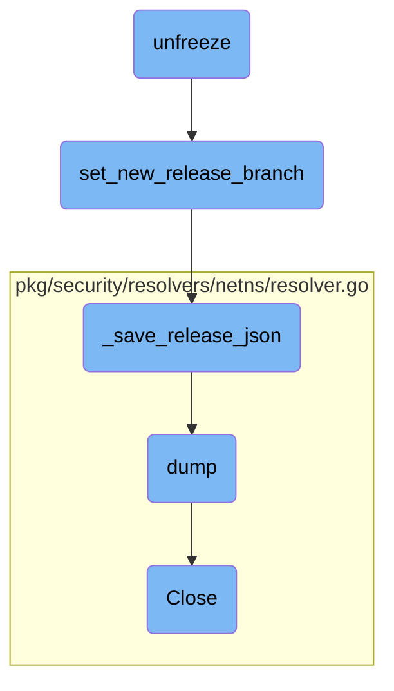

In this document, we will explain the process of unfreezing the main branch during the agent release cycle. The process involves creating release branches in multiple repositories, updating the <SwmPath>[release.json](release.json)</SwmPath> file, and modifying entries in <SwmPath>[.gitlab-ci.yml](.gitlab-ci.yml)</SwmPath> and <SwmPath>[.gitlab/notify/notify.yml](.gitlab/notify/notify.yml)</SwmPath>.

The flow starts with the unfreeze process, which creates new release branches in several repositories. Next, it updates the <SwmPath>[release.json](release.json)</SwmPath> file to point to these new branches. After that, it modifies entries in <SwmPath>[.gitlab-ci.yml](.gitlab-ci.yml)</SwmPath> and <SwmPath>[.gitlab/notify/notify.yml](.gitlab/notify/notify.yml)</SwmPath> to reflect the changes. Finally, it ensures that the repository state is clean and pushes the new branches to the upstream repository.

# Flow drill down



<SwmSnippet path="/tasks/release.py" line="572">

---

## unfreeze

The <SwmToken path="tasks/release.py" pos="572:2:2" line-data="def unfreeze(ctx, base_directory=&quot;~/dd&quot;, major_versions=&quot;6,7&quot;, upstream=&quot;origin&quot;):">`unfreeze`</SwmToken> function is responsible for performing a series of tasks required to unfreeze the main branch during the agent release cycle. It creates release branches in multiple repositories, updates the <SwmPath>[release.json](release.json)</SwmPath> file, and modifies entries in <SwmPath>[.gitlab-ci.yml](.gitlab-ci.yml)</SwmPath> and <SwmPath>[.gitlab/notify/notify.yml](.gitlab/notify/notify.yml)</SwmPath>. This function ensures that the repository state is clean, creates new branches, and pushes them to the upstream repository.

```python
def unfreeze(ctx, base_directory="~/dd", major_versions="6,7", upstream="origin"):
    """
    Performs set of tasks required for the main branch unfreeze during the agent release cycle.
    That includes:
    - creates a release branch in datadog-agent, datadog-agent-macos, omnibus-ruby and omnibus-software repositories,
    - updates release.json on new datadog-agent branch to point to newly created release branches in nightly section
    - updates entries in .gitlab-ci.yml and .gitlab/notify/notify.yml which depend on local branch name

    Notes:
    base_directory - path to the directory where dd repos are cloned, defaults to ~/dd, but can be overwritten.
    This requires a Github token (either in the GITHUB_TOKEN environment variable, or in the MacOS keychain),
    with 'repo' permissions.
    This also requires that there are no local uncommitted changes, that the current branch is 'main' or the
    release branch, and that no branch named 'release/<new rc version>' already exists locally or upstream.
    """

    list_major_versions = parse_major_versions(major_versions)

    current = current_version(ctx, max(list_major_versions))
    next = current.next_version(bump_minor=True)
    current.rc = False
```

---

</SwmSnippet>

<SwmSnippet path="/tasks/libs/releasing/json.py" line="320">

---

## <SwmToken path="tasks/libs/releasing/json.py" pos="320:2:2" line-data="def set_new_release_branch(branch):">`set_new_release_branch`</SwmToken>

The <SwmToken path="tasks/libs/releasing/json.py" pos="320:2:2" line-data="def set_new_release_branch(branch):">`set_new_release_branch`</SwmToken> function updates the <SwmPath>[release.json](release.json)</SwmPath> file to point to the newly created release branch. It modifies the <SwmToken path="tasks/libs/releasing/json.py" pos="323:4:4" line-data="    rj[&quot;base_branch&quot;] = branch">`base_branch`</SwmToken> and updates fields in the nightly sections to reflect the new branch name.

```python
def set_new_release_branch(branch):
    rj = _load_release_json()

    rj["base_branch"] = branch

    for nightly in ["nightly", "nightly-a7"]:
        for field in RELEASE_JSON_FIELDS_TO_UPDATE:
            rj[nightly][field] = f"{branch}"

    _save_release_json(rj)
```

---

</SwmSnippet>

<SwmSnippet path="/tasks/libs/releasing/json.py" line="51">

---

## <SwmToken path="tasks/libs/releasing/json.py" pos="51:2:2" line-data="def _save_release_json(release_json):">`_save_release_json`</SwmToken>

The <SwmToken path="tasks/libs/releasing/json.py" pos="51:2:2" line-data="def _save_release_json(release_json):">`_save_release_json`</SwmToken> function saves the updated <SwmPath>[release.json](release.json)</SwmPath> file to disk. It ensures that the file is written with proper formatting, including indentation and sorting of keys.

```python
def _save_release_json(release_json):
    with open("release.json", "w") as release_json_stream:
        # Note, no space after the comma
        json.dump(release_json, release_json_stream, indent=4, sort_keys=False, separators=(',', ': '))
        release_json_stream.write('\n')
```

---

</SwmSnippet>

<SwmSnippet path="/pkg/security/resolvers/netns/resolver.go" line="592">

---

## dump

The <SwmToken path="pkg/security/resolvers/netns/resolver.go" pos="592:9:9" line-data="func (nr *Resolver) dump(params *api.DumpNetworkNamespaceParams) []NetworkNamespaceDump {">`dump`</SwmToken> function in the <SwmToken path="pkg/security/resolvers/netns/resolver.go" pos="592:6:6" line-data="func (nr *Resolver) dump(params *api.DumpNetworkNamespaceParams) []NetworkNamespaceDump {">`Resolver`</SwmToken> class iterates over the list of network namespaces and collects information about each namespace. It gathers details such as namespace ID, handle file descriptor, and network devices. This function is crucial for generating a snapshot of the current network namespace state.

```go
func (nr *Resolver) dump(params *api.DumpNetworkNamespaceParams) []NetworkNamespaceDump {
	nr.Lock()
	defer nr.Unlock()

	var handle *os.File
	var ntl *manager.NetlinkSocket
	var links []netlink.Link
	var dump []NetworkNamespaceDump
	var err error

	// iterate over the list of network namespaces
	for _, nsID := range nr.networkNamespaces.Keys() {
		netns, _ := nr.networkNamespaces.Peek(nsID)
		netns.Lock()

		netnsDump := NetworkNamespaceDump{
			NsID:          netns.nsID,
			HandleFD:      int(netns.handle.Fd()),
			HandlePath:    netns.handle.Name(),
			LonelyTimeout: netns.lonelyTimeout,
		}
```

---

</SwmSnippet>

<SwmSnippet path="/pkg/security/resolvers/netns/resolver.go" line="554">

---

## Close

The <SwmToken path="pkg/security/resolvers/netns/resolver.go" pos="554:2:2" line-data="// Close closes this resolver and frees all the resources">`Close`</SwmToken> function in the <SwmToken path="pkg/security/resolvers/netns/resolver.go" pos="554:8:8" line-data="// Close closes this resolver and frees all the resources">`resolver`</SwmToken> class is responsible for closing the resolver and freeing all associated resources. It purges the network namespaces and performs a manual flush of namespaces to ensure that all resources are properly released.

```go
// Close closes this resolver and frees all the resources
func (nr *Resolver) Close() {
	if nr.networkNamespaces != nil {
		nr.Lock()
		nr.networkNamespaces.Purge()
		nr.Unlock()
	}
	nr.manualFlushNamespaces()
}
```

---

</SwmSnippet>

&nbsp;

*This is an auto-generated document by Swimm AI 🌊 and has not yet been verified by a human*

<SwmMeta version="3.0.0" repo-id="Z2l0aHViJTNBJTNBZGF0YWRvZy1hZ2VudCUzQSUzQVN3aW1tLURlbW8=" repo-name="datadog-agent"><sup>Powered by [Swimm](/)</sup></SwmMeta>
