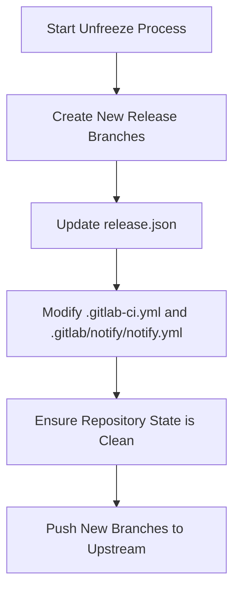

This document will cover the Unfreeze Process Flow, which includes:

1. Creating new release branches
2. Updating the <SwmPath>[release.json](release.json)</SwmPath> file
3. Modifying <SwmPath>[.gitlab-ci.yml](.gitlab-ci.yml)</SwmPath> and <SwmPath>[.gitlab/notify/notify.yml](.gitlab/notify/notify.yml)</SwmPath>
4. Ensuring repository state is clean and pushing new branches.

Technical document: <SwmLink doc-title="Unfreeze Process Flow">[Unfreeze Process Flow](/.swm/unfreeze-process-flow.s8gt4p6b.sw.md)</SwmLink>

# [Creating New Release Branches](https://app.swimm.io/repos/Z2l0aHViJTNBJTNBZGF0YWRvZy1hZ2VudCUzQSUzQVN3aW1tLURlbW8=/docs/s8gt4p6b#unfreeze)

The unfreeze process begins by creating new release branches in several repositories, including datadog-agent, datadog-agent-macos, omnibus-ruby, and omnibus-software. This step ensures that each repository has a dedicated branch for the upcoming release, allowing for isolated development and testing of new features and fixes.

# [Updating the release.json File](https://app.swimm.io/repos/Z2l0aHViJTNBJTNBZGF0YWRvZy1hZ2VudCUzQSUzQVN3aW1tLURlbW8=/docs/s8gt4p6b#set_new_release_branch)

Next, the <SwmPath>[release.json](release.json)</SwmPath> file is updated to point to the newly created release branches. This file contains configuration details for the release process, and updating it ensures that all subsequent steps in the release pipeline reference the correct branches. Specifically, the <SwmToken path="tasks/diff.py" pos="107:1:1" line-data="        base_branch = _get_release_json_value(&quot;base_branch&quot;)">`base_branch`</SwmToken> field and fields in the nightly sections are modified to reflect the new branch names.

# <SwmPath>[.gitlab/notify/notify.yml](.gitlab/notify/notify.yml)</SwmPath>

After updating the <SwmPath>[release.json](release.json)</SwmPath> file, entries in <SwmPath>[.gitlab-ci.yml](.gitlab-ci.yml)</SwmPath> and <SwmPath>[.gitlab/notify/notify.yml](.gitlab/notify/notify.yml)</SwmPath> are modified. These files contain CI/CD pipeline configurations and notification settings, respectively. Updating them ensures that the CI/CD pipelines run against the correct branches and that notifications are sent for the appropriate branch activities.

# [Ensuring Repository State is Clean and Pushing New Branches](https://app.swimm.io/repos/Z2l0aHViJTNBJTNBZGF0YWRvZy1hZ2VudCUzQSUzQVN3aW1tLURlbW8=/docs/s8gt4p6b#unfreeze)

Finally, the repository state is checked to ensure it is clean, meaning there are no uncommitted changes, and the current branch is either main or the release branch. Once verified, the new branches are pushed to the upstream repository. This step finalizes the unfreeze process, making the new branches available for development and testing by the team.

&nbsp;

*This is an auto-generated document by Swimm AI 🌊 and has not yet been verified by a human*

<SwmMeta version="3.0.0" repo-id="Z2l0aHViJTNBJTNBZGF0YWRvZy1hZ2VudCUzQSUzQVN3aW1tLURlbW8=" repo-name="datadog-agent">Powered by [Swimm](/)</SwmMeta>
