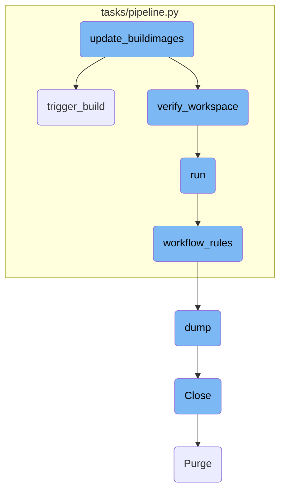
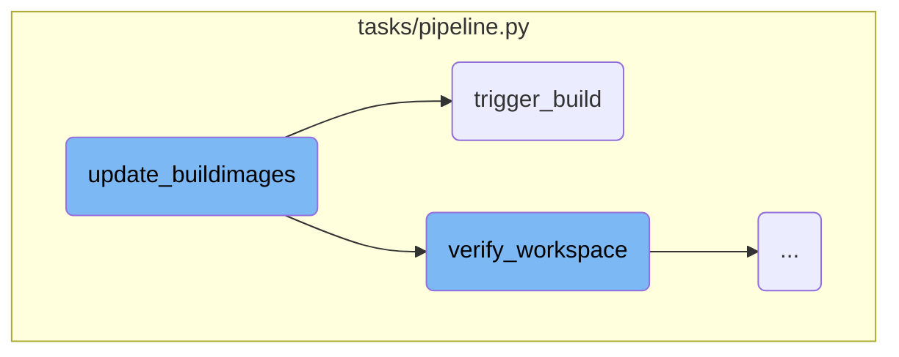
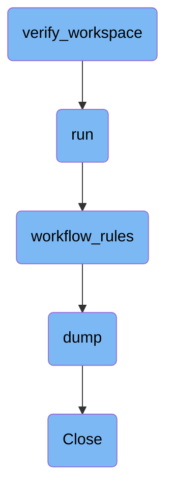

In this document, we will explain the process of updating build images. The process involves verifying the workspace, updating configuration files, and triggering the build.

The flow starts with verifying the workspace to ensure it's clean and ready for modifications. Next, the configuration files for <SwmToken path="tasks/pipeline.py" pos="143:8:8" line-data="def workflow_rules(gitlab_file=&quot;.gitlab-ci.yml&quot;):">`gitlab`</SwmToken> and <SwmToken path="tasks/pipeline.py" pos="756:5:5" line-data="    update_circleci_config(&quot;.circleci/config.yml&quot;, image_tag, test_version=test_version)">`circleci`</SwmToken> are updated with the new image tag. Finally, the build process is triggered, which involves committing the changes and pushing them to the repository, followed by running the pipeline.

Here is a high level diagram of the flow, showing only the most important functions:



# Flow drill down

First, we'll zoom into this section of the flow:



<SwmSnippet path="/tasks/pipeline.py" line="748">

---

## Updating Build Images

The <SwmToken path="tasks/pipeline.py" pos="748:2:2" line-data="def update_buildimages(ctx, image_tag, test_version=True, branch_name=None):">`update_buildimages`</SwmToken> function updates local configuration files with a new image tag from <SwmToken path="tasks/pipeline.py" pos="750:19:21" line-data="    Update local files to run with new image_tag from agent-buildimages and launch a full pipeline">`agent-buildimages`</SwmToken> and initiates a full pipeline. It first verifies the workspace and updates the <SwmToken path="tasks/pipeline.py" pos="755:5:5" line-data="    update_gitlab_config(&quot;.gitlab-ci.yml&quot;, image_tag, test_version=test_version)">`gitlab`</SwmToken> and <SwmToken path="tasks/pipeline.py" pos="756:5:5" line-data="    update_circleci_config(&quot;.circleci/config.yml&quot;, image_tag, test_version=test_version)">`circleci`</SwmToken> configuration files with the new image tag. Finally, it calls the <SwmToken path="tasks/pipeline.py" pos="757:1:1" line-data="    trigger_build(ctx, branch_name=branch_name, create_branch=create_branch)">`trigger_build`</SwmToken> function to start the build process.

```python
def update_buildimages(ctx, image_tag, test_version=True, branch_name=None):
    """
    Update local files to run with new image_tag from agent-buildimages and launch a full pipeline
    Use --no-test-version to commit without the _test_only suffixes
    """
    create_branch = branch_name is None
    branch_name = verify_workspace(ctx, branch_name=branch_name)
    update_gitlab_config(".gitlab-ci.yml", image_tag, test_version=test_version)
    update_circleci_config(".circleci/config.yml", image_tag, test_version=test_version)
    trigger_build(ctx, branch_name=branch_name, create_branch=create_branch)
```

---

</SwmSnippet>

<SwmSnippet path="/tasks/pipeline.py" line="856">

---

## Triggering the Build

The <SwmToken path="tasks/pipeline.py" pos="856:2:2" line-data="def trigger_build(ctx, branch_name=None, create_branch=False):">`trigger_build`</SwmToken> function is responsible for initiating a pipeline from the current branch. If a new branch needs to be created, it checks out a new branch. It then prompts the user to confirm if they want to trigger the pipeline, commits the changes, and pushes them to the repository. After a short delay to allow <SwmToken path="tasks/pipeline.py" pos="864:11:11" line-data="        ctx.run(&quot;git add .gitlab-ci.yml .circleci/config.yml&quot;)">`gitlab`</SwmToken> to process the events, it calls the <SwmToken path="tasks/pipeline.py" pos="861:3:3" line-data="        ctx.run(f&quot;git checkout -b {branch_name}&quot;)">`run`</SwmToken> function to start the pipeline.

```python
def trigger_build(ctx, branch_name=None, create_branch=False):
    """
    Trigger a pipeline from current branch on-demand (useful for test image)
    """
    if create_branch:
        ctx.run(f"git checkout -b {branch_name}")
    answer = input("Do you want to trigger a pipeline (will also commit and push)? [Y/n]\n")
    if len(answer) == 0 or answer.casefold() == "y":
        ctx.run("git add .gitlab-ci.yml .circleci/config.yml")
        ctx.run("git commit -m 'Update buildimages version'")
        ctx.run(f"git push origin {branch_name}")
        print("Wait 10s to let Gitlab create the first events before triggering a new pipeline")
        time.sleep(10)
        run(ctx, here=True)
```

---

</SwmSnippet>

Now, lets zoom into this section of the flow:



<SwmSnippet path="/tasks/pipeline.py" line="760">

---

## <SwmToken path="tasks/pipeline.py" pos="760:2:2" line-data="def verify_workspace(ctx, branch_name=None):">`verify_workspace`</SwmToken>

The <SwmToken path="tasks/pipeline.py" pos="760:2:2" line-data="def verify_workspace(ctx, branch_name=None):">`verify_workspace`</SwmToken> function ensures that the workspace is in a clean state before any modifications or commits are made. It checks for potential conflicts both locally and upstream. If no branch name is provided, it generates one based on the current user. The function then uses the <SwmToken path="tasks/pipeline.py" pos="767:5:5" line-data="        github = GithubAPI(repository=GITHUB_REPO_NAME)">`GithubAPI`</SwmToken> to verify the branch state and ensure it is clean.

```python
def verify_workspace(ctx, branch_name=None):
    """
    Assess we can modify files and commit without risk of local or upstream conflicts
    """
    if branch_name is None:
        user_name = ctx.run("whoami", hide="out")
        branch_name = f"{user_name.stdout.rstrip()}/test_buildimages"
        github = GithubAPI(repository=GITHUB_REPO_NAME)
        check_clean_branch_state(ctx, github, branch_name)
    return branch_name
```

---

</SwmSnippet>

<SwmSnippet path="/tasks/pipeline.py" line="229">

---

## run

The <SwmToken path="tasks/pipeline.py" pos="229:2:2" line-data="def run(">`run`</SwmToken> function is responsible for executing a pipeline based on a specified git reference or the current branch. It supports various options such as running all builds and tests, deploying artifacts, and handling release candidates. The function ensures that only one of the <SwmToken path="tasks/pipeline.py" pos="244:43:44" line-data="    Run a pipeline on the given git ref (--git-ref &lt;git ref&gt;), or on the current branch if --here is given.">`--here`</SwmToken> or <SwmToken path="tasks/pipeline.py" pos="244:18:21" line-data="    Run a pipeline on the given git ref (--git-ref &lt;git ref&gt;), or on the current branch if --here is given.">`--git-ref`</SwmToken> options is specified, checks the validity of deploy pipelines, and manages running pipelines on the same git reference.

```python
def run(
    ctx,
    git_ref="",
    here=False,
    use_release_entries=False,
    major_versions=None,
    repo_branch="dev",
    deploy=False,
    all_builds=True,
    e2e_tests=True,
    kmt_tests=True,
    rc_build=False,
    rc_k8s_deployments=False,
):
    """
    Run a pipeline on the given git ref (--git-ref <git ref>), or on the current branch if --here is given.
    By default, this pipeline will run all builds & tests, including all kitchen tests, but is not a deploy pipeline.
    Use --deploy to make this pipeline a deploy pipeline, which will upload artifacts to the staging repositories.
    Use --no-all-builds to not run builds for all architectures (only a subset of jobs will run. No effect on pipelines on the default branch).
    Use --no-kitchen-tests to not run all kitchen tests on the pipeline.
    Use --e2e-tests to run all e2e tests on the pipeline.
```

---

</SwmSnippet>

<SwmSnippet path="/tasks/pipeline.py" line="143">

---

## <SwmToken path="tasks/pipeline.py" pos="143:2:2" line-data="def workflow_rules(gitlab_file=&quot;.gitlab-ci.yml&quot;):">`workflow_rules`</SwmToken>

The <SwmToken path="tasks/pipeline.py" pos="143:2:2" line-data="def workflow_rules(gitlab_file=&quot;.gitlab-ci.yml&quot;):">`workflow_rules`</SwmToken> function retrieves the workflow rules from the <SwmToken path="tasks/pipeline.py" pos="143:8:8" line-data="def workflow_rules(gitlab_file=&quot;.gitlab-ci.yml&quot;):">`gitlab`</SwmToken> CI configuration file. It reads the <SwmPath>[.gitlab-ci.yml](.gitlab-ci.yml)</SwmPath> file and returns the workflow rules in a <SwmToken path="tasks/pipeline.py" pos="144:18:20" line-data="    &quot;&quot;&quot;Get Gitlab workflow rules list in a YAML-formatted string.&quot;&quot;&quot;">`YAML-formatted`</SwmToken> string.

```python
def workflow_rules(gitlab_file=".gitlab-ci.yml"):
    """Get Gitlab workflow rules list in a YAML-formatted string."""
    with open(gitlab_file) as f:
        return yaml.dump(yaml.safe_load(f.read())["workflow"]["rules"])
```

---

</SwmSnippet>

<SwmSnippet path="/pkg/security/resolvers/netns/resolver.go" line="592">

---

## dump

The <SwmToken path="pkg/security/resolvers/netns/resolver.go" pos="592:9:9" line-data="func (nr *Resolver) dump(params *api.DumpNetworkNamespaceParams) []NetworkNamespaceDump {">`dump`</SwmToken> function in the <SwmToken path="pkg/security/resolvers/netns/resolver.go" pos="592:6:6" line-data="func (nr *Resolver) dump(params *api.DumpNetworkNamespaceParams) []NetworkNamespaceDump {">`Resolver`</SwmToken> class iterates over network namespaces and collects information about each namespace, including network devices and their attributes. It locks the namespace during the operation to ensure thread safety and returns a list of <SwmToken path="pkg/security/resolvers/netns/resolver.go" pos="592:21:21" line-data="func (nr *Resolver) dump(params *api.DumpNetworkNamespaceParams) []NetworkNamespaceDump {">`NetworkNamespaceDump`</SwmToken> objects containing the collected data.

```go
func (nr *Resolver) dump(params *api.DumpNetworkNamespaceParams) []NetworkNamespaceDump {
	nr.Lock()
	defer nr.Unlock()

	var handle *os.File
	var ntl *manager.NetlinkSocket
	var links []netlink.Link
	var dump []NetworkNamespaceDump
	var err error

	// iterate over the list of network namespaces
	for _, nsID := range nr.networkNamespaces.Keys() {
		netns, _ := nr.networkNamespaces.Peek(nsID)
		netns.Lock()

		netnsDump := NetworkNamespaceDump{
			NsID:          netns.nsID,
			HandleFD:      int(netns.handle.Fd()),
			HandlePath:    netns.handle.Name(),
			LonelyTimeout: netns.lonelyTimeout,
		}
```

---

</SwmSnippet>

<SwmSnippet path="/pkg/security/resolvers/netns/resolver.go" line="554">

---

## Close

The <SwmToken path="pkg/security/resolvers/netns/resolver.go" pos="554:2:2" line-data="// Close closes this resolver and frees all the resources">`Close`</SwmToken> function in the <SwmToken path="pkg/security/resolvers/netns/resolver.go" pos="554:8:8" line-data="// Close closes this resolver and frees all the resources">`resolver`</SwmToken> class is responsible for releasing all resources associated with the resolver. It purges the network namespaces and performs a manual flush to ensure that all resources are properly freed.

```go
// Close closes this resolver and frees all the resources
func (nr *Resolver) Close() {
	if nr.networkNamespaces != nil {
		nr.Lock()
		nr.networkNamespaces.Purge()
		nr.Unlock()
	}
	nr.manualFlushNamespaces()
}
```

---

</SwmSnippet>

&nbsp;

*This is an auto-generated document by Swimm AI 🌊 and has not yet been verified by a human*

<SwmMeta version="3.0.0" repo-id="Z2l0aHViJTNBJTNBZGF0YWRvZy1hZ2VudCUzQSUzQVN3aW1tLURlbW8=" repo-name="datadog-agent"><sup>Powered by [Swimm](/)</sup></SwmMeta>
