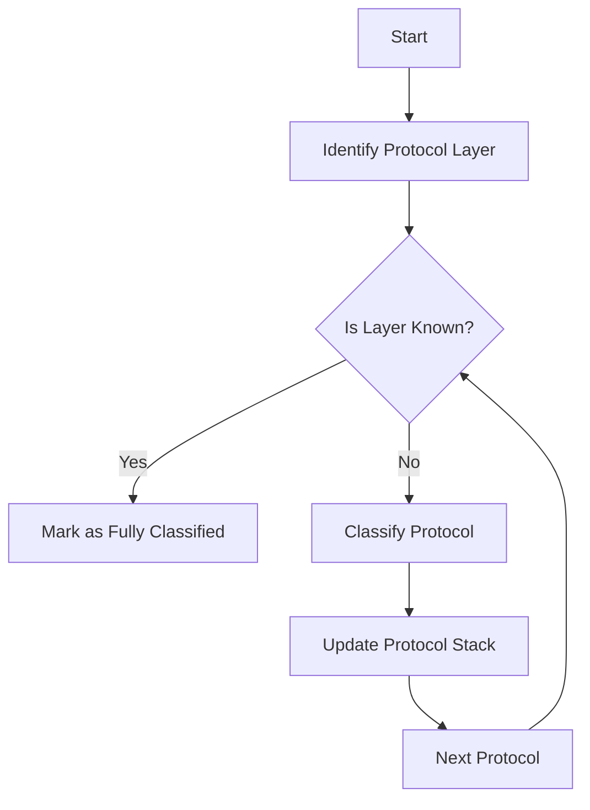

# Protocols in <SwmToken path="pkg/network/ebpf/c/protocols/classification/defs.h" pos="106:6:6" line-data="// bloats the eBPF stack size of some NPM probes.  Using the wrapper type">`eBPF`</SwmToken>

Protocols in the <SwmToken path="pkg/network/ebpf/c/protocols/classification/defs.h" pos="106:6:6" line-data="// bloats the eBPF stack size of some NPM probes.  Using the wrapper type">`eBPF`</SwmToken> context refer to the various communication protocols that the system can classify and handle. These protocols are categorized into different layers such as API, Application, and Encryption. Each protocol belongs to a specific layer, and the classification process involves identifying the protocol and its corresponding layer. This is essential for understanding the type of traffic and applying appropriate handling or monitoring rules.

# Protocol Layers

The <SwmToken path="pkg/network/ebpf/c/protocols/classification/defs.h" pos="77:3:3" line-data="// `protocol_layer_t` value (see notes above).">`protocol_layer_t`</SwmToken> enum represents all existing protocol layers. Each <SwmToken path="pkg/network/ebpf/c/protocols/classification/defs.h" pos="76:5:5" line-data="// Each `protocol_t` entry is implicitly associated to a single">`protocol_t`</SwmToken> entry is implicitly associated with a single <SwmToken path="pkg/network/ebpf/c/protocols/classification/defs.h" pos="77:3:3" line-data="// `protocol_layer_t` value (see notes above).">`protocol_layer_t`</SwmToken> value. This helps in determining which protocol layer a specific protocol belongs to.

<SwmSnippet path="/pkg/network/ebpf/c/protocols/classification/defs.h" line="74">

---

The <SwmToken path="pkg/network/ebpf/c/protocols/classification/defs.h" pos="77:3:3" line-data="// `protocol_layer_t` value (see notes above).">`protocol_layer_t`</SwmToken> enum defines the different protocol layers such as API, Application, and Encryption. This enum is used to categorize protocols into their respective layers.

```c
// This enum represents all existing protocol layers
//
// Each `protocol_t` entry is implicitly associated to a single
// `protocol_layer_t` value (see notes above).
//
//In order to determine which `protocol_layer_t` a `protocol_t` belongs to,
// users can call `get_protocol_layer`
typedef enum {
    LAYER_UNKNOWN,
    LAYER_API,
    LAYER_APPLICATION,
    LAYER_ENCRYPTION,
} __attribute__ ((packed)) protocol_layer_t;
```

---

</SwmSnippet>

# Protocol Classification

The classification process involves multiple protocol layers: API, Application, and Encryption. Each protocol belongs to a specific layer, and once a layer is known, only the remaining layers are classified. This process is optimized to avoid unnecessary classification attempts.

<SwmSnippet path="/pkg/network/ebpf/c/protocols/classification/protocol-classification.h" line="28">

---

The classification logic is implemented using various helper functions and macros that check the protocol type and update the protocol stack accordingly. This ensures that the system can accurately and efficiently classify the traffic it monitors.

```c
// Some considerations about multiple protocol classification:
//
// * There are 3 protocol layers: API, Application and Encryption
//
// * Each protocol belongs to a specific layer (a `protocol_t` value encodes both the
// protocol ID itself and the protocol layer it belongs to)
//
// * Once a layer is "known" (for example, the application-layer protocol is
// classified), we only attempt to classify the remaining layers;
//
// * Protocol classification can be sliced/grouped into multiple BPF tail call
// programs (this is what we currently have now, but it is worth noting that in the
// new design all protocols from a given program must belong to the same layer)
//
// * If all 3 layers of a connection are known we don't do anything; In addition to
// that, there is a helper `mark_as_fully_classified` that works as a sort of
// special-case for this. For example, if we're in a socket filter context and we
// have classified a connection as a MySQL (application-level), we can call this
// helper to indicate that no further classification attempts are necessary (there
// won't be any api-level protocols above MySQL and if we were able to determine
```

---

</SwmSnippet>

# Helper Functions

The function `classify_protocol_for_dispatcher` determines the protocol of a given buffer. It checks various conditions and updates the protocol type accordingly. This function is crucial for the classification process.

# Protocol Identification

The function <SwmToken path="pkg/network/ebpf/c/protocols/http/classification-helpers.h" pos="8:6:6" line-data="static __always_inline bool is_http(const char *buf, __u32 size) {">`is_http`</SwmToken> checks if a given buffer starts with an HTTP prefix or a specific HTTP method. This helps in identifying HTTP traffic during the classification process.

<SwmSnippet path="/pkg/network/ebpf/c/protocols/http/classification-helpers.h" line="1">

---

The function <SwmToken path="pkg/network/ebpf/c/protocols/http/classification-helpers.h" pos="8:6:6" line-data="static __always_inline bool is_http(const char *buf, __u32 size) {">`is_http`</SwmToken> checks if a given buffer starts with an HTTP prefix or a specific HTTP method. This helps in identifying HTTP traffic during the classification process.

```c
#ifndef __HTTP_HELPERS_H
#define __HTTP_HELPERS_H

#include "protocols/classification/common.h"

// Checks if the given buffers start with `HTTP` prefix (represents a response) or starts with `<method> /` which represents
// a request, where <method> is one of: GET, POST, PUT, DELETE, HEAD, OPTIONS, PATCH, or TRACE.
static __always_inline bool is_http(const char *buf, __u32 size) {
    CHECK_PRELIMINARY_BUFFER_CONDITIONS(buf, size, HTTP_MIN_SIZE);

#define HTTP "HTTP/"
#define GET "GET /"
#define POST "POST /"
#define PUT "PUT /"
#define DELETE "DELETE /"
#define HEAD "HEAD /"
#define OPTIONS1 "OPTIONS /"
#define OPTIONS2 "OPTIONS *"
#define PATCH "PATCH /"
#define TRACE "TRACE /"
```

---

</SwmSnippet>

<SwmSnippet path="/pkg/network/ebpf/c/protocols/classification/stack-helpers.h" line="7">

---

The function <SwmToken path="pkg/network/ebpf/c/protocols/classification/stack-helpers.h" pos="7:2:2" line-data="// get_protocol_layer retrieves the `protocol_layer_t` associated to the given `protocol_t`.">`get_protocol_layer`</SwmToken> retrieves the <SwmToken path="pkg/network/ebpf/c/protocols/classification/stack-helpers.h" pos="7:9:9" line-data="// get_protocol_layer retrieves the `protocol_layer_t` associated to the given `protocol_t`.">`protocol_layer_t`</SwmToken> associated with a given <SwmToken path="pkg/network/ebpf/c/protocols/classification/stack-helpers.h" pos="7:21:21" line-data="// get_protocol_layer retrieves the `protocol_layer_t` associated to the given `protocol_t`.">`protocol_t`</SwmToken>. This is used to determine the layer to which a protocol belongs.

```c
// get_protocol_layer retrieves the `protocol_layer_t` associated to the given `protocol_t`.
// Example:
// get_protocol_layer(PROTOCOL_HTTP) => LAYER_APPLICATION
// get_protocol_layer(PROTOCOL_TLS)  => LAYER_ENCRYPTION
static __always_inline protocol_layer_t get_protocol_layer(protocol_t proto) {
    u16 layer_bit = proto&(LAYER_API_BIT|LAYER_APPLICATION_BIT|LAYER_ENCRYPTION_BIT);

    switch(layer_bit) {
    case LAYER_API_BIT:
        return LAYER_API;
    case LAYER_APPLICATION_BIT:
        return LAYER_APPLICATION;
    case LAYER_ENCRYPTION_BIT:
        return LAYER_ENCRYPTION;
    }

    return LAYER_UNKNOWN;
}
```

---

</SwmSnippet>

# Protocol Endpoints

The <SwmToken path="pkg/network/ebpf/c/protocols/kafka/kafka-classification.h" pos="72:6:6" line-data="static __always_inline bool is_valid_kafka_request_header(const kafka_header_t *kafka_header) {">`is_valid_kafka_request_header`</SwmToken> function checks if a given Kafka request header is valid. It verifies various conditions such as message size, API key, API version, correlation ID, and client ID size. This function ensures that the Kafka request adheres to the expected protocol specifications.

<SwmSnippet path="/pkg/network/ebpf/c/protocols/kafka/kafka-classification.h" line="72">

---

The <SwmToken path="pkg/network/ebpf/c/protocols/kafka/kafka-classification.h" pos="72:6:6" line-data="static __always_inline bool is_valid_kafka_request_header(const kafka_header_t *kafka_header) {">`is_valid_kafka_request_header`</SwmToken> function checks if a given Kafka request header is valid. It verifies various conditions such as message size, API key, API version, correlation ID, and client ID size.

```c
static __always_inline bool is_valid_kafka_request_header(const kafka_header_t *kafka_header) {
    if (kafka_header->message_size < sizeof(kafka_header_t) || kafka_header->message_size  < 0) {
        return false;
    }

    if (kafka_header->api_version < 0) {
        return false;
    }

    switch (kafka_header->api_key) {
    case KAFKA_FETCH:
        if (kafka_header->api_version > KAFKA_MAX_SUPPORTED_FETCH_REQUEST_API_VERSION) {
            // Fetch request version 13 and above is not supported.
            return false;
        }
        break;
    case KAFKA_PRODUCE:
        if (kafka_header->api_version == 0) {
            // We have seen some false positives when both request_api_version and request_api_key are 0,
            // so dropping support for this case
            return false;
```

---

</SwmSnippet>

## <SwmToken path="pkg/network/ebpf/c/protocols/amqp/helpers.h" pos="21:6:6" line-data="static __always_inline bool is_amqp(const char* buf, __u32 buf_size) {">`is_amqp`</SwmToken>

The <SwmToken path="pkg/network/ebpf/c/protocols/amqp/helpers.h" pos="21:6:6" line-data="static __always_inline bool is_amqp(const char* buf, __u32 buf_size) {">`is_amqp`</SwmToken> function checks if a given buffer is an AMQP message. It first verifies if the buffer starts with the AMQP protocol header. If not, it further checks the frame type and extracts the class and method <SwmToken path="pkg/network/ebpf/c/protocols/amqp/helpers.h" pos="28:33:33" line-data="    // Validate that we will be able to get from the buffer the class and method ids.">`ids`</SwmToken> to determine if the buffer represents a valid AMQP message. This function helps in identifying and classifying AMQP traffic.

<SwmSnippet path="/pkg/network/ebpf/c/protocols/amqp/helpers.h" line="21">

---

The <SwmToken path="pkg/network/ebpf/c/protocols/amqp/helpers.h" pos="21:6:6" line-data="static __always_inline bool is_amqp(const char* buf, __u32 buf_size) {">`is_amqp`</SwmToken> function checks if a given buffer is an AMQP message. It first verifies if the buffer starts with the AMQP protocol header. If not, it further checks the frame type and extracts the class and method <SwmToken path="pkg/network/ebpf/c/protocols/amqp/helpers.h" pos="28:33:33" line-data="    // Validate that we will be able to get from the buffer the class and method ids.">`ids`</SwmToken> to determine if the buffer represents a valid AMQP message.

```c
static __always_inline bool is_amqp(const char* buf, __u32 buf_size) {
    // New connection should start with protocol header of AMQP.
    // Ref https://www.rabbitmq.com/resources/specs/amqp0-9-1.pdf.
    if (is_amqp_protocol_header(buf, buf_size)) {
        return true;
    }

    // Validate that we will be able to get from the buffer the class and method ids.
    if (buf_size < AMQP_MIN_PAYLOAD_LENGTH) {
       return false;
    }

    __u8 frame_type = buf[0];
    // Check only for method frame type.
    if (frame_type != AMQP_FRAME_METHOD_TYPE) {
        return false;
    }

    // We extract the class id and method id by big endian from the buffer.
    // Ref https://www.rabbitmq.com/resources/specs/amqp0-9-1.pdf.
    amqp_header *hdr = (amqp_header *)(buf+7);
```

---

</SwmSnippet>

&nbsp;

*This is an auto-generated document by Swimm AI 🌊 and has not yet been verified by a human*

<SwmMeta version="3.0.0" repo-id="Z2l0aHViJTNBJTNBZGF0YWRvZy1hZ2VudCUzQSUzQVN3aW1tLURlbW8=" repo-name="datadog-agent"><sup>Powered by [Swimm](/)</sup></SwmMeta>
