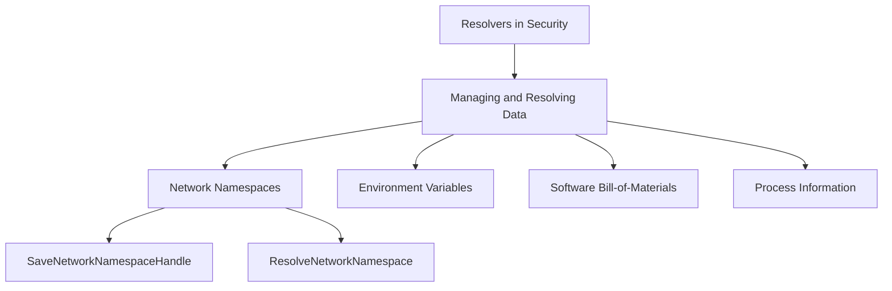

# Overview

Resolvers are components responsible for managing and resolving various types of data within the security module. They handle tasks such as resolving network namespaces, environment variables, software bill-of-materials (SBOM), and process information. Resolvers ensure that the necessary data is available and up-to-date for security monitoring and analysis. They play a crucial role in maintaining the integrity and accuracy of the data used by the security probes and other components.

# Package `configresolver`

This package provides the <SwmToken path="pkg/security/resolvers/container/resolver.go" pos="16:10:10" line-data="// Resolver is used to resolve the container context of the events">`resolve`</SwmToken> function that resolves a given configuration template against a given service by replacing template variables with corresponding data from the service. The <SwmToken path="pkg/security/resolvers/resolvers_windows.go" pos="22:2:2" line-data="// Resolvers holds the list of the event attribute resolvers">`Resolvers`</SwmToken> struct holds the list of event attribute resolvers, including <SwmToken path="pkg/security/resolvers/resolvers_windows.go" pos="24:1:1" line-data="	ProcessResolver            *process.Resolver">`ProcessResolver`</SwmToken>, <SwmToken path="pkg/security/resolvers/resolvers_windows.go" pos="25:1:1" line-data="	TagsResolver               tags.Resolver">`TagsResolver`</SwmToken>, <SwmToken path="pkg/security/resolvers/resolvers_windows.go" pos="26:1:1" line-data="	UserSessions               *usersessions.Resolver">`UserSessions`</SwmToken>, <SwmToken path="pkg/security/resolvers/resolvers_windows.go" pos="27:1:1" line-data="	UserGroupResolver          *usergroup.Resolver">`UserGroupResolver`</SwmToken>, and <SwmToken path="pkg/security/resolvers/resolvers_windows.go" pos="28:1:1" line-data="	SecurityDescriptorResolver *securitydescriptors.Resolver">`SecurityDescriptorResolver`</SwmToken>.

<SwmSnippet path="/pkg/security/resolvers/resolvers_windows.go" line="22">

---

The <SwmToken path="pkg/security/resolvers/resolvers_windows.go" pos="22:2:2" line-data="// Resolvers holds the list of the event attribute resolvers">`Resolvers`</SwmToken> struct holds the list of event attribute resolvers.

```go
// Resolvers holds the list of the event attribute resolvers
type Resolvers struct {
	ProcessResolver            *process.Resolver
	TagsResolver               tags.Resolver
	UserSessions               *usersessions.Resolver
	UserGroupResolver          *usergroup.Resolver
	SecurityDescriptorResolver *securitydescriptors.Resolver
}
```

---

</SwmSnippet>

# Resolver Structs

The <SwmToken path="pkg/security/resolvers/resolvers_windows.go" pos="24:6:6" line-data="	ProcessResolver            *process.Resolver">`Resolver`</SwmToken> struct represents a cache for mount points and the corresponding file systems. It includes various fields such as <SwmToken path="pkg/security/resolvers/mount/resolver.go" pos="85:1:1" line-data="	opts            ResolverOpts">`opts`</SwmToken>, <SwmToken path="pkg/security/resolvers/mount/resolver.go" pos="86:1:1" line-data="	cgroupsResolver *cgroup.Resolver">`cgroupsResolver`</SwmToken>, <SwmToken path="pkg/security/resolvers/mount/resolver.go" pos="87:1:1" line-data="	statsdClient    statsd.ClientInterface">`statsdClient`</SwmToken>, and several statistics counters.

<SwmSnippet path="/pkg/security/resolvers/mount/resolver.go" line="83">

---

The <SwmToken path="pkg/security/resolvers/mount/resolver.go" pos="83:2:2" line-data="// Resolver represents a cache for mountpoints and the corresponding file systems">`Resolver`</SwmToken> struct represents a cache for mount points and the corresponding file systems.

```go
// Resolver represents a cache for mountpoints and the corresponding file systems
type Resolver struct {
	opts            ResolverOpts
	cgroupsResolver *cgroup.Resolver
	statsdClient    statsd.ClientInterface
	lock            sync.RWMutex
	mounts          map[uint32]*model.Mount
	pidToMounts     map[uint32]map[uint32]*model.Mount
	minMountID      uint32 // used to find the first userspace visible mount ID
	redemption      *simplelru.LRU[uint32, *redemptionEntry]
	fallbackLimiter *utils.Limiter[uint64]

	// stats
	cacheHitsStats *atomic.Int64
	cacheMissStats *atomic.Int64
	procHitsStats  *atomic.Int64
	procMissStats  *atomic.Int64
}
```

---

</SwmSnippet>

# Container Context

The <SwmToken path="pkg/security/resolvers/resolvers_windows.go" pos="24:6:6" line-data="	ProcessResolver            *process.Resolver">`Resolver`</SwmToken> struct is used to resolve the container context of the events.

<SwmSnippet path="/pkg/security/resolvers/container/resolver.go" line="16">

---

The <SwmToken path="pkg/security/resolvers/container/resolver.go" pos="16:2:2" line-data="// Resolver is used to resolve the container context of the events">`Resolver`</SwmToken> struct is used to resolve the container context of the events.

```go
// Resolver is used to resolve the container context of the events
type Resolver struct{}
```

---

</SwmSnippet>

# Cache Resolver Interface

The <SwmToken path="pkg/security/resolvers/resolvers_windows.go" pos="24:6:6" line-data="	ProcessResolver            *process.Resolver">`Resolver`</SwmToken> interface represents a cache resolver with methods like <SwmToken path="pkg/security/resolvers/tags/resolver.go" pos="44:1:1" line-data="	Start(ctx context.Context) error">`Start`</SwmToken>, <SwmToken path="pkg/security/resolvers/tags/resolver.go" pos="45:1:1" line-data="	Stop() error">`Stop`</SwmToken>, <SwmToken path="pkg/security/resolvers/container/resolver.go" pos="16:10:10" line-data="// Resolver is used to resolve the container context of the events">`resolve`</SwmToken>, <SwmToken path="pkg/security/resolvers/tags/resolver.go" pos="47:1:1" line-data="	ResolveWithErr(id string) ([]string, error)">`ResolveWithErr`</SwmToken>, and <SwmToken path="pkg/security/resolvers/tags/resolver.go" pos="48:1:1" line-data="	GetValue(id string, tag string) string">`GetValue`</SwmToken>.

<SwmSnippet path="/pkg/security/resolvers/tags/resolver.go" line="42">

---

The <SwmToken path="pkg/security/resolvers/tags/resolver.go" pos="42:2:2" line-data="// Resolver represents a cache resolver">`Resolver`</SwmToken> interface represents a cache resolver.

```go
// Resolver represents a cache resolver
type Resolver interface {
	Start(ctx context.Context) error
	Stop() error
	Resolve(id string) []string
	ResolveWithErr(id string) ([]string, error)
	GetValue(id string, tag string) string
}
```

---

</SwmSnippet>

# Kernel Timestamps

The <SwmToken path="pkg/security/resolvers/resolvers_windows.go" pos="24:6:6" line-data="	ProcessResolver            *process.Resolver">`Resolver`</SwmToken> struct converts kernel monotonic timestamps to absolute times.

<SwmSnippet path="/pkg/security/resolvers/time/resolver.go" line="19">

---

The <SwmToken path="pkg/security/resolvers/time/resolver.go" pos="19:2:2" line-data="// Resolver converts kernel monotonic timestamps to absolute times">`Resolver`</SwmToken> struct converts kernel monotonic timestamps to absolute times.

```go
// Resolver converts kernel monotonic timestamps to absolute times
type Resolver struct {
	bootTime time.Time
}
```

---

</SwmSnippet>

# TC Resolver

The <SwmToken path="pkg/security/resolvers/resolvers_windows.go" pos="24:6:6" line-data="	ProcessResolver            *process.Resolver">`Resolver`</SwmToken> struct defines a TC resolver with fields like <SwmToken path="pkg/security/resolvers/tc/resolver.go" pos="38:1:1" line-data="	config   *config.Config">`config`</SwmToken> and <SwmToken path="pkg/security/resolvers/tc/resolver.go" pos="39:1:1" line-data="	programs map[NetDeviceKey]*manager.Probe">`programs`</SwmToken>.

<SwmSnippet path="/pkg/security/resolvers/tc/resolver.go" line="35">

---

The <SwmToken path="pkg/security/resolvers/tc/resolver.go" pos="35:2:2" line-data="// Resolver defines a TC resolver">`Resolver`</SwmToken> struct defines a TC resolver.

```go
// Resolver defines a TC resolver
type Resolver struct {
	sync.RWMutex
	config   *config.Config
	programs map[NetDeviceKey]*manager.Probe
}
```

---

</SwmSnippet>

# Cgroup Monitor

The <SwmToken path="pkg/security/resolvers/resolvers_windows.go" pos="24:6:6" line-data="	ProcessResolver            *process.Resolver">`Resolver`</SwmToken> struct defines a cgroup monitor with fields like <SwmToken path="pkg/security/resolvers/cgroup/resolver.go" pos="43:1:1" line-data="	workloads            *simplelru.LRU[string, *cgroupModel.CacheEntry]">`workloads`</SwmToken>, <SwmToken path="pkg/security/resolvers/resolvers_windows.go" pos="25:1:1" line-data="	TagsResolver               tags.Resolver">`TagsResolver`</SwmToken>, and <SwmToken path="pkg/security/resolvers/cgroup/resolver.go" pos="48:1:1" line-data="	listeners     map[Event][]Listener">`listeners`</SwmToken>.

<SwmSnippet path="/pkg/security/resolvers/cgroup/resolver.go" line="40">

---

The <SwmToken path="pkg/security/resolvers/cgroup/resolver.go" pos="40:2:2" line-data="// Resolver defines a cgroup monitor">`Resolver`</SwmToken> struct defines a cgroup monitor.

```go
// Resolver defines a cgroup monitor
type Resolver struct {
	sync.RWMutex
	workloads            *simplelru.LRU[string, *cgroupModel.CacheEntry]
	tagsResolver         tags.Resolver
	workloadsWithoutTags chan *cgroupModel.CacheEntry

	listenersLock sync.Mutex
	listeners     map[Event][]Listener
}
```

---

</SwmSnippet>

# Path and File Names

The <SwmToken path="pkg/security/resolvers/resolvers_windows.go" pos="24:6:6" line-data="	ProcessResolver            *process.Resolver">`Resolver`</SwmToken> struct describes a resolver for path and file names, including <SwmToken path="pkg/security/resolvers/path/resolver.go" pos="23:1:1" line-data="	dentryResolver *dentry.Resolver">`dentryResolver`</SwmToken> and <SwmToken path="pkg/security/resolvers/path/resolver.go" pos="24:1:1" line-data="	mountResolver  mount.ResolverInterface">`mountResolver`</SwmToken>.

<SwmSnippet path="/pkg/security/resolvers/path/resolver.go" line="21">

---

The <SwmToken path="pkg/security/resolvers/path/resolver.go" pos="21:2:2" line-data="// Resolver describes a resolvers for path and file names">`Resolver`</SwmToken> struct describes a resolver for path and file names.

```go
// Resolver describes a resolvers for path and file names
type Resolver struct {
	dentryResolver *dentry.Resolver
	mountResolver  mount.ResolverInterface
}
```

---

</SwmSnippet>

# Software <SwmToken path="pkg/security/resolvers/sbom/resolver.go" pos="130:10:14" line-data="// Resolver is the Software Bill-Of-material resolver">`Bill-Of-material`</SwmToken>

The <SwmToken path="pkg/security/resolvers/resolvers_windows.go" pos="24:6:6" line-data="	ProcessResolver            *process.Resolver">`Resolver`</SwmToken> struct is the Software <SwmToken path="pkg/security/resolvers/sbom/resolver.go" pos="130:10:14" line-data="// Resolver is the Software Bill-Of-material resolver">`Bill-Of-material`</SwmToken> resolver with fields like <SwmToken path="pkg/security/resolvers/sbom/resolver.go" pos="132:1:1" line-data="	cfg            *config.RuntimeSecurityConfig">`cfg`</SwmToken>, <SwmToken path="pkg/security/resolvers/sbom/resolver.go" pos="134:1:1" line-data="	sboms          map[string]*SBOM">`sboms`</SwmToken>, <SwmToken path="pkg/security/resolvers/sbom/resolver.go" pos="137:1:1" line-data="	scannerChan    chan *SBOM">`scannerChan`</SwmToken>, and <SwmToken path="pkg/security/resolvers/mount/resolver.go" pos="87:1:1" line-data="	statsdClient    statsd.ClientInterface">`statsdClient`</SwmToken>.

<SwmSnippet path="/pkg/security/resolvers/sbom/resolver.go" line="130">

---

The <SwmToken path="pkg/security/resolvers/sbom/resolver.go" pos="130:2:2" line-data="// Resolver is the Software Bill-Of-material resolver">`Resolver`</SwmToken> struct is the Software <SwmToken path="pkg/security/resolvers/sbom/resolver.go" pos="130:10:14" line-data="// Resolver is the Software Bill-Of-material resolver">`Bill-Of-material`</SwmToken> resolver.

```go
// Resolver is the Software Bill-Of-material resolver
type Resolver struct {
	cfg            *config.RuntimeSecurityConfig
	sbomsLock      sync.RWMutex
	sboms          map[string]*SBOM
	sbomsCacheLock sync.RWMutex
	sbomsCache     *simplelru.LRU[string, *SBOM]
	scannerChan    chan *SBOM
	statsdClient   statsd.ClientInterface
	sbomScanner    *sbomscanner.Scanner
	hostRootDevice uint64
	hostSBOM       *SBOM

	sbomGenerations       *atomic.Uint64
	failedSBOMGenerations *atomic.Uint64
	sbomsCacheHit         *atomic.Uint64
	sbomsCacheMiss        *atomic.Uint64

	// context tags and attributes
	hostname    string
	source      string
```

---

</SwmSnippet>

# Namespace Handles

The <SwmToken path="pkg/security/resolvers/resolvers_windows.go" pos="24:6:6" line-data="	ProcessResolver            *process.Resolver">`Resolver`</SwmToken> struct is used to store namespace handles with fields like <SwmToken path="pkg/security/resolvers/netns/resolver.go" pos="194:1:1" line-data="	state      *atomic.Int64">`state`</SwmToken>, <SwmToken path="pkg/security/resolvers/netns/resolver.go" pos="195:1:1" line-data="	tcResolver *tc.Resolver">`tcResolver`</SwmToken>, and <SwmToken path="pkg/security/resolvers/netns/resolver.go" pos="200:1:1" line-data="	networkNamespaces *simplelru.LRU[uint32, *NetworkNamespace]">`networkNamespaces`</SwmToken>.

<SwmSnippet path="/pkg/security/resolvers/netns/resolver.go" line="191">

---

The <SwmToken path="pkg/security/resolvers/netns/resolver.go" pos="191:2:2" line-data="// Resolver is used to store namespace handles">`Resolver`</SwmToken> struct is used to store namespace handles.

```go
// Resolver is used to store namespace handles
type Resolver struct {
	sync.Mutex
	state      *atomic.Int64
	tcResolver *tc.Resolver
	client     statsd.ClientInterface
	config     *config.Config
	manager    *manager.Manager

	networkNamespaces *simplelru.LRU[uint32, *NetworkNamespace]
```

---

</SwmSnippet>

# Environment Variables

The <SwmToken path="pkg/security/resolvers/resolvers_windows.go" pos="24:6:6" line-data="	ProcessResolver            *process.Resolver">`Resolver`</SwmToken> struct defines a resolver for environment variables with a field <SwmToken path="pkg/security/resolvers/envvars/resolver.go" pos="19:1:1" line-data="	priorityEnvs []string">`priorityEnvs`</SwmToken>.

<SwmSnippet path="/pkg/security/resolvers/envvars/resolver.go" line="17">

---

The <SwmToken path="pkg/security/resolvers/envvars/resolver.go" pos="17:2:2" line-data="// Resolver defines a resolver">`Resolver`</SwmToken> struct defines a resolver for environment variables.

```go
// Resolver defines a resolver
type Resolver struct {
	priorityEnvs []string
}
```

---

</SwmSnippet>

# Main Functions

There are several main functions in this folder. Some of them are Start, Stop, Resolve, <SwmToken path="pkg/security/resolvers/tags/resolver.go" pos="47:1:1" line-data="	ResolveWithErr(id string) ([]string, error)">`ResolveWithErr`</SwmToken>, and <SwmToken path="pkg/security/resolvers/tags/resolver.go" pos="48:1:1" line-data="	GetValue(id string, tag string) string">`GetValue`</SwmToken>. We will dive a little into Start and Resolve.

## Start

The <SwmToken path="pkg/security/resolvers/tags/resolver.go" pos="44:1:1" line-data="	Start(ctx context.Context) error">`Start`</SwmToken> function initializes the resolver and starts the underlying tagger. It ensures that the resolver is ready to handle requests by starting necessary background processes.

<SwmSnippet path="/pkg/security/resolvers/tags/resolver.go" line="56">

---

The <SwmToken path="pkg/security/resolvers/tags/resolver.go" pos="56:2:2" line-data="// Start the resolver">`Start`</SwmToken> function initializes the resolver and starts the underlying tagger.

```go
// Start the resolver
func (t *DefaultResolver) Start(ctx context.Context) error {
	go func() {
		if err := t.tagger.Start(ctx); err != nil {
			log.Errorf("failed to init tagger: %s", err)
		}
	}()

	go func() {
		<-ctx.Done()
		_ = t.tagger.Stop()
	}()

	return nil
}
```

---

</SwmSnippet>

## Resolve

The <SwmToken path="pkg/security/resolvers/container/resolver.go" pos="16:10:10" line-data="// Resolver is used to resolve the container context of the events">`resolve`</SwmToken> function takes an ID and returns a list of tags associated with that ID. It is used to fetch relevant metadata for a given identifier.

<SwmSnippet path="/pkg/security/resolvers/tags/resolver.go" line="46">

---

The <SwmToken path="pkg/security/resolvers/tags/resolver.go" pos="46:1:1" line-data="	Resolve(id string) []string">`Resolve`</SwmToken> function takes an ID and returns a list of tags associated with that ID.

```go
	Resolve(id string) []string
	ResolveWithErr(id string) ([]string, error)
```

---

</SwmSnippet>

# Endpoints of Resolvers

Endpoints of Resolvers include functions like <SwmToken path="pkg/security/resolvers/netns/resolver.go" pos="235:2:2" line-data="// SaveNetworkNamespaceHandle inserts the provided process network namespace in the list of tracked network. Returns">`SaveNetworkNamespaceHandle`</SwmToken> and <SwmToken path="pkg/security/resolvers/netns/resolver.go" pos="288:2:2" line-data="// ResolveNetworkNamespace returns a file descriptor to the network namespace. WARNING: it is up to the caller to">`ResolveNetworkNamespace`</SwmToken>.

## <SwmToken path="pkg/security/resolvers/netns/resolver.go" pos="235:2:2" line-data="// SaveNetworkNamespaceHandle inserts the provided process network namespace in the list of tracked network. Returns">`SaveNetworkNamespaceHandle`</SwmToken>

The <SwmToken path="pkg/security/resolvers/netns/resolver.go" pos="235:2:2" line-data="// SaveNetworkNamespaceHandle inserts the provided process network namespace in the list of tracked network. Returns">`SaveNetworkNamespaceHandle`</SwmToken> function inserts the provided process network namespace into the list of tracked networks. It returns a new entry if added.

<SwmSnippet path="/pkg/security/resolvers/netns/resolver.go" line="235">

---

The <SwmToken path="pkg/security/resolvers/netns/resolver.go" pos="235:2:2" line-data="// SaveNetworkNamespaceHandle inserts the provided process network namespace in the list of tracked network. Returns">`SaveNetworkNamespaceHandle`</SwmToken> function inserts the provided process network namespace into the list of tracked networks.

```go
// SaveNetworkNamespaceHandle inserts the provided process network namespace in the list of tracked network. Returns
// true if a new entry was added.
func (nr *Resolver) SaveNetworkNamespaceHandle(nsID uint32, nsPath *utils.NetNSPath) (*NetworkNamespace, bool) {
	return nr.SaveNetworkNamespaceHandleLazy(nsID, func() *utils.NetNSPath {
		return nsPath
	})
}
```

---

</SwmSnippet>

## <SwmToken path="pkg/security/resolvers/netns/resolver.go" pos="288:2:2" line-data="// ResolveNetworkNamespace returns a file descriptor to the network namespace. WARNING: it is up to the caller to">`ResolveNetworkNamespace`</SwmToken>

The <SwmToken path="pkg/security/resolvers/netns/resolver.go" pos="288:2:2" line-data="// ResolveNetworkNamespace returns a file descriptor to the network namespace. WARNING: it is up to the caller to">`ResolveNetworkNamespace`</SwmToken> function returns a file descriptor to the network namespace. It is the caller's responsibility to close this file descriptor to avoid exhausting host <SwmToken path="pkg/security/resolvers/netns/resolver.go" pos="290:8:8" line-data="// exhaust the host IPs by keeping all network namespaces alive.">`IPs`</SwmToken>.

<SwmSnippet path="/pkg/security/resolvers/netns/resolver.go" line="288">

---

The <SwmToken path="pkg/security/resolvers/netns/resolver.go" pos="288:2:2" line-data="// ResolveNetworkNamespace returns a file descriptor to the network namespace. WARNING: it is up to the caller to">`ResolveNetworkNamespace`</SwmToken> function returns a file descriptor to the network namespace.

```go
// ResolveNetworkNamespace returns a file descriptor to the network namespace. WARNING: it is up to the caller to
// close this file descriptor when it is done using it. Do not forget to close this file descriptor, otherwise we might
// exhaust the host IPs by keeping all network namespaces alive.
func (nr *Resolver) ResolveNetworkNamespace(nsID uint32) *NetworkNamespace {
	if !nr.config.NetworkEnabled || nsID == 0 {
		return nil
	}

	nr.Lock()
	defer nr.Unlock()

	if ns, found := nr.networkNamespaces.Get(nsID); found {
		return ns
	}

	return nil
}
```

---

</SwmSnippet>

&nbsp;

*This is an auto-generated document by Swimm AI 🌊 and has not yet been verified by a human*

<SwmMeta version="3.0.0" repo-id="Z2l0aHViJTNBJTNBZGF0YWRvZy1hZ2VudCUzQSUzQVN3aW1tLURlbW8=" repo-name="datadog-agent"><sup>Powered by [Swimm](/)</sup></SwmMeta>
