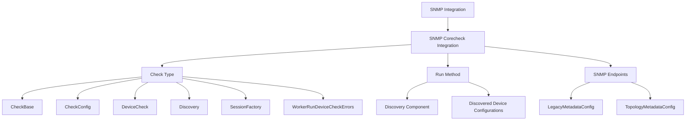

# SNMP Integration

The SNMP (Simple Network Management Protocol) integration within the Collector component is responsible for aggregating metrics from various network devices using SNMP. This integration is essential for collecting and processing SNMP data.

# SNMP Corecheck Integration

The <SwmToken path="pkg/collector/corechecks/snmp/internal/common/constants.go" pos="8:14:14" line-data="// SnmpIntegrationName is the name of the snmp integration">`snmp`</SwmToken> package contains the SNMP corecheck integration. This package is central to the functionality of the SNMP integration, as it aggregates metrics from one Check instance.

# Check Type

The <SwmToken path="pkg/collector/corechecks/snmp/snmp.go" pos="39:2:2" line-data="// Check aggregates metrics from one Check instance">`Check`</SwmToken> type in the <SwmToken path="pkg/collector/corechecks/snmp/internal/common/constants.go" pos="8:14:14" line-data="// SnmpIntegrationName is the name of the snmp integration">`snmp`</SwmToken> package aggregates metrics from one Check instance. It includes several components such as <SwmToken path="pkg/collector/corechecks/snmp/snmp.go" pos="41:3:3" line-data="	core.CheckBase">`CheckBase`</SwmToken>, <SwmToken path="pkg/collector/corechecks/snmp/snmp.go" pos="42:4:4" line-data="	config                     *checkconfig.CheckConfig">`checkconfig`</SwmToken>, <SwmToken path="pkg/collector/corechecks/snmp/snmp.go" pos="43:4:4" line-data="	singleDeviceCk             *devicecheck.DeviceCheck">`devicecheck`</SwmToken>, and <SwmToken path="pkg/collector/corechecks/snmp/snmp.go" pos="44:1:1" line-data="	discovery                  *discovery.Discovery">`discovery`</SwmToken> to facilitate the collection and processing of SNMP data.

<SwmSnippet path="/pkg/collector/corechecks/snmp/snmp.go" line="39">

---

The <SwmToken path="pkg/collector/corechecks/snmp/snmp.go" pos="39:2:2" line-data="// Check aggregates metrics from one Check instance">`Check`</SwmToken> type aggregates metrics from one Check instance and includes several components such as <SwmToken path="pkg/collector/corechecks/snmp/snmp.go" pos="41:3:3" line-data="	core.CheckBase">`CheckBase`</SwmToken>, <SwmToken path="pkg/collector/corechecks/snmp/snmp.go" pos="42:4:4" line-data="	config                     *checkconfig.CheckConfig">`checkconfig`</SwmToken>, <SwmToken path="pkg/collector/corechecks/snmp/snmp.go" pos="43:4:4" line-data="	singleDeviceCk             *devicecheck.DeviceCheck">`devicecheck`</SwmToken>, and <SwmToken path="pkg/collector/corechecks/snmp/snmp.go" pos="44:1:1" line-data="	discovery                  *discovery.Discovery">`discovery`</SwmToken>.

```go
// Check aggregates metrics from one Check instance
type Check struct {
	core.CheckBase
	config                     *checkconfig.CheckConfig
	singleDeviceCk             *devicecheck.DeviceCheck
	discovery                  *discovery.Discovery
	sessionFactory             session.Factory
	workerRunDeviceCheckErrors *atomic.Uint64
}
```

---

</SwmSnippet>

# <SwmToken path="pkg/collector/corechecks/snmp/snmp.go" pos="33:3:3" line-data="	// CheckName is the name of the check">`CheckName`</SwmToken> Constant

The <SwmToken path="pkg/collector/corechecks/snmp/snmp.go" pos="33:3:3" line-data="	// CheckName is the name of the check">`CheckName`</SwmToken> constant defines the name of the SNMP check, which is used throughout the integration.

# <SwmToken path="pkg/collector/corechecks/snmp/internal/common/constants.go" pos="8:2:2" line-data="// SnmpIntegrationName is the name of the snmp integration">`SnmpIntegrationName`</SwmToken> Constant

The <SwmToken path="pkg/collector/corechecks/snmp/internal/common/constants.go" pos="8:2:2" line-data="// SnmpIntegrationName is the name of the snmp integration">`SnmpIntegrationName`</SwmToken> constant defines the name of the SNMP integration, which is referenced in the <SwmToken path="pkg/collector/corechecks/snmp/snmp.go" pos="33:3:3" line-data="	// CheckName is the name of the check">`CheckName`</SwmToken> constant.

<SwmSnippet path="/pkg/collector/corechecks/snmp/internal/common/constants.go" line="8">

---

The <SwmToken path="pkg/collector/corechecks/snmp/internal/common/constants.go" pos="8:2:2" line-data="// SnmpIntegrationName is the name of the snmp integration">`SnmpIntegrationName`</SwmToken> constant defines the name of the SNMP integration, which is referenced in the <SwmToken path="pkg/collector/corechecks/snmp/snmp.go" pos="33:3:3" line-data="	// CheckName is the name of the check">`CheckName`</SwmToken> constant.

```go
// SnmpIntegrationName is the name of the snmp integration
const SnmpIntegrationName = "snmp"

// SnmpExternalTagsSourceType is the source id used for external tags
```

---

</SwmSnippet>

<SwmSnippet path="/pkg/collector/corechecks/snmp/snmp.go" line="41">

---

The <SwmToken path="pkg/collector/corechecks/snmp/snmp.go" pos="44:1:1" line-data="	discovery                  *discovery.Discovery">`discovery`</SwmToken> component within the <SwmToken path="pkg/collector/corechecks/snmp/snmp.go" pos="39:2:2" line-data="// Check aggregates metrics from one Check instance">`Check`</SwmToken> type is used to get discovered device configurations, which are essential for the SNMP check.

```go
	core.CheckBase
	config                     *checkconfig.CheckConfig
	singleDeviceCk             *devicecheck.DeviceCheck
	discovery                  *discovery.Discovery
	sessionFactory             session.Factory
	workerRunDeviceCheckErrors *atomic.Uint64
}
```

---

</SwmSnippet>

# Run Method

The <SwmToken path="rtloader/test/python/datadog_checks/base/checks/__init__.py" pos="9:3:3" line-data="    def run(self):">`run`</SwmToken> method executes the SNMP check, utilizing the <SwmToken path="pkg/collector/corechecks/snmp/snmp.go" pos="44:1:1" line-data="	discovery                  *discovery.Discovery">`discovery`</SwmToken> component to get discovered device configurations and process them.

# SNMP Endpoints

The SNMP endpoints include configurations for legacy metadata and topology metadata.

## <SwmToken path="pkg/collector/corechecks/snmp/internal/checkconfig/config_metadata.go" pos="12:2:2" line-data="// LegacyMetadataConfig contains metadata config used for backward compatibility">`LegacyMetadataConfig`</SwmToken>

The <SwmToken path="pkg/collector/corechecks/snmp/internal/checkconfig/config_metadata.go" pos="12:2:2" line-data="// LegacyMetadataConfig contains metadata config used for backward compatibility">`LegacyMetadataConfig`</SwmToken> contains metadata configurations used for backward compatibility. It ensures that users with older versions of <SwmPath>[pkg/collector/corechecks/snmp/internal/test/conf.d/snmp.d/profiles/\_base.yaml](pkg/collector/corechecks/snmp/internal/test/conf.d/snmp.d/profiles/_base.yaml)</SwmPath> and <SwmToken path="pkg/collector/corechecks/snmp/internal/checkconfig/config_metadata.go" pos="13:22:24" line-data="// When users have their own copy of _base.yaml and _generic_if.yaml files">`_generic_if.yaml`</SwmToken> files still have access to the necessary metadata definitions for device and interface resources.

## <SwmToken path="pkg/collector/corechecks/snmp/internal/checkconfig/config_metadata.go" pos="107:2:2" line-data="// TopologyMetadataConfig represent the metadata needed for topology">`TopologyMetadataConfig`</SwmToken>

The <SwmToken path="pkg/collector/corechecks/snmp/internal/checkconfig/config_metadata.go" pos="107:2:2" line-data="// TopologyMetadataConfig represent the metadata needed for topology">`TopologyMetadataConfig`</SwmToken> represents the metadata needed for topology. It includes various fields and their corresponding OIDs to gather information about network topology, such as LLDP and CDP remote devices.

<SwmSnippet path="/pkg/collector/corechecks/snmp/internal/checkconfig/config_metadata.go" line="107">

---

The <SwmToken path="pkg/collector/corechecks/snmp/internal/checkconfig/config_metadata.go" pos="107:2:2" line-data="// TopologyMetadataConfig represent the metadata needed for topology">`TopologyMetadataConfig`</SwmToken> represents the metadata needed for topology. It includes various fields and their corresponding OIDs to gather information about network topology, such as LLDP and CDP remote devices.

```go
// TopologyMetadataConfig represent the metadata needed for topology
var TopologyMetadataConfig = profiledefinition.MetadataConfig{
```

---

</SwmSnippet>

&nbsp;

*This is an auto-generated document by Swimm AI 🌊 and has not yet been verified by a human*

<SwmMeta version="3.0.0" repo-id="Z2l0aHViJTNBJTNBZGF0YWRvZy1hZ2VudCUzQSUzQVN3aW1tLURlbW8=" repo-name="datadog-agent"><sup>Powered by [Swimm](/)</sup></SwmMeta>
